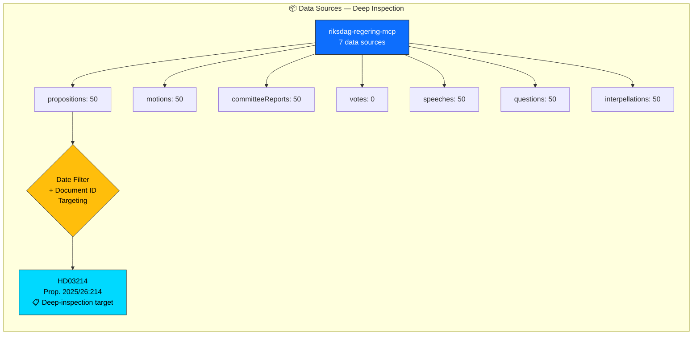

# 📦 Data Download Manifest — Deep Inspection 2026-04-03

**Generated**: 2026-04-03 22:42 UTC (enriched from per-document analysis)
**Focus**: Prop. 2025/26:214 — National Cybersecurity Center
**Confidence**: HIGH

---

## 📊 Data Source Overview

---

## 📋 Download Summary

| Metric | Value |
|--------|:-----:|
| **Total Documents Downloaded** (session-wide) | 300 |
| **MCP Data Sources** | 7 |
| **Date-Filtered Documents** (2026-04-03) | 0 |
| **Document-ID Targeted** | 1 (`HD03214`, dated 2026-04-01) |
| **Documents Selected for Analysis** | **1** |

---

## 📊 Document Counts by Type

| Document Type | Downloaded | Date-Filtered | ID-Targeted | Selected |
|---------------|:---------:|:------------:|:-----------:|:--------:|
| propositions | 50 | 0 | 1 (`HD03214`) | **1** |
| motions | 50 | 0 | 0 | 0 |
| committeeReports | 50 | 0 | 0 | 0 |
| votes | 0 | 0 | 0 | 0 |
| speeches | 50 | 0 | 0 | 0 |
| questions | 50 | 0 | 0 | 0 |
| interpellations | 50 | 0 | 0 | 0 |
| **Total** | **300** | **0** | **1** | **1** |

---

## 📋 Selected Document Details

| dok_id | Title | Type | Date | Riksmöte | Organ |
|--------|-------|:----:|:----:|:--------:|-------|
| `HD03214` | Lagändringar för ett stärkt nationellt cybersäkerhetscenter | Proposition | 2026-04-01 | 2025/26 | Försvarsdepartementet |

---

## ⚠️ Data Quality Notes

- Deep-inspection uses targeted document selection by ID, not date filtering alone
- `HD03214` was published 2026-04-01 (2 days before analysis date) — correctly included via `--document-ids` targeting
- v4.1 fix: `pre-article-analysis.ts` now supports `--document-ids` flag to bypass strict date filtering for deep-inspection targets
- **[HIGH confidence]** — document metadata verified against riksdag-regering-mcp
