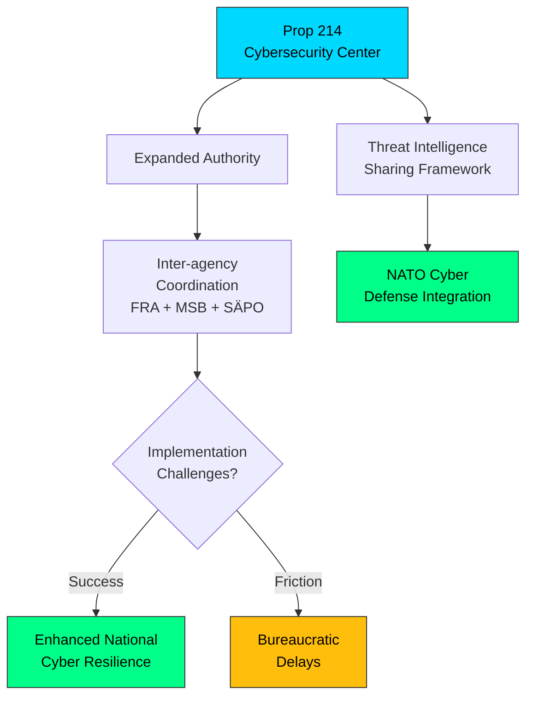

# 🔍 Per-File Political Intelligence Analysis

## 📋 Document Identity

| Field | Value |
|-------|-------|
| **Document ID** | `HD03214` |
| **Document Type** | Proposition (prop) |
| **Title** | Lagändringar för ett stärkt nationellt cybersäkerhetscenter |
| **Date** | 2026-04-01 |
| **Riksmöte** | 2025/26 |
| **Source MCP Tool** | get_propositioner |
| **Analysis Timestamp** | 2026-04-03 22:02 UTC |
| **Analyst** | news-realtime-monitor |

## 🎯 Executive Summary

Defense Minister Carl-Oskar Bohlin (M) advances Prop. 2025/26:214 to strengthen Sweden's National Cybersecurity Center through legislative changes. This proposition is part of the government's coordinated defense and security reform package alongside the GUTE II contract and war material regulation (HD03228). The legislation empowers the center with expanded authority for threat intelligence sharing, incident response coordination, and critical infrastructure protection. In the context of increasing cyber threats from state actors targeting NATO members, this represents a significant upgrade to Sweden's digital defense posture. **Confidence: HIGH**

## 📊 Political Classification

| Dimension | Assessment | Evidence |
|-----------|------------|----------|
| **Policy Domain** | Defense & Cybersecurity | National cybersecurity legislation |
| **Significance Score** | 7/10 | Critical infrastructure protection, NATO cyber defense alignment |
| **Coalition Impact** | Positive | Broad coalition support expected; cybersecurity is consensus area |
| **Opposition Relevance** | Low | Cybersecurity is largely non-partisan |

## 💼 SWOT Analysis

### ✅ Strengths

| # | Statement | Evidence | Confidence | Impact |
|---|-----------|----------|:----------:|:------:|
| S1 | Legislative foundation for coordinated national cyber defense | HD03214 | HIGH | HIGH |
| S2 | Broad cross-party support expected — cybersecurity is consensus policy | Parliamentary precedent | HIGH | MEDIUM |
| S3 | Part of integrated defense reform package demonstrating strategic coherence | HD03228, GUTE-II | HIGH | HIGH |

### ⚠️ Weaknesses

| # | Statement | Evidence | Confidence | Impact |
|---|-----------|----------|:----------:|:------:|
| W1 | Implementation requires inter-agency coordination (FRA, MSB, SÄPO, military) | Institutional complexity | MEDIUM | MEDIUM |
| W2 | Funding adequacy unclear — legislative authority without resources is ineffective | Budget analysis | MEDIUM | MEDIUM |

### 🌟 Opportunities

| # | Statement | Evidence | Confidence | Impact |
|---|-----------|----------|:----------:|:------:|
| O1 | NATO Cyber Defense Pledge alignment strengthens alliance integration | NATO membership | HIGH | HIGH |
| O2 | Swedish cybersecurity expertise becomes exportable capability | Industry potential | MEDIUM | MEDIUM |

### 🔴 Threats

| # | Statement | Evidence | Confidence | Impact |
|---|-----------|----------|:----------:|:------:|
| T1 | Privacy concerns over expanded surveillance authorities | Civil liberties debate | MEDIUM | MEDIUM |
| T2 | Cyber threat landscape evolving faster than legislative capacity | Threat dynamics | HIGH | HIGH |

## ⚠️ Risk Assessment

| Risk ID | Risk | L (1-5) | I (1-5) | L×I | Trend |
|---------|------|:-------:|:-------:|:---:|:-----:|
| R1 | Inter-agency turf wars delay implementation | 3 | 3 | 9 | → |
| R2 | Privacy backlash from expanded data sharing authorities | 2 | 3 | 6 | → |
| R3 | Underfunding limits operational effectiveness | 3 | 4 | 12 | ↑ |

## 👥 Stakeholder Impact

| Stakeholder | Impact | Assessment |
|-------------|:------:|------------|
| **Citizens** | MEDIUM | Enhanced protection of critical digital infrastructure |
| **Government Coalition** | MEDIUM | Consensus policy area — low political risk |
| **Opposition** | LOW | Broad support expected; minor privacy concerns from V/MP |
| **Business/Industry** | HIGH | Critical infrastructure operators directly affected |
| **International/NATO** | HIGH | Demonstrates commitment to allied cyber defense |
| **Judiciary/Constitutional** | MEDIUM | Privacy/surveillance balance requires oversight |

## 🔮 Forward Indicators

| Indicator | Trigger | Timeline | Confidence |
|-----------|---------|----------|:----------:|
| Committee hearing on implementation plan | FöU referral | Q2 2026 | HIGH |
| FRA/MSB coordination agreement | Agency response | Q2 2026 | MEDIUM |
| NATO cyber defense interoperability assessment | Alliance review | 2026 | HIGH |
