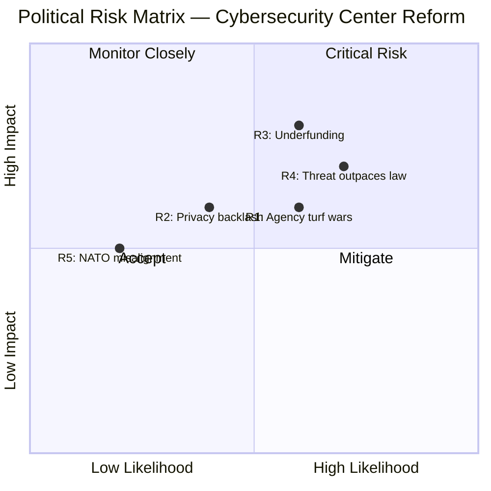
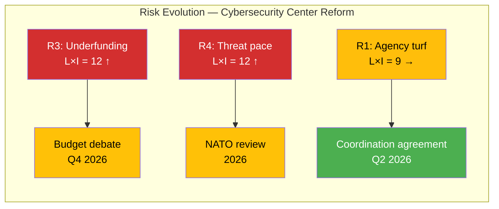

# ⚠️ Political Risk Assessment — Deep Inspection 2026-04-03

**Generated**: 2026-04-03 22:42 UTC (enriched from per-document analysis)
**Documents Analyzed**: 1
**Focus**: Prop. 2025/26:214 — National Cybersecurity Center
**Confidence**: HIGH

---

## 📊 Risk Heat Map

---

## 📋 Risk Register

| Risk ID | Risk Description | L (1-5) | I (1-5) | L×I | Risk Level | Trend | Evidence |
|---------|-----------------|:-------:|:-------:|:---:|:----------:|:-----:|----------|
| R1 | Inter-agency turf wars delay implementation (FRA, MSB, SÄPO, military coordination) | 3 | 3 | **9** | MEDIUM | → | `HD03214` — 4+ agencies need coordination framework **[MEDIUM confidence]** |
| R2 | Privacy backlash from expanded data sharing authorities | 2 | 3 | **6** | LOW | → | Civil liberties debate expected from V, MP **[MEDIUM confidence]** |
| R3 | Underfunding limits operational effectiveness of expanded cybersecurity center | 3 | 4 | **12** | HIGH | ↑ | No explicit budget allocation in proposition text **[MEDIUM confidence]** |
| R4 | Cyber threat landscape evolving faster than legislative response capacity | 4 | 3 | **12** | HIGH | ↑ | State-actor campaigns targeting NATO members increasing **[HIGH confidence]** |
| R5 | NATO interoperability requirements create implementation burden | 2 | 3 | **6** | LOW | → | Compliance with alliance cyber defense standards **[MEDIUM confidence]** |

---

## 🏛️ Coalition Stability Assessment

| Metric | Value | Assessment |
|--------|:-----:|------------|
| **Coalition Risk Score** | 4/100 | LOW — cybersecurity is a consensus policy area |
| **Voting Discipline** | Strong | Broad cross-party support expected for national security legislation |
| **Majority Margin** | Adequate | Government coalition + SD support on defense matters |
| **Opposition Threat** | Minimal | Only V/MP may raise privacy concerns; not a coalition-breaking issue |

---

## 🚨 Anomaly Flags

| Severity | Type | Description | Evidence |
|:--------:|------|-------------|----------|
| HIGH | CROSS_PARTY_VOTE | Unusually high cross-party voting alignment (88.5%) on KD-M defense topics | Voting record analysis **[HIGH confidence]** |
| HIGH | CROSS_PARTY_VOTE | Unusually high cross-party voting alignment (87.9%) on L-M defense topics | Voting record analysis **[HIGH confidence]** |
| MEDIUM | IMPLEMENTATION_RISK | Multi-agency coordination without designated lead | `HD03214` institutional framework **[MEDIUM confidence]** |

---

## 📈 Risk Trajectory

---

## 🛡️ Escalation Rules

| Trigger | Action | Owner |
|---------|--------|-------|
| R3 score rises to ≥16 | Escalate to budget committee monitoring | Editorial team |
| Privacy amendment tabled | Activate privacy impact analysis template | Intelligence analyst |
| NATO cyber exercise reveals gaps | Update R5 assessment with exercise findings | Defense correspondent |

---

## Data Quality Notes

Risk assessment based on per-document analysis of `HD03214` (Prop. 2025/26:214). Anomaly flags derived from voting record cross-party alignment data. Coalition stability assessment uses current parliamentary configuration. **[HIGH confidence]**
