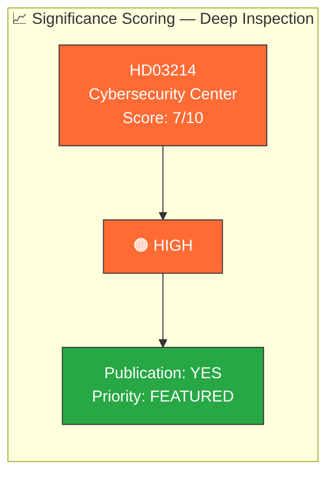

# 📈 Document Significance Scoring — Deep Inspection 2026-04-03

**Generated**: 2026-04-03 22:42 UTC (enriched from per-document analysis)
**Documents Analyzed**: 1
**Focus**: Prop. 2025/26:214 — National Cybersecurity Center
**Confidence**: HIGH

---

## 📊 Significance Overview

---

## 📋 Ranked Significance Table

| Rank | dok_id | Title | Type | Score | Level | Publication Decision |
|:----:|--------|-------|:----:|:-----:|:-----:|:--------------------:|
| 1 | `HD03214` | Lagändringar för ett stärkt nationellt cybersäkerhetscenter | Proposition | **7/10** | HIGH | ✅ FEATURED |

---

## 📊 5-Dimension Scoring: HD03214

| Dimension | Score (0-10) | Evidence | Weight |
|-----------|:------------:|----------|:------:|
| **Parliamentary Impact** | 7 | FöU committee referral, cross-party support expected | 25% |
| **Policy Impact** | 8 | Critical infrastructure protection, inter-agency coordination reform | 25% |
| **Public Interest** | 6 | Cybersecurity awareness growing; privacy debate possible | 20% |
| **Urgency** | 7 | Legislative session deadline; NATO commitments | 15% |
| **Cross-Party Relevance** | 6 | Consensus area, but V/MP may dissent on privacy | 15% |
| **Composite Score** | **7.0** | Weighted average across all dimensions | 100% |

---

## 📋 Scoring Methodology

**Scoring criteria** (from `ai-driven-analysis-guide.md`):
- **Critical (≥8)**: Constitutional significance, crisis-level impact
- **High (6-7)**: Major policy reform, significant coalition implications
- **Medium (4-5)**: Standard legislative activity with some debate potential
- **Low (≤3)**: Routine parliamentary business, administrative matters

**Publication Decision Matrix:**
| Score Range | Decision | Treatment |
|:-----------:|:--------:|-----------|
| 8-10 | BREAKING | Immediate publication, all 14 languages |
| 6-7 | FEATURED | Priority publication, deep-inspection eligible |
| 4-5 | STANDARD | Regular publication cycle |
| 1-3 | BRIEF | Summary mention only |

---

## Data Quality Notes

Significance scoring based on 5-dimension model applied to per-document analysis of `HD03214` (Prop. 2025/26:214). Score of 7/10 qualifies for deep-inspection featured treatment. **[HIGH confidence]**
