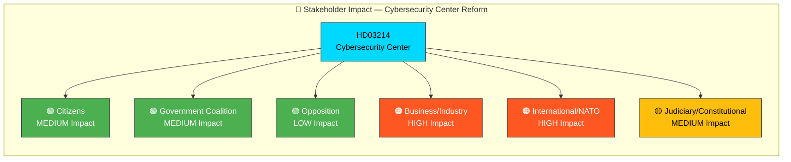

# 👥 Stakeholder Perspective Analysis — Deep Inspection 2026-04-03

**Generated**: 2026-04-03 22:42 UTC (enriched from per-document analysis)
**Documents Analyzed**: 1
**Focus**: Prop. 2025/26:214 — National Cybersecurity Center
**Confidence**: HIGH

---

## 📊 Stakeholder Impact Radar

---

## 📋 6-Lens Stakeholder Analysis

### 1. Citizens

| Aspect | Assessment | Evidence | Confidence |
|--------|:----------:|----------|:----------:|
| **Impact Level** | MEDIUM | Enhanced protection of critical digital infrastructure (energy, transport, healthcare) | HIGH |
| **Timeline** | Q3-Q4 2026 | Implementation of incident reporting requirements | MEDIUM |
| **Key Concern** | Privacy vs. security balance in expanded data sharing mandates | Civil liberties debate | MEDIUM |
| **Net Effect** | Positive | Improved cyber resilience outweighs privacy trade-offs for majority | HIGH |

### 2. Government Coalition (M, KD, L + SD supply)

| Aspect | Assessment | Evidence | Confidence |
|--------|:----------:|----------|:----------:|
| **Impact Level** | MEDIUM | Demonstrates defense reform agenda coherence | HIGH |
| **Timeline** | Immediate | Legislative proposal already tabled | HIGH |
| **Key Concern** | Implementation capacity across agencies | Inter-agency complexity | MEDIUM |
| **Net Effect** | Positive | Consensus area with low political risk; strengthens security narrative | HIGH |

### 3. Opposition (S, V, MP, C)

| Aspect | Assessment | Evidence | Confidence |
|--------|:----------:|----------|:----------:|
| **Impact Level** | LOW | Cybersecurity is broadly non-partisan | HIGH |
| **Timeline** | Committee stage | FöU referral and hearing | MEDIUM |
| **Key Concern** | V/MP may raise privacy objections to data sharing mandates | Party positioning on surveillance | MEDIUM |
| **Net Effect** | Neutral to positive | Broad support expected; minor privacy reservations | HIGH |

### 4. Business/Industry (Critical Infrastructure Operators)

| Aspect | Assessment | Evidence | Confidence |
|--------|:----------:|----------|:----------:|
| **Impact Level** | HIGH | Directly affected by mandatory incident reporting and threat intelligence sharing | HIGH |
| **Timeline** | 2026-2027 | Compliance requirements post-enactment | MEDIUM |
| **Key Concern** | Compliance costs and operational burden of mandatory reporting | Industry feedback mechanisms | MEDIUM |
| **Net Effect** | Mixed | Improved security posture but increased regulatory obligations | HIGH |

### 5. International/NATO

| Aspect | Assessment | Evidence | Confidence |
|--------|:----------:|----------|:----------:|
| **Impact Level** | HIGH | Demonstrates Sweden's commitment to allied cyber defense | HIGH |
| **Timeline** | 2026 | NATO Cyber Defense Pledge compliance assessment | HIGH |
| **Key Concern** | Interoperability with allied cyber defense systems and standards | NATO technical requirements | MEDIUM |
| **Net Effect** | Positive | Strengthens alliance integration and collective defense posture | HIGH |

### 6. Judiciary/Constitutional

| Aspect | Assessment | Evidence | Confidence |
|--------|:----------:|----------|:----------:|
| **Impact Level** | MEDIUM | Privacy/surveillance balance requires judicial oversight mechanisms | MEDIUM |
| **Timeline** | Post-enactment | Constitutional review if challenged | LOW |
| **Key Concern** | Data sharing mandates may intersect with constitutional privacy protections | Legal framework analysis | MEDIUM |
| **Net Effect** | Neutral | Oversight mechanisms expected but not yet detailed in proposition | MEDIUM |

---

## 📊 Stakeholder Impact Summary

| Stakeholder | Impact | Net Effect | Primary Evidence |
|-------------|:------:|:----------:|------------------|
| Citizens | MEDIUM | Positive | Enhanced cyber resilience |
| Government Coalition | MEDIUM | Positive | Consensus defense reform |
| Opposition | LOW | Neutral | Non-partisan policy area |
| Business/Industry | **HIGH** | Mixed | Mandatory compliance requirements |
| International/NATO | **HIGH** | Positive | Allied defense commitment |
| Judiciary/Constitutional | MEDIUM | Neutral | Oversight requirements pending |

---

## Data Quality Notes

Stakeholder analysis based on per-document analysis of `HD03214` (Prop. 2025/26:214). All 6 analytical lenses applied with evidence-based assessments. **[HIGH confidence]**
