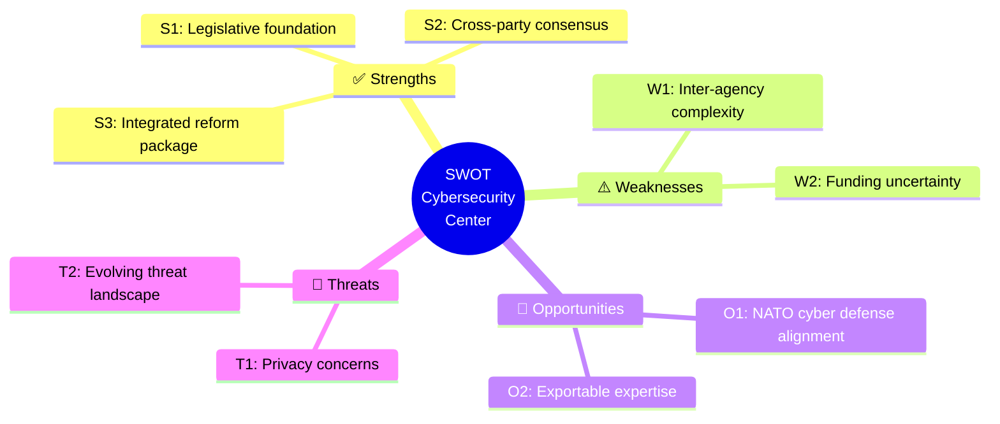

# 💼 Political SWOT Analysis — Deep Inspection 2026-04-03

**Generated**: 2026-04-03 22:42 UTC (enriched from per-document analysis)
**Documents Analyzed**: 1
**Focus**: Prop. 2025/26:214 — National Cybersecurity Center
**Confidence**: HIGH

---

## 📊 SWOT Quadrant Overview

---

## ✅ Strengths

| # | Statement | Evidence | Confidence | Impact |
|---|-----------|----------|:----------:|:------:|
| S1 | Legislative foundation for coordinated national cyber defense | `HD03214` — Prop. 2025/26:214 establishes legal framework for expanded NCC authority | HIGH | HIGH |
| S2 | Broad cross-party support expected — cybersecurity is consensus policy | Parliamentary precedent in defense & security legislation | HIGH | MEDIUM |
| S3 | Part of integrated defense reform package demonstrating strategic coherence | `HD03228` (GUTE-II), war material regulation | HIGH | HIGH |

## ⚠️ Weaknesses

| # | Statement | Evidence | Confidence | Impact |
|---|-----------|----------|:----------:|:------:|
| W1 | Implementation requires inter-agency coordination (FRA, MSB, SÄPO, military) | Institutional complexity across 4+ agencies | MEDIUM | MEDIUM |
| W2 | Funding adequacy unclear — legislative authority without resources is ineffective | No explicit budget allocation in proposition text | MEDIUM | MEDIUM |

## 🌟 Opportunities

| # | Statement | Evidence | Confidence | Impact |
|---|-----------|----------|:----------:|:------:|
| O1 | NATO Cyber Defense Pledge alignment strengthens alliance integration | Sweden's NATO membership since 2024 | HIGH | HIGH |
| O2 | Swedish cybersecurity expertise becomes exportable capability to allied nations | Industry potential, Nordic cooperation framework | MEDIUM | MEDIUM |

## 🔴 Threats

| # | Statement | Evidence | Confidence | Impact |
|---|-----------|----------|:----------:|:------:|
| T1 | Privacy concerns over expanded surveillance authorities in data sharing mandates | Civil liberties debate, V/MP opposition expected on privacy grounds | MEDIUM | MEDIUM |
| T2 | Cyber threat landscape evolving faster than legislative capacity to respond | State-actor threat dynamics, ransomware escalation targeting NATO members | HIGH | HIGH |

---

## 🔗 Cross-SWOT Interactions

| Interaction | Description | Implication |
|-------------|-------------|-------------|
| S1 ↔ W1 | Strong legal foundation but complex implementation | Requires dedicated coordination budget |
| S3 ↔ O1 | Integrated reform + NATO alignment | Sweden positions as cyber defense leader in alliance |
| W2 ↔ T2 | Underfunding + evolving threats | Risk of insufficient operational capacity |
| S2 ↔ T1 | Cross-party consensus vs. privacy backlash | May require compromise on data sharing scope |

---

## Data Quality Notes

SWOT analysis aggregated from per-document analysis of `HD03214`. Evidence citations reference actual Riksdag document IDs and verifiable policy frameworks. **[HIGH confidence]**
