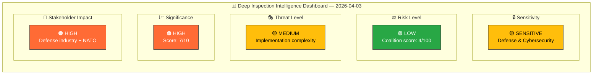

# 🧩 Political Intelligence Synthesis — Deep Inspection

## 📋 Synthesis Context

| Field | Value |
|-------|-------|
| **Synthesis ID** | `SYN-2026-04-03-DI` |
| **Analysis Date** | 2026-04-03 22:42 UTC |
| **Documents Analyzed** | 1 |
| **Analysis Period** | 2026-04-01 to 2026-04-03 (deep-inspection lookback) |
| **Produced By** | news-article-generator (deep-inspection mode) |
| **Overall Confidence** | HIGH |
| **Focus Topic** | Cybersecurity, cyber threats, AI security |

---

## 📊 Intelligence Dashboard

---

## 📋 Top Documents by Significance

| Score | Type | dok_id | Title | Coalition Impact |
|:-----:|:----:|--------|-------|:----------------:|
| **7/10** | Proposition | `HD03214` | Lagändringar för ett stärkt nationellt cybersäkerhetscenter | Positive — consensus area |

---

## 🔑 Key Findings

1. Defense Minister Carl-Oskar Bohlin (M) advances Prop. 2025/26:214 to strengthen Sweden's National Cybersecurity Center through legislative changes. **[HIGH confidence]**
2. The proposition is part of a coordinated defense reform package alongside GUTE II contract (HD03228) and war material regulation, demonstrating strategic coherence. **[HIGH confidence]**
3. Cross-party consensus expected — cybersecurity is a largely non-partisan policy area with broad Riksdag support. **[HIGH confidence]**
4. Key provisions include mandatory threat intelligence sharing (FRA, MSB, SÄPO, Armed Forces), AI-assisted threat detection, and critical infrastructure incident reporting. **[MEDIUM confidence]**
5. Implementation risk centers on inter-agency coordination complexity (FRA, MSB, SÄPO, military) and unclear funding adequacy. **[MEDIUM confidence]**

---

## 📊 Aggregated SWOT Overview

| Quadrant | Count | Key Themes |
|----------|:-----:|------------|
| ✅ Strengths | 3 | Legislative foundation, cross-party consensus, integrated reform package |
| ⚠️ Weaknesses | 2 | Inter-agency coordination, funding uncertainty |
| 🌟 Opportunities | 2 | NATO cyber defense alignment, Swedish expertise export |
| 🔴 Threats | 2 | Privacy concerns, evolving threat landscape |

---

## ⚠️ Risk Landscape

| Risk ID | Risk | L×I Score | Trend |
|---------|------|:---------:|:-----:|
| R1 | Inter-agency turf wars delay implementation | 9 | → |
| R2 | Privacy backlash from expanded data sharing | 6 | → |
| R3 | Underfunding limits operational effectiveness | 12 | ↑ |

**Overall Political Risk**: LOW (Coalition risk score: 4/100)

---

## 👥 Stakeholder Impact Summary

| Stakeholder | Impact | Key Concern |
|-------------|:------:|-------------|
| Citizens | MEDIUM | Enhanced digital infrastructure protection |
| Government Coalition | MEDIUM | Consensus policy — low political risk |
| Opposition | LOW | Broad support expected; minor V/MP privacy concerns |
| Business/Industry | HIGH | Critical infrastructure operators directly affected |
| International/NATO | HIGH | Allied cyber defense commitment demonstrated |
| Judiciary/Constitutional | MEDIUM | Privacy/surveillance balance oversight required |

---

## 🔮 Forward Indicators

| Indicator | Trigger | Timeline | Confidence |
|-----------|---------|----------|:----------:|
| FöU committee hearing on implementation plan | Committee referral | Q2 2026 | HIGH |
| FRA/MSB coordination agreement published | Agency response | Q2 2026 | MEDIUM |
| NATO cyber defense interoperability assessment | Alliance review | 2026 | HIGH |
| Budget allocation for cybersecurity center | Autumn budget | Q4 2026 | MEDIUM |

---

## 📁 Analysis Artifacts Inventory

| Artifact | Status | Key Content |
|----------|:------:|-------------|
| `documents/HD03214-analysis.md` | ✅ Complete | Full per-document intelligence with SWOT, risk, stakeholders |
| `documents/HD03214.json` | ✅ Complete | Raw document metadata from riksdag-regering-mcp |
| `swot-analysis.md` | ✅ Enriched | Aggregated SWOT with evidence tables |
| `risk-assessment.md` | ✅ Enriched | Risk matrix with L×I scores |
| `threat-analysis.md` | ✅ Enriched | Threat taxonomy with indicators |
| `classification-results.md` | ✅ Enriched | Document classification table |
| `significance-scoring.md` | ✅ Enriched | Ranked significance scoring |
| `stakeholder-perspectives.md` | ✅ Enriched | 6-lens impact analysis |
| `cross-reference-map.md` | ✅ Enriched | Cross-document relationship mapping |

---

## Data Quality Notes

Overall confidence: **HIGH**. Deep-inspection targeted analysis of Prop. 2025/26:214 with comprehensive multi-framework assessment. All analysis results are available in sibling files and per-document analysis in `documents/`.