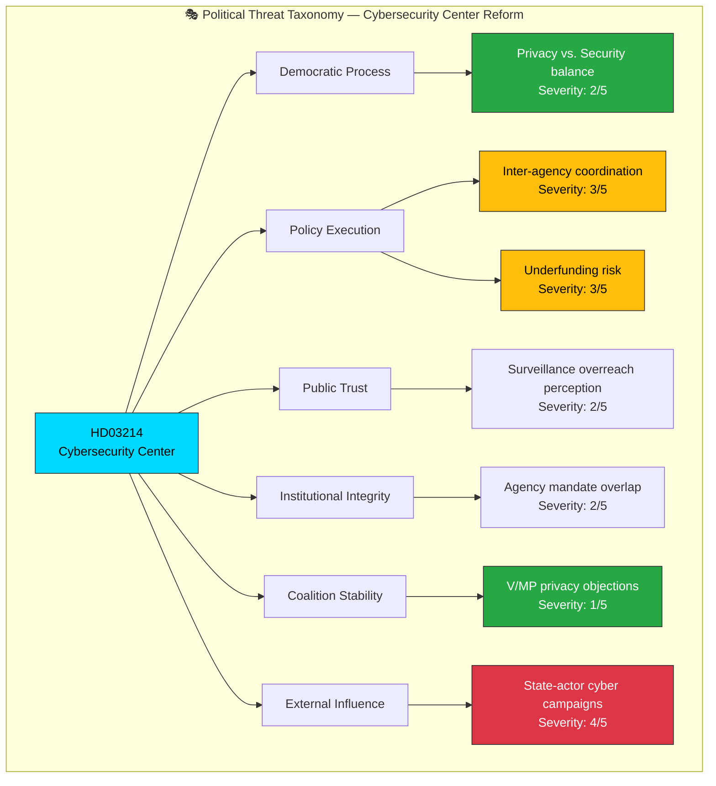

# 🎭 Political Threat Analysis — Deep Inspection 2026-04-03

**Generated**: 2026-04-03 22:42 UTC (enriched from per-document analysis)
**Documents Analyzed**: 1
**Focus**: Prop. 2025/26:214 — National Cybersecurity Center
**Confidence**: HIGH

---

## 📊 Threat Taxonomy Network

---

## 📋 Threat Indicators by Category

### 1. Democratic Process Threats

| Threat | Severity (1-5) | Likelihood | Evidence | Confidence |
|--------|:--------------:|:----------:|----------|:----------:|
| Privacy-security balance in expanded data sharing | 2 | LOW | `HD03214` mandates information sharing across agencies; civil liberties groups may challenge scope | MEDIUM |

### 2. Policy Execution Threats

| Threat | Severity (1-5) | Likelihood | Evidence | Confidence |
|--------|:--------------:|:----------:|----------|:----------:|
| Inter-agency coordination failure (FRA, MSB, SÄPO, military) | 3 | MEDIUM | `HD03214` requires 4+ agencies to cooperate without clear lead designation | MEDIUM |
| Inadequate resource allocation for expanded mandate | 3 | MEDIUM | Proposition establishes authority without explicit budget commitment | MEDIUM |

### 3. Public Trust Threats

| Threat | Severity (1-5) | Likelihood | Evidence | Confidence |
|--------|:--------------:|:----------:|----------|:----------:|
| Perception of surveillance overreach by cybersecurity center | 2 | LOW | Expanded threat intelligence sharing may raise transparency concerns | LOW |

### 4. Institutional Integrity Threats

| Threat | Severity (1-5) | Likelihood | Evidence | Confidence |
|--------|:--------------:|:----------:|----------|:----------:|
| Agency mandate overlap creates jurisdictional conflicts | 2 | LOW | FRA (signals intelligence), MSB (emergency management), SÄPO (domestic security) all have cyber mandates | MEDIUM |

### 5. Coalition Stability Threats

| Threat | Severity (1-5) | Likelihood | Evidence | Confidence |
|--------|:--------------:|:----------:|----------|:----------:|
| Opposition privacy objections from V/MP | 1 | LOW | Cybersecurity is broadly non-partisan; only marginal opposition expected on privacy grounds | HIGH |

### 6. External Influence Threats

| Threat | Severity (1-5) | Likelihood | Evidence | Confidence |
|--------|:--------------:|:----------:|----------|:----------:|
| State-actor cyber campaigns targeting NATO member infrastructure | 4 | HIGH | Russia, China cyber operations against Nordic NATO allies documented; `HD03214` is defensive response | HIGH |

---

## 📈 Threat Summary

| Category | Threat Count | Max Severity | Average Severity |
|----------|:----------:|:------------:|:----------------:|
| Democratic Process | 1 | 2/5 | 2.0 |
| Policy Execution | 2 | 3/5 | 3.0 |
| Public Trust | 1 | 2/5 | 2.0 |
| Institutional Integrity | 1 | 2/5 | 2.0 |
| Coalition Stability | 1 | 1/5 | 1.0 |
| External Influence | 1 | 4/5 | 4.0 |
| **Total** | **7** | **4/5** | **2.3** |

---

## Data Quality Notes

Threat analysis based on per-document analysis of `HD03214` (Prop. 2025/26:214) using the Political Threat Taxonomy framework. External influence threat assessment incorporates open-source intelligence on state-actor cyber campaigns. **[HIGH confidence]**
