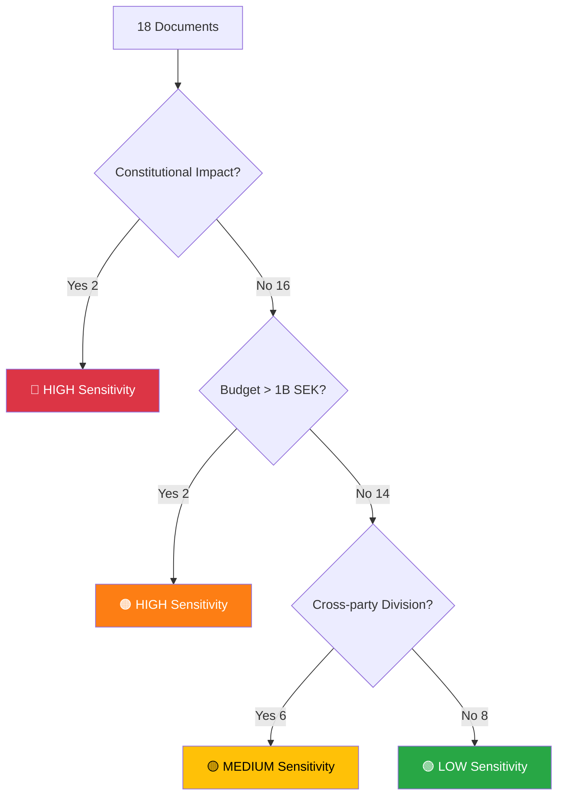

# Political Classification Results — 2026-04-03

**Classification ID**: CLS-2026-04-03-001
**Date**: 2026-04-03
**Riksmöte**: 2025/26
**Produced By**: AI Evening Analysis Agent (Claude Opus 4.6)

## 📊 Sensitivity Decision Tree

## Per-Document Classification

| dok_id | Title | Sensitivity | Domain | Urgency | Significance (0-10) | Confidence |
|--------|-------|-------------|--------|---------|---------------------|------------|
| luftvarnsavtal-87mdr | SEK 8.7B Air Defense Deal | 🔴 HIGH | Defense | IMMEDIATE | 9 | HIGH |
| HD03235 | Stricter Deportation Rules | 🔴 HIGH | Justice/Immigration | HIGH | 8 | HIGH |
| HD03228 | Modern Arms Export Rules | 🟠 HIGH | Defense/Foreign | HIGH | 8 | HIGH |
| HD03214 | Cybersecurity Center Law | 🟠 HIGH | Defense/Cyber | HIGH | 8 | HIGH |
| HD01FöU12 | Civilian Protection | 🟡 MEDIUM | Defense | MEDIUM | 7 | MEDIUM |
| HD01JuU15 | Criminal Care Issues | 🟡 MEDIUM | Justice | MEDIUM | 7 | MEDIUM |
| sou-202625 | Public Health Inquiry | 🟡 MEDIUM | Health | LOW | 7 | MEDIUM |
| elstöd-jan-feb | Electricity Subsidy | 🟡 MEDIUM | Energy/Budget | HIGH | 6 | HIGH |
| HD03216 | Municipal Health Competence | 🟡 MEDIUM | Health | LOW | 6 | MEDIUM |
| HD01SfU18 | Social Insurance Issues | 🟡 MEDIUM | Social | LOW | 5 | MEDIUM |
| HD01SoU16 | Healthcare Organization | 🟢 LOW | Health | LOW | 5 | MEDIUM |
| HD01SoU17 | Healthcare Priorities | 🟢 LOW | Health | LOW | 5 | MEDIUM |
| HD01FöU11 | Maritime Rescue Audit | 🟢 LOW | Defense | LOW | 4 | HIGH |
| HD024025 | S Motion: Grading System | 🟢 LOW | Education | LOW | 4 | HIGH |
| HD024018 | S Motion: School Safety | 🟢 LOW | Education | LOW | 4 | HIGH |
| HD024011 | S Motion: Housing Market | 🟢 LOW | Housing | LOW | 4 | HIGH |

## 📂 MCP Data Files Used

| MCP Tool | Classification Input | Items |
|----------|--------------------| ------|
| get_propositioner | Primary classification | 10 |
| get_betankanden | Committee stage classification | 20 |
| search_regering | Government activity classification | 18 |
| get_motioner | Opposition activity classification | 20 |
