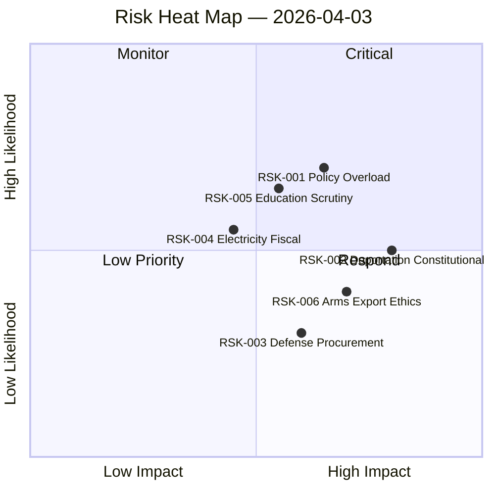
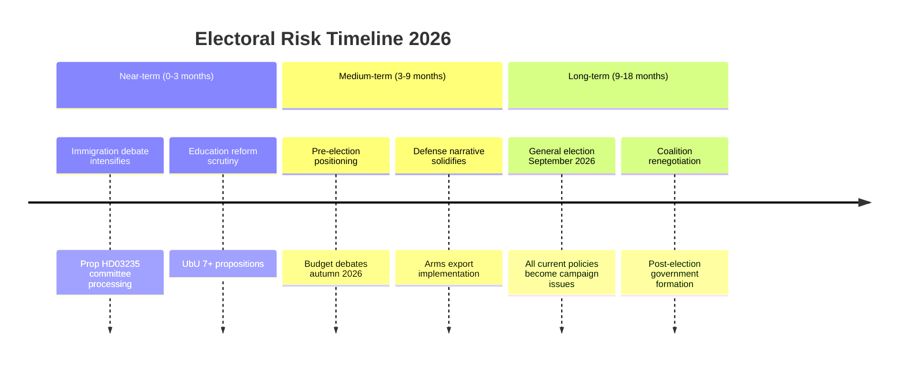
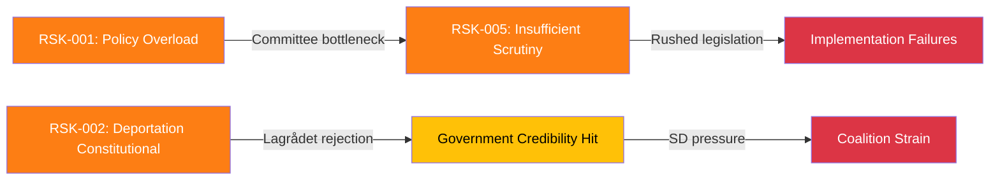

# Risk Assessment — 2026-04-03

**Risk Assessment ID**: RSK-2026-04-03-001
**Date**: 2026-04-03
**Riksmöte**: 2025/26
**Analysis Period**: 2026-04-01 to 2026-04-03
**Produced By**: AI Evening Analysis Agent (Claude Opus 4.6)
**Political Context**: Government advancing defense, immigration, and education agendas simultaneously. Coalition partners (M, KD, L + SD support) maintaining cohesion on security but facing scrutiny on constitutional boundaries. [MEDIUM confidence]
**Overall Risk Level**: 🟡 MEDIUM

## 🗂️ Risk Inventory

### Risk Heat Map

| Risk ID | Risk Description | Likelihood (1-5) | Impact (1-5) | Score (L×I) | Tier | Evidence |
|---------|-----------------|-------------------|---------------|-------------|------|----------|
| RSK-001 | Policy implementation overload: 7+ education props competing | 4 | 3 | 12 | 🟠 HIGH | Prop 193, 194, 195, 197 all filed week of Mar 31 |
| RSK-002 | Constitutional challenge to deportation strengthening | 3 | 4 | 12 | 🟠 HIGH | Prop HD03235 — stricter deportation rules |
| RSK-003 | Defense procurement delays on anti-drone systems | 2 | 4 | 8 | 🟡 MEDIUM | SEK 8.7B contract signed but delivery timeline unclear |
| RSK-004 | Electricity subsidy fiscal impact on budget | 3 | 3 | 9 | 🟡 MEDIUM | Ds elstöd Jan-Feb 2026 + remiss ongoing |
| RSK-005 | Insufficient UbU scrutiny of education reforms | 4 | 3 | 12 | 🟠 HIGH | 7 education propositions simultaneously |
| RSK-006 | Arms export rules sparking ethics debate | 2 | 3 | 6 | 🟡 MEDIUM | Prop HD03228 modernizing arms export framework |

| Risk Score Summary | Count |
|--------------------|-------|
| 🔴 Critical (15–25) | 0 |
| 🟠 High (10–14) | 3 |
| 🟡 Medium (5–9) | 3 |
| 🟢 Low (1–4) | 0 |

## 🤝 Coalition Stability Risk

**Current Coalition Assessment**:
- Governing parties: M, KD, L (with SD parliamentary support)
- Coalition strength: 176/349 seats (with SD)
- Confidence: 72% [MEDIUM confidence]
- Opposition majority risk: LOW — SD cooperation holding
- Collapse probability (90 days): <5%

| Coalition Risk Factor | Severity | Trigger | Evidence |
|----------------------|----------|---------|----------|
| Arms export disagreement (KD vs M) | Low | KD evangelical base opposition to broader exports | Prop HD03228, Benjamin Dousa (UD) |
| SD immigration expectations | Medium | SD demands faster implementation | Prop HD03235, HD03229 alignment with SD priorities |
| Education reform pace | Low | L education priorities vs M austerity | Multiple UbU propositions |

## 📋 Policy Implementation Risk

| Policy | Ministry | Stage | Risk Level | Blocking Factor |
|--------|----------|-------|------------|-----------------|
| Stricter deportation rules | Justitiedepartementet | Proposition filed | 🟠 HIGH | Potential constitutional review (Lagrådet) |
| Cybersecurity center | Försvarsdepartementet | Proposition filed | 🟡 MEDIUM | Inter-agency coordination |
| Arms export modernization | Utrikesdepartementet | Proposition filed | 🟡 MEDIUM | International perception, NGO opposition |
| 7 education reforms | Utbildningsdepartementet | Multiple props filed | 🟠 HIGH | UbU committee capacity bottleneck |
| Electricity subsidy | Klimat- och näringslivsdepartementet | Remiss stage | 🟡 MEDIUM | Budget ceiling pressure |

## 💰 Budget Risk

- Budget Year: 2025/26
- FiU Status: Spring fiscal policy framework pending
- Key Risks: Electricity subsidy costs (Ds), SEK 8.7B defense commitment
- Autumn Budget Status: Planning phase

## 🗳️ Electoral Risk Timeline

## �� Cascading Risk Chain

## 🔮 Forward Indicators & Scenario Outlook

| Scenario | Probability | Key Trigger | Risk Dimensions |
|----------|-------------|-------------|-----------------|
| Education reforms advance smoothly | 40% | UbU schedules hearings efficiently | RSK-001, RSK-005 resolve |
| Deportation rules face constitutional review | 35% | Lagrådet raises concerns | RSK-002 escalates to HIGH |
| Coalition stable through spring | 60% | No SD ultimatum on immigration pace | All risks contained |
| Policy overload causes legislative delays | 50% | UbU requests extension | RSK-001, RSK-005 worsen |

## 📂 MCP Data Files Used

| MCP Tool | Risk-Relevant Data | Items |
|----------|-------------------|-------|
| get_propositioner | Policy risk assessment | 10 |
| get_betankanden | Committee capacity analysis | 20 |
| search_regering | Government activity level | 18 |
| search_voteringar | Coalition cohesion data | 50 |
