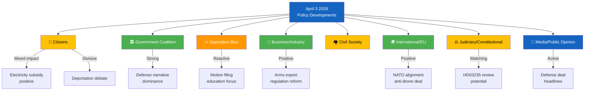

# Stakeholder Impact Analysis — 2026-04-03

**Stakeholder ID**: STA-2026-04-03-001
**Date**: 2026-04-03
**Riksmöte**: 2025/26
**Produced By**: AI Evening Analysis Agent (Claude Opus 4.6)

## 🎭 Impact Radar

## Impact Summary Matrix

| Stakeholder Group | Impact Level | Direction | Key Driver | Evidence | Confidence |
|-------------------|-------------|-----------|------------|----------|------------|
| 👥 Citizens | Medium | Mixed | Electricity subsidy (positive) vs deportation debate (divisive) | Ds elstöd, Prop HD03235 | MEDIUM |
| 🏛️ Government Coalition | High | Positive | Defense investment + security narrative + legislative momentum | 8.7B deal, Props HD03214/HD03228/HD03235 | HIGH |
| ⚔️ Opposition Bloc | Medium | Reactive | Active motion filing but fragmented response | 20+ motions (Ygeman, Järrebring, Paarup-Petersen, Berglund) | HIGH |
| �� Business/Industry | Medium | Positive | Arms export modernization, business regulation simplification | Prop HD03228, NU debate on regulation | MEDIUM |
| 🏘️ Civil Society | Medium | Concerned | Immigration policy impact, school reform effects | Props on deportation/housing/education | MEDIUM |
| 🌍 International/EU | High | Positive | NATO defense alignment, EU NIS2 cyber compliance, arms export modernization | 8.7B deal, Prop HD03214, HD03228, Jonson USA visit | HIGH |
| ⚖️ Judiciary/Constitutional | Medium | Watchful | Potential constitutional review of stricter deportation rules | Prop HD03235 proportionality | MEDIUM |
| 📰 Media/Public Opinion | High | Active | Defense deal dominates headlines; immigration debate generates engagement | Press releases, debate activity | MEDIUM |

## Detailed Stakeholder Assessments

### Citizens
- **Positive**: Electricity subsidy for Jan-Feb 2026 provides direct financial relief [MEDIUM confidence]
- **Negative**: Deportation debate creates uncertainty for immigrant communities [MEDIUM confidence]
- **Neutral**: Healthcare reforms (Prop HD03216) long-term positive but not immediately felt [LOW confidence]

### Government Coalition (M, KD, L + SD support)
- **Primary gain**: Dominant security narrative through defense investments and cybersecurity [HIGH confidence]
- **Risk exposure**: Constitutional boundary testing on deportation, education reform bottleneck [MEDIUM confidence]
- **Strategic position**: Pre-election agenda setting on security, order, and modernization [HIGH confidence]

### Opposition Bloc (S, V, MP, C)
- **S (Social Democrats)**: Active via Ygeman, Damberg, Järrebring — filing detailed counter-motions [HIGH confidence]
- **C (Centre)**: Niche engagement via Paarup-Petersen on education, Nordin on energy [MEDIUM confidence]
- **MP (Green)**: Environmental and rights-based counter-positions via Berglund, Hansén [MEDIUM confidence]
- **V (Left)**: Parliament debate engagement (Lahti on energy) but limited motion activity today [LOW confidence]

## 📂 MCP Data Files Used

| MCP Tool | Stakeholder Relevance | Items |
|----------|---------------------|-------|
| search_regering | Government + Citizens + International | 18 |
| get_propositioner | All stakeholders | 10 |
| get_motioner | Opposition | 20 |
| search_anforanden | Government + Opposition | 50 |
| get_betankanden | Citizens + Judiciary | 20 |
