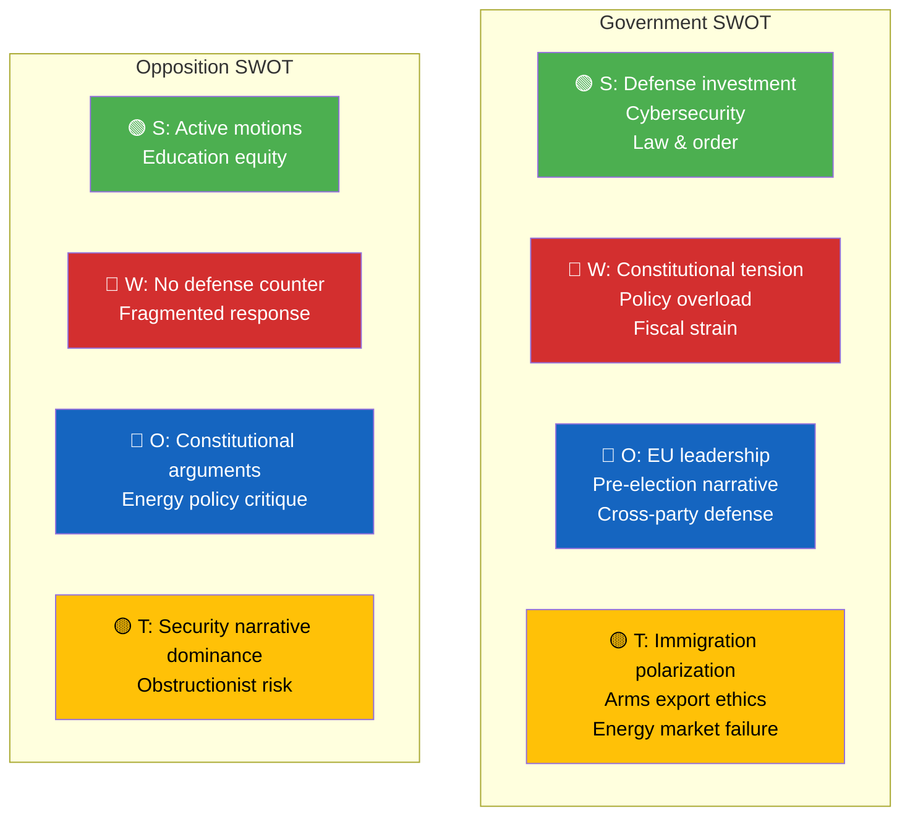

# SWOT Analysis — 2026-04-03

**SWOT ID**: SWT-2026-04-03-001
**Date**: 2026-04-03
**Riksmöte**: 2025/26
**Scope**: Government coalition (M, KD, L + SD) vs Opposition (S, V, MP, C)
**Reference Period**: 2026-04-01 to 2026-04-03
**Produced By**: AI Evening Analysis Agent (Claude Opus 4.6)
**Primary MCP Sources**: get_propositioner, get_betankanden, search_regering, search_anforanden
**Validity Window**: 7 days

## Section 1: Government Coalition SWOT

### Strengths

| # | Statement | Evidence (dok_id) | Confidence | Impact | Entry Date |
|---|-----------|-------------------|------------|--------|------------|
| S1 | SEK 8.7B anti-drone air defense deal demonstrates defense investment leadership | Press release luftvarnsavtal-87mdr, 2026-04-02 | HIGH | HIGH | 2026-04-02 |
| S2 | Comprehensive cybersecurity legislation advancing EU NIS2 compliance | Prop HD03214, Carl-Oskar Bohlin (FöD) | HIGH | HIGH | 2026-04-01 |
| S3 | Modernized arms export rules strengthening NATO interoperability | Prop HD03228, Benjamin Dousa (UD) | MEDIUM | HIGH | 2026-04-01 |
| S4 | Strong law-and-order narrative with deportation and crime victim measures | Prop HD03235, HD03222, Johan Forssell (JuD) | HIGH | MEDIUM | 2026-04-01 |
| S5 | Civil defense modernization advancing through FöU committee | HD01FöU12 (FöU), 2026-04-02 | MEDIUM | MEDIUM | 2026-04-02 |

### Weaknesses

| # | Statement | Evidence (dok_id) | Confidence | Impact | Entry Date |
|---|-----------|-------------------|------------|--------|------------|
| W1 | Constitutional tension on stricter deportation rules — potential Lagrådet pushback | Prop HD03235, proportionality concerns | MEDIUM | HIGH | 2026-04-01 |
| W2 | Education reform overload: 7+ propositions simultaneously straining UbU capacity | Prop 193, 194, 195, 197, + opposition motions HD024018-HD024054 | HIGH | MEDIUM | 2026-04-01 |
| W3 | Electricity subsidy fiscal drain — recurring emergency measures undermine budget credibility | Ds elstöd Jan-Feb 2026, remiss ongoing | MEDIUM | MEDIUM | 2026-04-02 |
| W4 | Arms export ethics debate may alienate values-driven KD base | Prop HD03228 broadening export criteria | LOW | MEDIUM | 2026-04-01 |

### Opportunities

| # | Statement | Evidence (dok_id) | Confidence | Impact | Entry Date |
|---|-----------|-------------------|------------|--------|------------|
| O1 | EU NIS2 cybersecurity compliance leadership position | Prop HD03214 | MEDIUM | HIGH | 2026-04-01 |
| O2 | Pre-election security narrative consolidation (18 months to election) | Multiple defense/security props + SEK 8.7B deal | HIGH | HIGH | 2026-04-02 |
| O3 | Cross-party defense consensus potential (S historically supportive) | FöU12 civilian protection bipartisan framing | MEDIUM | MEDIUM | 2026-04-02 |
| O4 | Public health modernization through SOU 2026:25 | SOU smittskydd, Jakob Forssmed health summit France | MEDIUM | LOW | 2026-04-02 |

### Threats

| # | Statement | Evidence (dok_id) | Confidence | Impact | Entry Date |
|---|-----------|-------------------|------------|--------|------------|
| T1 | Immigration policy polarization approaching election | Prop HD03235 (deportation) + HD03229 (reception) + HD03215 (housing) | HIGH | HIGH | 2026-04-01 |
| T2 | Arms export liberalization may draw international NGO criticism | Prop HD03228 | LOW | MEDIUM | 2026-04-01 |
| T3 | Electricity subsidy recurring costs signal structural market failure | Ds elstöd, NU17 debate ongoing | MEDIUM | MEDIUM | 2026-04-02 |

## Section 2: Main Opposition SWOT

**Subject**: S + V + MP + C bloc

### Strengths

| # | Statement | Evidence (dok_id) | Confidence | Impact | Entry Date |
|---|-----------|-------------------|------------|--------|------------|
| S1 | Active legislative engagement: 20+ counter-motions filed April 1 | HD024008-HD024054, Anders Ygeman (S), Joakim Järrebring (S), Mats Berglund (MP), Niels Paarup-Petersen (C) | HIGH | MEDIUM | 2026-04-01 |
| S2 | Education policy: detailed alternative proposals with social equity framing | HD024025 (grading), HD024019 (school support), HD024018 (school safety) by S | HIGH | MEDIUM | 2026-04-01 |

### Weaknesses

| # | Statement | Evidence (dok_id) | Confidence | Impact | Entry Date |
|---|-----------|-------------------|------------|--------|------------|
| W1 | No unified opposition defense counter-narrative to SEK 8.7B deal | No opposition statements on air defense deal | MEDIUM | HIGH | 2026-04-02 |
| W2 | Fragmented responses — S, C, MP filing separate motions on same propositions | HD024041 (C), HD024050 (MP), HD024018 (S) all on Prop 193 | HIGH | MEDIUM | 2026-04-01 |

### Opportunities

| # | Statement | Evidence (dok_id) | Confidence | Impact | Entry Date |
|---|-----------|-------------------|------------|--------|------------|
| O1 | Constitutional argument against deportation strengthening | Prop HD03235 proportionality concerns | MEDIUM | HIGH | 2026-04-01 |
| O2 | Electricity subsidy exposes government reactive energy policy | Ds elstöd, NU17 debate (Monica Haider S, Rickard Nordin C) | MEDIUM | MEDIUM | 2026-04-02 |

### Threats

| # | Statement | Evidence (dok_id) | Confidence | Impact | Entry Date |
|---|-----------|-------------------|------------|--------|------------|
| T1 | Government security narrative dominant, opposition struggling on defense positioning | Multiple defense props + 8.7B deal | MEDIUM | HIGH | 2026-04-02 |
| T2 | Education counter-proposals risk appearing obstructionist | Multiple reject motions (HD024025, HD024018) | LOW | MEDIUM | 2026-04-01 |

## 📊 SWOT Quadrant Mapping

## Section 5: Cross-SWOT Interference

| Gov Element | Opp Element | Interference | Net Effect |
|------------|------------|-------------|------------|
| S1 (Defense investment) | OW1 (No defense counter) | Government strength amplified by opposition silence | Government advantage +2 |
| W1 (Constitutional tension) | OO1 (Constitutional arguments) | Opposition opportunity directly exploits government weakness | Balanced -1/+1 |
| T1 (Immigration polarization) | OS1 (Active motions) | Both sides energized; risk of escalating rhetoric | Polarization risk ↑ |

## Section 6: TOWS Strategic Options

| Strategy Type | Strategy | Specific Action | Evidence |
|--------------|---------|----------------|----------|
| SO (Strength-Opportunity) | Leverage defense deal for EU leadership narrative | PM highlights at NATO summit | Press release luftvarnsavtal + Prop HD03214 |
| WO (Weakness-Opportunity) | Use cross-party defense support to deflect constitutional criticism | Invite S to consultations on FöU12 implementation | FöU12 bipartisan potential |

## 🔮 Forward Indicators & Scenario Outlook

| Scenario | Probability | Key Trigger | SWOT Elements |
|----------|-------------|-------------|---------------|
| Government consolidates security narrative | 55% | FöU12 passes with bipartisan support | S1, S2, O2 strengthen |
| Deportation rules spark constitutional crisis | 20% | Lagrådet rejects Prop HD03235 | W1 escalates, OO1 activates |
| Education reform jam in committee | 40% | UbU unable to process 7 props by recess | W2, RSK-005 escalate |

## 📂 MCP Data Files Used

| MCP Tool | SWOT Quadrant | Items |
|----------|-------------|-------|
| get_propositioner | S, W, O, T | 10 |
| search_regering | S (press releases) | 18 |
| get_betankanden | S, W | 20 |
| search_anforanden | Debate analysis | 50 |
| get_motioner | Opposition S | 20 |
