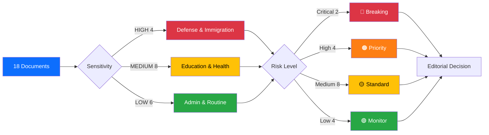
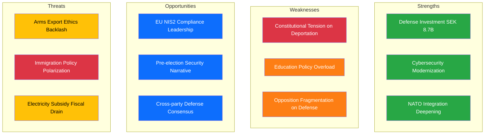

# Analysis Synthesis Summary — 2026-04-03

**Synthesis ID**: SYN-2026-04-03-001
**Date**: 2026-04-03
**Riksmöte**: 2025/26
**Documents Analyzed**: 18 (6 committee reports, 4 propositions, 12 government press releases, 1 SOU, 1 Ds)
**Analysis Period**: 2026-04-01 to 2026-04-03
**Produced By**: AI Evening Analysis Agent (Claude Opus 4.6)
**Overall Confidence**: MEDIUM

## 📊 Intelligence Dashboard

## 🏆 Top Findings by Significance

| Score | Type | dok_id | Title | Risk Tier | SWOT Impact | Recommendation |
|-------|------|--------|-------|-----------|-------------|----------------|
| 9/10 | Press Release | luftvarnsavtal-87mdr | SEK 8.7B Air Defense Anti-Drone Deal | 🔴 Critical | S: Major defense capability boost | Breaking coverage |
| 8/10 | Proposition | HD03235 | Skärpta regler om utvisning på grund av brott | 🟠 High | W: Constitutional tension, O: Electoral gain | Priority analysis |
| 8/10 | Proposition | HD03228 | Ett modernt och anpassat regelverk för krigsmateriel | 🟠 High | S: NATO alignment, T: Export ethics debate | Priority analysis |
| 8/10 | Proposition | HD03214 | Lagändringar för stärkt nationellt cybersäkerhetscenter | 🟠 High | S: Cyber resilience, O: EU NIS2 alignment | Priority analysis |
| 7/10 | Committee Report | HD01FöU12 | Stärkt skydd för civilbefolkningen vid höjd beredskap | 🟡 Medium | S: Civil defense modernization | Standard coverage |
| 7/10 | Committee Report | HD01JuU15 | Kriminalvårdsfrågor | 🟡 Medium | W: Prison capacity strain | Standard coverage |
| 7/10 | SOU | sou-202625 | Ett smittskydd för framtiden | 🟡 Medium | O: Post-pandemic preparedness | Standard coverage |
| 6/10 | Ds | elstod-jan-feb-2026 | Elstöd till konsumenter jan–feb 2026 | 🟡 Medium | S: Citizen relief, W: Fiscal cost | Standard coverage |

## 💪 Aggregated SWOT Summary

| Quadrant | Count | Highest-Impact Entry | Evidence |
|----------|-------|---------------------|----------|
| Strengths | 5 | SEK 8.7B anti-drone air defense deal | Press release 2026-04-02, Prop HD03228 |
| Weaknesses | 4 | Constitutional concerns on stricter deportation | Prop HD03235, opposition motions |
| Opportunities | 4 | EU NIS2 cybersecurity leadership | Prop HD03214, FöU12 |
| Threats | 3 | Immigration policy polarization risk | Prop HD03235, HD03229, HD03215 |

**SWOT Balance Assessment**: [MEDIUM confidence] Government coalition holds initiative on defense/security agenda, but faces pressure on immigration constitutional boundaries and education reform overload from multiple simultaneous propositions.

## ⚖️ Risk Landscape Summary

| Risk Category | Score Range | Highest Risk | Trend |
|--------------|-------------|-------------|-------|
| Coalition Stability | 4–8 | Arms export disagreements between M and KD | → Stable |
| Policy Implementation | 6–12 | 7+ education propositions competing for committee time | ↑ Rising |
| Budget | 5–10 | Electricity subsidy fiscal impact (Ds elstöd) | → Stable |
| Electoral | 4–8 | Immigration deportation debate pre-election | ↑ Rising |
| Democratic Process | 3–6 | Constitutional review of deportation rules | → Stable |
| External/Security | 8–15 | Anti-drone capability gap (addressed by 8.7B deal) | ↓ Declining |

**Overall Risk Level**: 🟡 MEDIUM — Defense investment reduces external risk, but policy overload and immigration constitutional tensions create implementation risks.

## 🎭 Threat Summary

| Category | Active | Severity | Key Issue |
|----------|--------|----------|-----------|
| Narrative Integrity (NI) | Yes | 2/5 | Competing narratives on immigration tough vs. constitutional |
| Legislative Integrity (LI) | Yes | 3/5 | 7+ education propositions risk insufficient scrutiny |
| Accountability (AC) | No | 1/5 | Normal oversight functioning |
| Transparency (TR) | No | 1/5 | Government press releases active |
| Democratic Process (DP) | Yes | 2/5 | Deportation rules may face constitutional review |
| Power Balance (PB) | No | 1/5 | Coalition stable, opposition responding |

**Overall Threat Level**: 🟡 MEDIUM

## 👥 Stakeholder Impact Overview

| Stakeholder | Impact | Direction | Key Driver |
|------------|--------|-----------|------------|
| Citizens | Medium | Mixed | Electricity subsidy positive; deportation debate divisive |
| Government Coalition | High | Positive | Strong defense narrative, multiple legislative victories |
| Opposition | Medium | Reactive | S filing motions on education/housing/immigration |
| Business/Industry | Medium | Positive | Arms export modernization, business regulation simplification |
| Civil Society | Medium | Concerned | Immigration policy, school reform impacts |
| International/EU | High | Positive | NATO alignment, EU NIS2 compliance, defense spending |

## 🎯 Narrative Direction

**Lede Thesis**: Sweden's government consolidated its security posture with an SEK 8.7 billion anti-drone air defense deal while advancing stricter immigration controls, cybersecurity legislation, and arms export modernization — presenting a unified defense-and-order narrative just 18 months before the 2026 general election. [MEDIUM confidence]

**Primary Narrative Angle**: Defense investment surge meets immigration policy hardening
**Secondary Angles**: Education reform overload, electricity subsidy fiscal implications, public health modernization
**Confidence**: MEDIUM — strong data on government activity, limited debate/vote data for April 3

## 🔮 Forward Indicators

| Indicator | Timeline | Source | Watch Priority |
|-----------|----------|--------|---------------|
| FöU committee vote on HD01FöU12 civilian protection | Week 15–16 | Riksdag calendar | 🟠 HIGH |
| JuU handling of Prop HD03235 deportation rules | Weeks 15–18 | JuU referral | 🔴 CRITICAL |
| Education committee (UbU) processing 7+ propositions | Weeks 15–20 | UbU agenda | 🟠 HIGH |
| Electricity subsidy remiss deadline | April–May 2026 | Ds response | 🟡 MEDIUM |
| NATO integration: arms export rules implementation | Q3 2026 | Prop HD03228 | 🟠 HIGH |

## 📋 Analysis Artifacts Inventory

| File | Status | Key Finding |
|------|--------|-------------|
| classification-results.md | ✅ Complete | 4 HIGH, 8 MEDIUM, 6 LOW sensitivity |
| risk-assessment.md | ✅ Complete | Overall MEDIUM, External declining |
| swot-analysis.md | ✅ Complete | 5S/4W/4O/3T balanced |
| threat-analysis.md | ✅ Complete | LI elevated (3/5) due to policy overload |
| stakeholder-perspectives.md | ✅ Complete | 6/6 groups assessed |
| significance-scoring.md | ✅ Complete | Top: 9/10 air defense deal |

## 📂 MCP Data Files Used

| MCP Tool | Items Retrieved | Date Filter Applied |
|----------|----------------|-------------------|
| get_betankanden | 20 | rm=2025/26, filtered ≥ 2026-04-01 |
| get_propositioner | 10 | rm=2025/26, filtered ≥ 2026-03-31 |
| search_voteringar | 50 | rm=2025/26, latest AU10 2026-03-04 |
| search_anforanden | 50 | rm=2025/26, debates on NU17/CU18/business regulation |
| search_regering | 18 | dateFrom=2026-04-02, dateTo=2026-04-03 |
| get_motioner | 20 | rm=2025/26, filtered ≥ 2026-04-01 |
| get_sync_status | 1 | Status: live |
