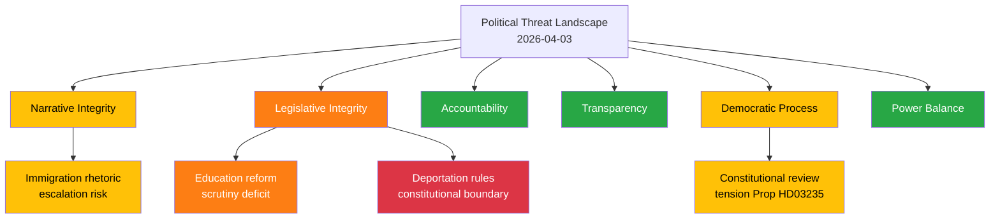

# Threat Analysis — 2026-04-03

**Threat Analysis ID**: THR-2026-04-03-001
**Date**: 2026-04-03
**Riksmöte**: 2025/26
**Produced By**: AI Evening Analysis Agent (Claude Opus 4.6)
**Overall Threat Level**: 🟡 MEDIUM

## 🎭 Threat Taxonomy Network

## Threat Assessment by Category

| Category | Active | Severity (1-5) | Description | Evidence |
|----------|--------|----------------|-------------|----------|
| Narrative Integrity (NI) | Yes | 2/5 | Competing immigration narratives between government security framing and opposition rights framing | Prop HD03235, opposition motions, debate tensions |
| Legislative Integrity (LI) | Yes | 3/5 | 7+ education propositions risk insufficient committee scrutiny; deportation rules testing constitutional limits | Prop 193-197, HD03235, UbU capacity |
| Accountability (AC) | No | 1/5 | Normal parliamentary oversight functioning; Riksrevisionen reports being processed (KU31) | HD01KU31 minority language audit |
| Transparency (TR) | No | 1/5 | Active government press release activity (12 releases Apr 2); SOU published | 12 press releases, SOU 2026:25 |
| Democratic Process (DP) | Yes | 2/5 | Stricter deportation rules may face Lagrådet constitutional review | Prop HD03235, proportionality questions |
| Power Balance (PB) | No | 1/5 | Coalition stable; SD support agreement intact; opposition filing appropriate counter-motions | Voting data AU10, motion activity |

## Threat Actor Mapping

| Actor | Role | Motivation | Capability | Evidence |
|-------|------|-----------|------------|----------|
| Government (M+KD+L) | Policy driver | Pre-election security narrative | High — majority with SD | Props HD03235, HD03228, HD03214 |
| SD | Kingmaker | Immigration enforcement maximization | High — parliamentary support essential | Prop HD03235 alignment |
| S (opposition) | Challenger | Alternative governance credibility | Medium — active motion filing | HD024008-HD024026, Ygeman, Damberg |
| Lagrådet | Constitutional arbiter | Rule of law | High — can delay/reject | Prop HD03235 review potential |

## Escalation Decision

| Condition | Action |
|-----------|--------|
| If Lagrådet raises concerns on HD03235 | Escalate to 🔴 CRITICAL — constitutional confrontation risk |
| If UbU formally requests extension | Elevate LI to 4/5 — legislative scrutiny threat |
| If SD issues immigration ultimatum | Escalate PB to 3/5 — coalition stability threat |

## 📂 MCP Data Files Used

| MCP Tool | Threat Category | Items |
|----------|----------------|-------|
| get_propositioner | LI, DP | 10 |
| get_betankanden | AC, LI | 20 |
| search_anforanden | NI, PB | 50 |
| search_regering | TR | 18 |
