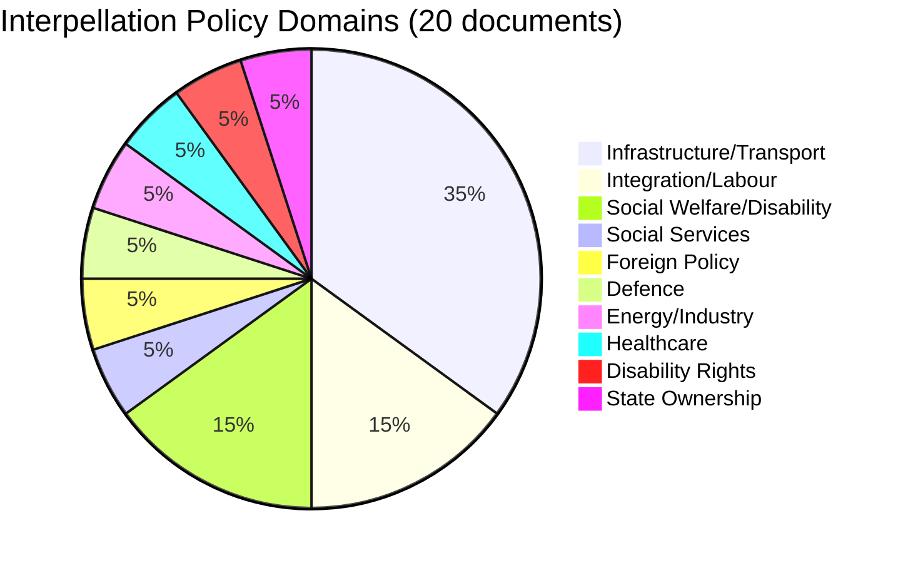
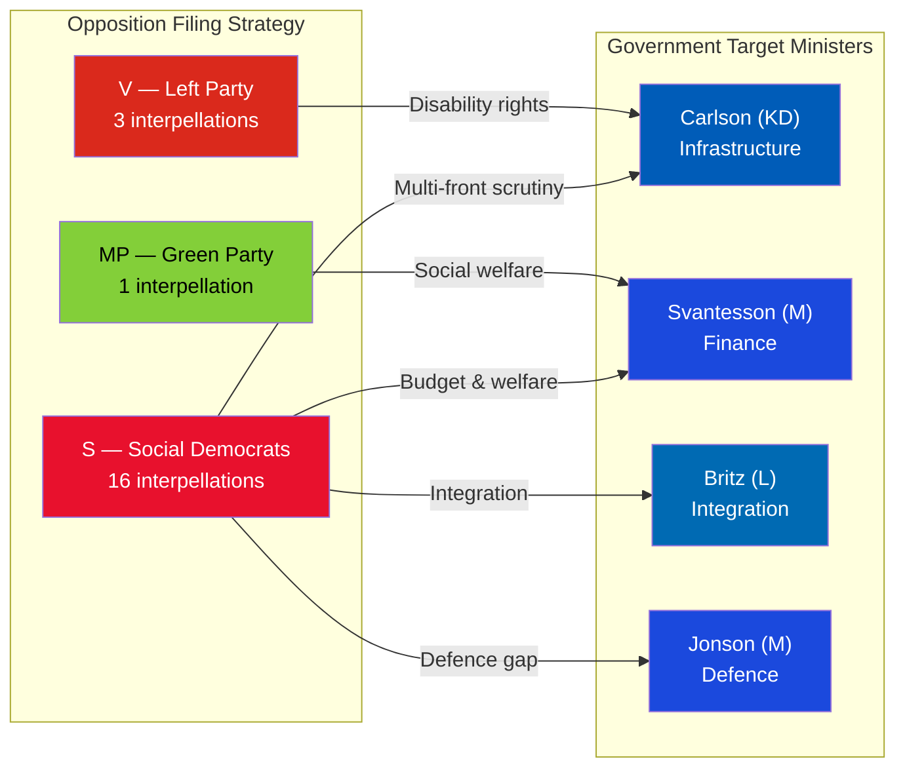

# Political Classification Results — 2026-04-02

**Generated**: 2026-04-02 07:28 UTC | **Enhanced**: 2026-04-02 (AI deep analysis)
**Data Sources**: riksdag-regering-mcp get_interpellationer (rm=2025/26)
**Documents Analyzed**: 20
**Confidence**: MEDIUM
**Riksmöte**: 2025/26

## Summary

Classified **20** parliamentary interpellations by policy domain, target minister, and significance.

## Domain Classification

| Domain | Count | Key Interpellations | Target Ministers |
|--------|-------|--------------------|--------------------|
| Infrastructure/Transport | 7 | HD10412, HD10413, HD10417, HD10418, HD10424, HD10425, HD10428 | Carlson (KD) |
| Integration/Labour | 3 | HD10420, HD10421, HD10422 | Svantesson (M), Britz (L), Strömmer (M) |
| Social Welfare/Disability | 3 | HD10409, HD10411, HD10416 | Waltersson Grönvall (M), Svantesson (M) |
| Social Services | 1 | HD10423 | Slottner (KD) |
| Foreign Policy | 1 | HD10426 | Malmer Stenergard (M) |
| Defence | 1 | HD10419 | Jonson (M) |
| Energy/Industry | 1 | HD10414 | Busch (KD) |
| Healthcare | 1 | HD10415 | Lann (KD) |
| Disability Rights | 1 | HD10412 | Carlson (KD) |
| State Ownership | 1 | HD10427 | Svantesson (M) |

## Filing Party Classification

| Party | Count | Lead MPs | Strategy Pattern |
|-------|-------|---------|------------------|
| S (Social Democrats) | 16 | Redar (3), Dahlqvist (2), From (2), Hultqvist (1) | Multi-front scrutiny campaign |
| V (Left Party) | 3 | Awad (3) | Disability rights focus |
| MP (Green Party) | 1 | Seye Larsen (1) | Social welfare spotlight |

## 📊 Domain Distribution Diagram

## Data Quality Notes

Classification confidence: MEDIUM [MEDIUM]. Based on full-text (5) and metadata/summary (15) analysis. Domain assignments validated against riksdag-regering-mcp interpellation metadata. Filing party analysis cross-referenced with MP profiles.
