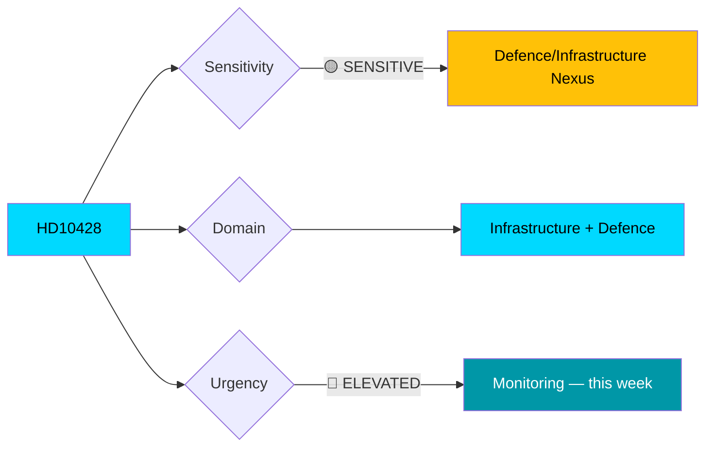

# Document Analysis: Beredskapsflygplats Scandinavian Mountain Airport

**Generated**: 2026-04-03 07:30 UTC
**dok_id**: HD10428
**Document Type**: interpellations
**Date**: 2026-04-02
**Author**: Peter Hultqvist (S)
**Party**: S
**Target Minister**: Andreas Carlson (KD) — Infrastructure and Housing
**Riksmöte**: 2025/26
**Significance**: 🟡 Medium (5/10)
**Confidence**: MEDIUM (65%)
**frs ID**: frs 2025/26:428

---

## Executive Summary

Former Defence Minister Peter Hultqvist (S) challenges Infrastructure Minister Andreas Carlson (KD) on Trafikverket's rejection of Scandinavian Mountain Airport in Malung-Sälen as an emergency preparedness airfield. The interpellation intersects defence readiness with regional economic development, as the airport serves both a major tourism region and potential military logistics. **[MEDIUM confidence]**

---

## Political Classification

| Field | Value |
|-------|-------|
| **Sensitivity** | 🟡 SENSITIVE — Defence/infrastructure nexus |
| **Domain** | Infrastructure, Defence Preparedness |
| **Urgency** | 🔵 ELEVATED — Part of pattern targeting Carlson (KD) |
| **Political Temperature** | Moderate — regional + national implications |

---

## SWOT Analysis

### Government (Coalition)

| # | Type | Statement | Evidence | Confidence |
|---|------|-----------|----------|------------|
| 1 | Weakness | Carlson (KD) faces 7th interpellation this week — capacity strain | HD10428 is 7th of 7 targeting Carlson in 8 days | HIGH |
| 2 | Weakness | Trafikverket's rejection contradicts government's defence expansion rhetoric | frs 2025/26:428 — Hultqvist citing defence readiness gap | MEDIUM |
| 3 | Opportunity | Could frame as Trafikverket operational independence (not political decision) | Standard ministerial deflection pattern | MEDIUM |

### Opposition

| # | Type | Statement | Evidence | Confidence |
|---|------|-----------|----------|------------|
| 1 | Strength | Hultqvist's credibility as former Defence Minister gives this weight | Peter Hultqvist served as Defence Minister 2014-2022 | HIGH |
| 2 | Strength | Links to broader S narrative about government neglect of regional Sweden | Pattern: HD10424, HD10410, HD10417 all target regional transport cuts | HIGH |
| 3 | Opportunity | Defence-tourism dual framing appeals to both security hawks and regional interests | Malung-Sälen area described as "strong and extensive tourism" | MEDIUM |

---

## Risk Assessment

| Risk | Likelihood (1-5) | Impact (1-5) | L×I | Level |
|------|------------------|--------------|-----|-------|
| Emergency preparedness gap in northern Sweden | 3 | 3 | **9** | 🟡 MEDIUM |
| Tourism-dependent region loses air connectivity | 3 | 2 | **6** | 🟢 LOW |
| Pattern of Trafikverket overruling defence needs | 2 | 4 | **8** | 🟡 MEDIUM |

---

## Stakeholder Impact

| Stakeholder | Impact | Evidence |
|-------------|--------|----------|
| **Citizens** (Malung-Sälen) | Regional accessibility at risk | Airport serves tourism area |
| **Government Coalition** | Additional pressure on Carlson (KD) | 7th interpellation in 8 days |
| **Opposition** | Narrative building — regional neglect | Hultqvist's defence credibility |
| **Business/Industry** | Tourism sector connectivity | "Stark och omfattande turism" |
| **Defence/Security** | Emergency preparedness gap | Trafikverket rejected defence use |

---

## Cross-Document References

- **HD10424** (Flyglinjen Torsby/Hagfors–Arlanda) — Same pattern: Trafikverket cutting regional air routes
- **HD10425** (Defence infrastructure costs) — Same theme: Trafikverket vs defence needs
- **HD10419** (Södertälje motorway bridge) — Infrastructure as defence vulnerability

---

## Forward Indicators

1. 🔍 **Watch**: Carlson's response to this interpellation (due ~April 27) — will he defer to Trafikverket or intervene?
2. 🔍 **Watch**: Trafikverket's Q2 2026 decision on regional aviation routes — affects multiple interpellations
3. 🔍 **Watch**: S election campaign framing of "defence neglect" narrative using Hultqvist's authority

---

## Data Quality Notes

- **Analysis confidence**: MEDIUM (65%)
- **Full-text content**: Metadata-based analysis (summary available)
- **Data sources**: get_interpellationer
- **Cross-references**: 3 related documents identified
- **Named actors**: Peter Hultqvist (S), Andreas Carlson (KD), Trafikverket
