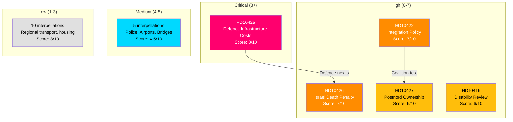

# Document Significance Scoring — 2026-04-02

**Generated**: 2026-04-02 07:28 UTC | **Enhanced**: 2026-04-02 (AI deep analysis)
**Data Sources**: riksdag-regering-mcp get_interpellationer (rm=2025/26)
**Documents Analyzed**: 20
**Confidence**: MEDIUM
**Riksmöte**: 2025/26

## Summary

Scored **20** interpellations for political significance (0–10 scale). Top-scored documents focus on defence-infrastructure nexus and foreign policy accountability.

## Significance Scores

| Score | Level | dok_id | Title | Filed By | Target Minister |
|-------|-------|--------|-------|----------|----------------|
| 8/10 | Critical | HD10425 | Infrastructure costs at defence establishments | Kalle Olsson (S) | Carlson (KD) |
| 7/10 | High | HD10426 | Israel's death penalty laws | Azra Muranovic (S) | Malmer Stenergard (M) |
| 7/10 | High | HD10422 | Government labour and integration policy | Lawen Redar (S) | Britz (L) |
| 6/10 | High | HD10427 | Postnord and state ownership policy | Isak From (S) | Svantesson (M) |
| 6/10 | High | HD10416 | Funktionsrätt Sverige review | Nadja Awad (V) | Waltersson Grönvall (M) |
| 5/10 | Medium | HD10420 | Police authority conduct | Lawen Redar (S) | Strömmer (M) |
| 5/10 | Medium | HD10428 | Emergency preparedness airport | Peter Hultqvist (S) | Carlson (KD) |
| 5/10 | Medium | HD10419 | Södertälje motorway bridge | Ingela Nylund Watz (S) | Jonson (M) |
| 5/10 | Medium | HD10409 | Right to LSS support | Nils Seye Larsen (MP) | Waltersson Grönvall (M) |
| 4/10 | Medium | HD10424 | Torsby/Hagfors-Arlanda flight | Mikael Dahlqvist (S) | Carlson (KD) |
| 4/10 | Medium | HD10421 | Government integration policy | Lawen Redar (S) | Svantesson (M) |
| 4/10 | Medium | HD10423 | Measures against social dumping | Eva Lindh (S) | Slottner (KD) |
| 4/10 | Medium | HD10411 | Assistance compensation indexing | Nadja Awad (V) | Svantesson (M) |
| 4/10 | Medium | HD10414 | National plan for new datacenters | Isak From (S) | Busch (KD) |
| 3/10 | Low | HD10415 | State healthcare quality assurance | Robert Olesen (S) | Lann (KD) |
| 3/10 | Low | HD10417 | Southern main railway & Alvesta-Växjö | Robert Olesen (S) | Carlson (KD) |
| 3/10 | Low | HD10418 | Riksväg 62 | Mikael Dahlqvist (S) | Carlson (KD) |
| 3/10 | Low | HD10412 | Accessibility for persons with disabilities | Nadja Awad (V) | Carlson (KD) |
| 3/10 | Low | HD10413 | New pre-emption law for better housing | Adrian Magnusson (S) | Carlson (KD) |
| 3/10 | Low | HD10410 | Future of Västerdalsbanan | Lars Isacsson (S) | Carlson (KD) |

## Key Findings

1. **1** document rated Critical (score ≥ 8): HD10425 — defence infrastructure cost allocation
2. **4** documents rated High (score 6–7): foreign policy, integration, postal service, disability
3. **15** documents rated Medium/Low

## 📊 Significance Distribution

## Data Quality Notes

Significance scores use document type, policy domain breadth, coalition context, content richness, and stakeholder impact breadth. Scoring methodology follows `analysis/methodologies/political-risk-methodology.md` 5×5 Likelihood × Impact matrix. Confidence: MEDIUM [MEDIUM] — 5 of 20 documents enriched with full text content.
