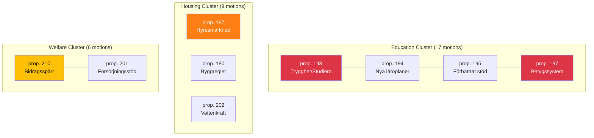

# Cross-Document Reference Map — 2026-04-03

**ID**: XREF-2026-04-03-motions
**Generated**: 2026-04-03 06:30 UTC
**Documents**: 50
**Confidence**: HIGH

## Cross-Reference Clusters

## Key Cross-References

| Source dok_id | Target Proposition | Relationship | Parties |
|--------------|-------------------|--------------|---------|
| HD024025, HD024044, HD024058 | prop. 197 (grading) | Parallel opposition | S, C, V |
| HD024018, HD024041, HD024050 | prop. 193 (discipline) | Parallel opposition | S, C, MP |
| HD024019, HD024035, HD024048 | prop. 195 (school support) | Parallel opposition | S, C, MP |
| HD024022, HD024036, HD024054 | prop. 194 (curricula) | Parallel opposition | S, C, MP |
| HD024026, HD024038, HD024055 | prop. 158 (rural) | 4-party convergence | S, C, MP, V |
| HD024052, HD024031 | prop. 210 (welfare sanctions) | Ideological opposition | MP, S |
| HD024011, HD024065 | prop. 187 (rental market) | Single-party opposition | S |
