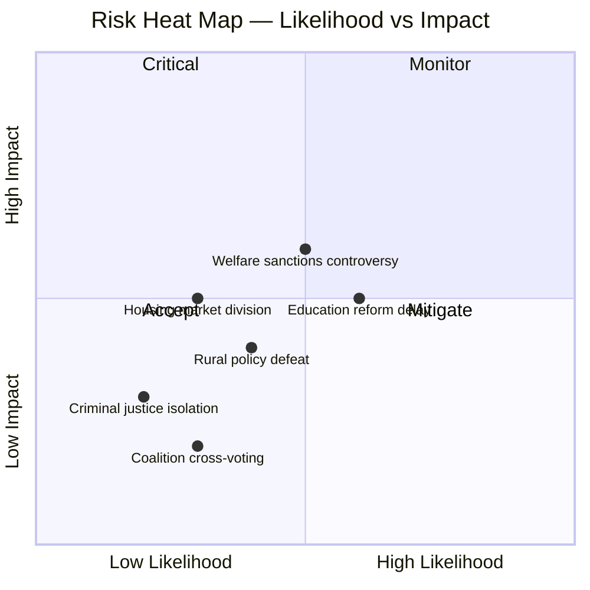
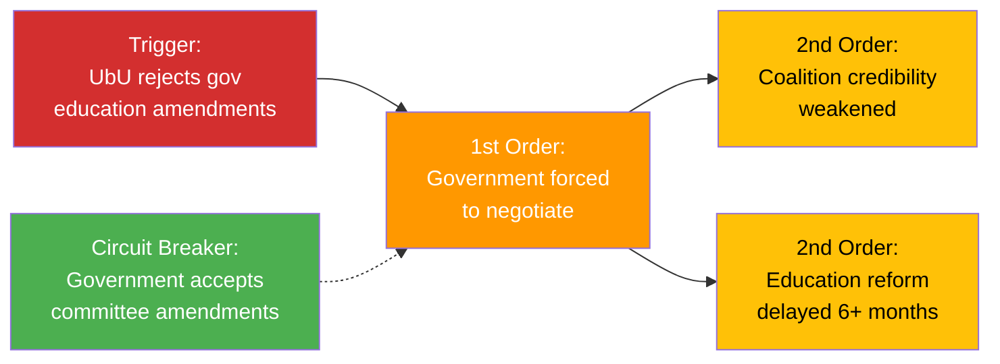

# Political Risk Assessment — 2026-04-03

**ID**: RISK-2026-04-03-motions
**Generated**: 2026-04-03 06:30 UTC
**Analysis Period**: 2026-04-01
**Workflow**: news-motions
**Political Context**: Kristersson (M) minority government with SD, KD, L support. 50 opposition motions filed on April 1.
**Riksmöte**: 2025/26
**Overall Risk Level**: LOW-MEDIUM
**Confidence**: HIGH

## 🗂️ Risk Inventory

| # | Risk | L (1-5) | I (1-5) | Score | Tier | Evidence |
|---|------|---------|---------|-------|------|----------|
| R1 | Education reform implementation delay due to broad opposition | 3 | 3 | 9 | 🟡 MEDIUM | 17 motions in UbU from S, C, MP on prop. 193-197 |
| R2 | Welfare sanctions (prop. 210) becomes electoral liability | 3 | 3 | 9 | 🟡 MEDIUM | HD024052 (MP rejects entirely), HD024031 (S opposes) |
| R3 | Rural policy (prop. 158) faces potential opposition majority | 2 | 3 | 6 | 🟡 MEDIUM | HD024026 (S), HD024038 (C), HD024055 (MP) — 4-party convergence |
| R4 | Housing market deregulation creates tenant backlash | 2 | 3 | 6 | 🟡 MEDIUM | HD024011 (S) opposes deposit requirements in prop. 187 |
| R5 | Criminal sentencing reform faces V opposition but passes | 2 | 2 | 4 | 🟢 LOW | HD024062 (V) alone opposes prop. 181 |
| R6 | Coalition internal stress from multi-front defense | 2 | 2 | 4 | 🟢 LOW | 15+ propositions defended simultaneously |

## 🤝 Coalition Stability Risk

| Factor | Assessment | Score |
|--------|-----------|-------|
| Internal disagreements | Low — KD-M alignment 88.5%, L-M 87.9% | 2/10 |
| Budget pressure | Low — no major fiscal motions | 2/10 |
| SD threshold | Stable — SD tolerance agreement holds | 3/10 |
| 90-day collapse probability | <5% [HIGH confidence] | — |

## 📋 Policy Implementation Risk

| Policy | Ministry | Stage | Risk | Blocking Factor |
|--------|----------|-------|------|----------------|
| Education overhaul (prop. 193-197) | Utbildningsdep. | Committee | 🟡 MEDIUM | 3-party opposition in UbU |
| Benefit sanctions (prop. 210) | Socialdep. | Committee | 🟡 MEDIUM | MP total rejection + S opposition |
| Flexible rental market (prop. 187) | Justitiedep. | Committee | 🟡 MEDIUM | S tenant protection concerns |
| Rural development (prop. 158) | Näringsdep. | Committee | 🟡 MEDIUM | 4-party opposition convergence |
| Criminal justice (prop. 181, 185) | Justitiedep. | Committee | 🟢 LOW | Only V opposes |

## 🔗 Section 5: Cascading Risk Chain

## 🌐 Section 6: Risk Interconnection Map

| Connection | Direction | Evidence | Impact |
|-----------|-----------|----------|--------|
| Education→Electoral | If reforms fail, government loses key campaign promise | prop. 193-197 represent major education agenda | MEDIUM |
| Welfare→Electoral | Benefit sanctions could energize left-wing voters | HD024052 frames as ideological battle | MEDIUM |
| Rural→Coalition | SD voters in rural areas may react to opposition success | prop. 158 affects SD-aligned constituencies | LOW |

## 🔮 Section 7: Forward Indicators & Scenario Outlook

| Scenario | Probability | Trigger | Risk Elements |
|----------|------------|---------|---------------|
| Government accepts minor education amendments | 40% | UbU committee recommends changes May 2026 | R1 reduced |
| Rural policy amendment passes with opposition support | 25% | C+S+MP+V form majority in NU | R3 escalated |
| Welfare sanctions pass unchanged on SD tolerance | 55% | SfU committee report supports government | R2 reduced |

## 📂 MCP Data Files Used

| Path | Tool | Type | Freshness |
|------|------|------|-----------|
| get_motioner(rm=2025/26) | riksdag-regering | API | Live |
| CIA coalition metrics | pre-article-analysis | Cached | Current |
| 50× documents/*.json | Downloaded | Cached | 2026-04-01 |
