# Stakeholder Perspective Analysis — 2026-04-03

**ID**: STKH-2026-04-03-motions
**Generated**: 2026-04-03 06:30 UTC
**Documents Analyzed**: 50
**Analysis Lenses**: 8
**Confidence**: HIGH

## Stakeholder Impact Matrix

```mermaid
flowchart LR
    subgraph Stakeholders["8 Stakeholder Groups"]
        CIT["👥 Citizens<br/>Impact: HIGH"]
        GOV["🏛️ Government Coalition<br/>Impact: MEDIUM"]
        OPP["⚔️ Opposition Bloc<br/>Impact: HIGH"]
        BIZ["💼 Business/Industry<br/>Impact: LOW"]
        CIV["🤝 Civil Society<br/>Impact: MEDIUM"]
        INT["🌐 International/EU<br/>Impact: LOW"]
        JUD["⚖️ Judiciary/Constitutional<br/>Impact: LOW"]
        MED["📰 Media/Public Opinion<br/>Impact: MEDIUM"]
    end
    style CIT fill:#D32F2F,color:#FFFFFF
    style GOV fill:#FF9800,color:#FFFFFF
    style OPP fill:#D32F2F,color:#FFFFFF
    style BIZ fill:#4CAF50,color:#FFFFFF
    style CIV fill:#FFC107,color:#000000
    style INT fill:#4CAF50,color:#FFFFFF
    style JUD fill:#4CAF50,color:#FFFFFF
    style MED fill:#FFC107,color:#000000
```

### 1. Citizens
- **Impact**: HIGH — Education reform (prop. 193-197) directly affects students, parents, teachers
- **Key concerns**: Grading system changes (prop. 197), school discipline (prop. 193), rental deposits (prop. 187)
- **Evidence**: HD024025 (S) warns new grading may increase school dropout [MEDIUM confidence]

### 2. Government Coalition (M, KD, L + SD tolerance)
- **Impact**: MEDIUM — Must defend 15+ propositions across 8 committees simultaneously
- **Key concerns**: Multi-front opposition pressure, especially on education and welfare
- **Evidence**: 50 motions in single day signal coordinated opposition strategy [HIGH confidence]

### 3. Opposition Bloc (S, MP, C, V)
- **Impact**: HIGH — Education provides strongest coordination platform
- **Key concerns**: Fragmentation across 11 committees dilutes impact
- **Evidence**: MP leads with 20 motions, S with 13, C with 12, V with 3 [HIGH confidence]

### 4. Business/Industry
- **Impact**: LOW — Procurement (prop. 177), fund market (prop. 186), competition (prop. 203) are technical
- **Key concerns**: Leverantörskontroll simplification (HD024014)
- **Evidence**: S motions seek stricter procurement controls [MEDIUM confidence]

### 5. Civil Society
- **Impact**: MEDIUM — Welfare sanctions (prop. 210) and social services reform (prop. 201) affect vulnerable groups
- **Key concerns**: Bidragsspärr (benefit lock) could harm social security recipients
- **Evidence**: HD024052 (MP) rejects entire benefit sanctions proposition [HIGH confidence]

### 6. International/EU
- **Impact**: LOW — Only Nordic cooperation (skr. 90) addressed
- **Key concerns**: C motion (HD024039) on strengthening Nordic parliamentary cooperation
- **Evidence**: Single motion in UU committee [HIGH confidence]

### 7. Judiciary/Constitutional
- **Impact**: LOW — Criminal justice motions (prop. 181, 185) are policy-focused, not constitutional
- **Key concerns**: V challenges sentencing severity (HD024062) and prison outsourcing (HD024063)
- **Evidence**: Only V raises fundamental rights concerns [MEDIUM confidence]

### 8. Media/Public Opinion
- **Impact**: MEDIUM — Education debate likely dominates news coverage
- **Key concerns**: School discipline, mobile bans, grading reform generate public interest
- **Evidence**: Prop. 193 (trygghet/studiero) attracts S, C, MP motions (HD024018, HD024041, HD024050) [HIGH confidence]
