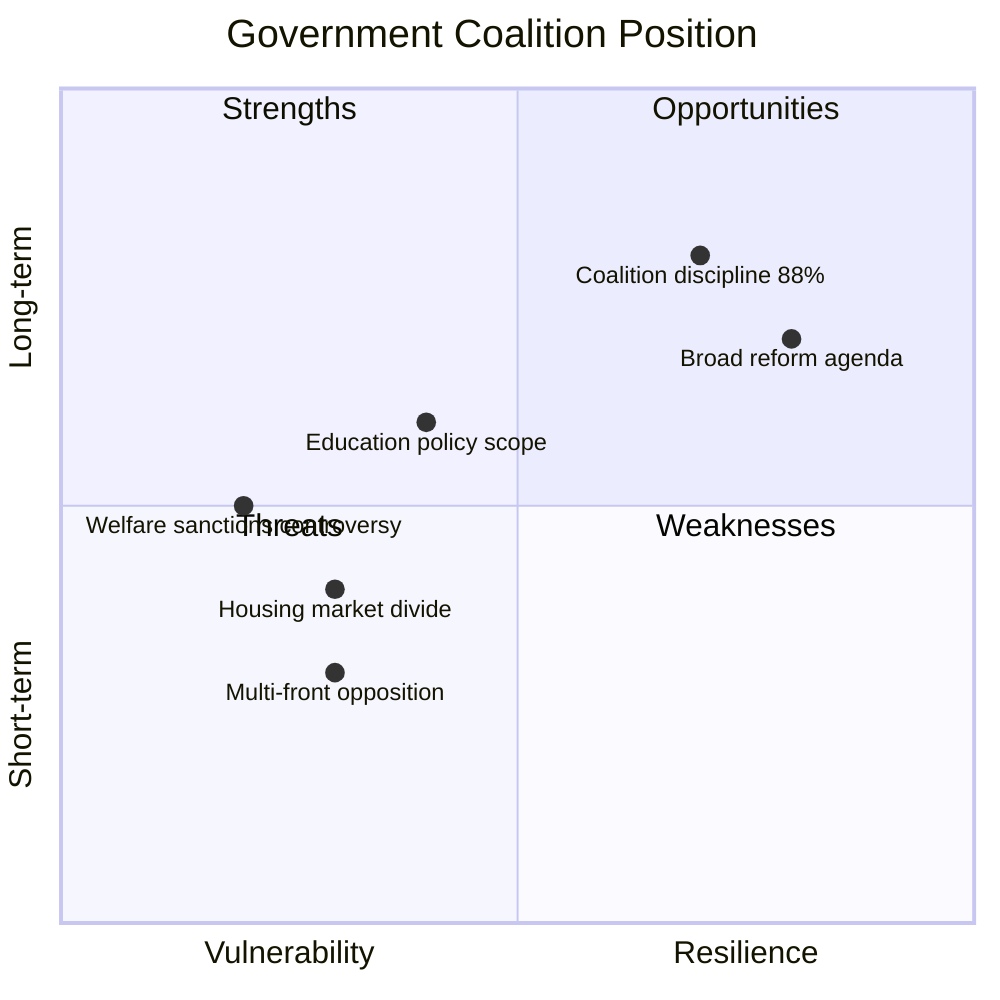
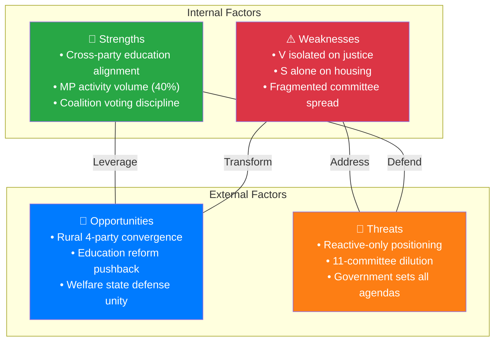

# Political SWOT Analysis — 2026-04-03

**ID**: SWOT-2026-04-03-motions
**Generated**: 2026-04-03 06:30 UTC
**Scope**: Opposition motions filed 2026-04-01
**Reference Period**: Riksmöte 2025/26
**Workflow**: news-motions
**MCP Sources**: riksdag-regering (get_motioner, get_sync_status)
**Documents Analyzed**: 50
**Confidence**: HIGH
**Validity Window**: 30 days

## 🏛️ Section 1: Government Coalition SWOT

### Strengths

| # | Statement | Evidence (dok_id) | Confidence | Impact | Entry Date |
|---|-----------|-------------------|------------|--------|------------|
| S1 | Government advancing 15+ major propositions simultaneously across 8 committees | prop. 2025/26:187, 193, 194, 195, 197, 210, 224 | [HIGH] | HIGH | 2026-04-01 |
| S2 | Coalition voting discipline strong at 88% KD-M alignment | CIA coalition metrics, risk-assessment anomaly flags | [HIGH] | MEDIUM | 2026-04-01 |
| S3 | Opposition fragmented — no single party filed >40% of motions across all committees | HD024011-HD024066 party distribution: MP 20, S 13, C 12, V 3 | [HIGH] | MEDIUM | 2026-04-01 |

### Weaknesses

| # | Statement | Evidence (dok_id) | Confidence | Impact | Entry Date |
|---|-----------|-------------------|------------|--------|------------|
| W1 | Education reform faces cross-party opposition from S, C, and MP on 6 propositions | HD024025 (S), HD024044 (C), HD024054 (MP) all on prop. 197 | [HIGH] | HIGH | 2026-04-01 |
| W2 | Housing market deregulation (prop. 187) provokes S opposition on tenant protection | HD024011 (S), HD024065 on prop. 187 rental deposit limits | [MEDIUM] | MEDIUM | 2026-04-01 |

### Opportunities

| # | Statement | Evidence (dok_id) | Confidence | Impact | Entry Date |
|---|-----------|-------------------|------------|--------|------------|
| O1 | Opposition motions are reactive (responding to propositions) not proactive — government sets agenda | All 50 motions reference "med anledning av prop/skr" | [HIGH] | HIGH | 2026-04-01 |
| O2 | Criminal justice reforms face minimal opposition (only V) | HD024062 (V) alone on prop. 181, HD024063 (V) on prop. 185 | [HIGH] | MEDIUM | 2026-04-01 |

### Threats

| # | Statement | Evidence (dok_id) | Confidence | Impact | Entry Date |
|---|-----------|-------------------|------------|--------|------------|
| T1 | Rural policy (prop. 158) faces 4-party opposition — rare convergence | HD024026 (S), HD024038 (C), HD024055 (MP), HD024037 (V via NU) | [HIGH] | HIGH | 2026-04-01 |
| T2 | Welfare sanctions (prop. 210) faces principled opposition from MP+V+S on ideological grounds | HD024052 (MP rejects entirely), HD024031 (S), HD024028 (SoU) | [MEDIUM] | MEDIUM | 2026-04-01 |

## 🏛️ Section 2: Main Opposition SWOT (S+MP+C+V)

### Strengths

| # | Statement | Evidence (dok_id) | Confidence | Impact | Entry Date |
|---|-----------|-------------------|------------|--------|------------|
| S1 | Education: unprecedented 3-party parallel motion filing on same propositions | S: HD024025, C: HD024044, MP: HD024054 all on prop. 197 (grading) | [HIGH] | HIGH | 2026-04-01 |
| S2 | MP most active (20 motions, 40%) covering education, welfare, environment, culture | HD024050-054 (MP education), HD024052 (MP welfare), HD024030 (MJU) | [HIGH] | MEDIUM | 2026-04-01 |

### Weaknesses

| # | Statement | Evidence (dok_id) | Confidence | Impact | Entry Date |
|---|-----------|-------------------|------------|--------|------------|
| W1 | V isolated on criminal justice — no other opposition party challenged sentencing reform | HD024062, HD024063 (V alone in JuU) | [HIGH] | MEDIUM | 2026-04-01 |
| W2 | No coordinated housing strategy — S acts alone on CU motions | HD024008-011 all S-only in CU | [MEDIUM] | MEDIUM | 2026-04-01 |

### Opportunities

| # | Statement | Evidence (dok_id) | Confidence | Impact | Entry Date |
|---|-----------|-------------------|------------|--------|------------|
| O1 | Rural policy convergence could form opposition majority | HD024026 (S), HD024038 (C), HD024055 (MP) all on prop. 158 | [HIGH] | HIGH | 2026-04-01 |
| O2 | Social welfare defense unites ideological spectrum from MP to V | HD024052 (MP), HD024031 (S), HD024028 (SoU welfare) | [MEDIUM] | MEDIUM | 2026-04-01 |

### Threats

| # | Statement | Evidence (dok_id) | Confidence | Impact | Entry Date |
|---|-----------|-------------------|------------|--------|------------|
| T1 | Opposition is purely reactive — all motions respond to government propositions | 50/50 motions begin "med anledning av prop/skr" | [HIGH] | MEDIUM | 2026-04-01 |
| T2 | Fragmentation across 11 committees dilutes opposition focus | UbU:17, CU:9, FiU:5, NU:5, SoU:4, MJU:2, SfU:2, JuU:2, UU:1, KrU:1 | [HIGH] | MEDIUM | 2026-04-01 |

## 🏛️ Section 3: Policy Domain SWOT — Education (UbU)

### Strengths

| # | Statement | Evidence (dok_id) | Confidence | Impact | Entry Date |
|---|-----------|-------------------|------------|--------|------------|
| S1 | 17 motions across 6 propositions show depth of engagement | HD024018-025, HD024033-036, HD024041, HD024044, HD024048-050, HD024054, HD024056, HD024058, HD024066 | [HIGH] | HIGH | 2026-04-01 |

### Weaknesses

| # | Statement | Evidence (dok_id) | Confidence | Impact | Entry Date |
|---|-----------|-------------------|------------|--------|------------|
| W1 | Different parties have different objections — no unified counter-proposal | S wants equity (HD024025), C wants testing (HD024035), MP wants breadth (HD024054) | [HIGH] | MEDIUM | 2026-04-01 |

### Opportunities

| # | Statement | Evidence (dok_id) | Confidence | Impact | Entry Date |
|---|-----------|-------------------|------------|--------|------------|
| O1 | Grading reform (prop. 197) unites 3 parties in committee | HD024025 (S), HD024044 (C), HD024058 (V) all in UbU | [HIGH] | HIGH | 2026-04-01 |

### Threats

| # | Statement | Evidence (dok_id) | Confidence | Impact | Entry Date |
|---|-----------|-------------------|------------|--------|------------|
| T1 | Government's reform momentum — 6 education propositions at once overwhelms opposition focus | prop. 191, 192, 193, 194, 195, 196, 197 | [HIGH] | MEDIUM | 2026-04-01 |

## 📊 SWOT Quadrant Mapping

## 🔄 Section 5: Cross-SWOT Interference

| Pair | Gov Element | Opp Element | Interaction | Effect |
|------|------------|-------------|-------------|--------|
| 1 | Gov-S1 (broad agenda) | Opp-T2 (fragmentation) | Gov's multi-front strategy directly causes opposition fragmentation across 11 committees | Amplifying — benefits government |
| 2 | Gov-W1 (education opposition) | Opp-S1 (3-party education) | Opposition education coordination directly exploits government's most vulnerable policy front | Counteracting — benefits opposition |
| 3 | Gov-O2 (justice unopposed) | Opp-W1 (V isolated) | V's isolation on justice means government faces no meaningful criminal justice resistance | Amplifying — benefits government |

## 📊 Section 6: TOWS Strategic Options

| Type | Strategy | Action | Evidence |
|------|----------|--------|----------|
| **SO** (Strengths→Opportunities) | Leverage education coordination for broader opposition platform | S, C, MP form joint education committee strategy | HD024025+HD024044+HD024054 parallel filings |
| **WO** (Weaknesses→Opportunities) | Extend rural convergence model to other policy areas | Use prop. 158 coalition as template | HD024026+HD024038+HD024055 4-party convergence |
| **ST** (Strengths→Threats) | Use education mass to force government concessions | Committee amendments on grading + school support | 17 motions in UbU create committee workload pressure |
| **WT** (Weaknesses→Threats) | Address fragmentation by prioritizing top 3 policy fronts | Focus on education, welfare, housing | Current 11-committee spread is unsustainable |

## 🔮 Section 7: Forward Indicators & Scenario Outlook

| Scenario | Probability | Trigger | Key SWOT Elements |
|----------|------------|---------|-------------------|
| Education compromise — government amends 1-2 propositions | 35% | UbU recommends amendments in committee report | Gov-W1, Opp-S1, Opp-O1 |
| Opposition forms rural policy majority | 25% | C+S+MP+V vote together on prop. 158 amendments | Opp-O1, Gov-T1 |
| Welfare sanctions pass unchanged | 55% | Government relies on SD tolerance vote | Gov-S2, Opp-W-welfare |

## 📂 MCP Data Files Used

| Path | Tool | Type | Freshness |
|------|------|------|-----------|
| get_motioner(rm=2025/26, limit=20) | riksdag-regering | API | Live |
| 50× documents/*.json | pre-article-analysis | Downloaded | 2026-04-01 |

### SWOT Quadrant Data Provenance

| Quadrant | Evidence Sources | dok_ids |
|----------|-----------------|---------|
| Gov Strengths | Motion count, coalition metrics | All 50 motions, CIA data |
| Gov Weaknesses | Cross-party parallel filings | HD024025, HD024044, HD024054 |
| Opp Strengths | Party activity distribution | HD024050-054, HD024026-038 |
| Opp Threats | Committee spread analysis | All 11 committee mappings |
