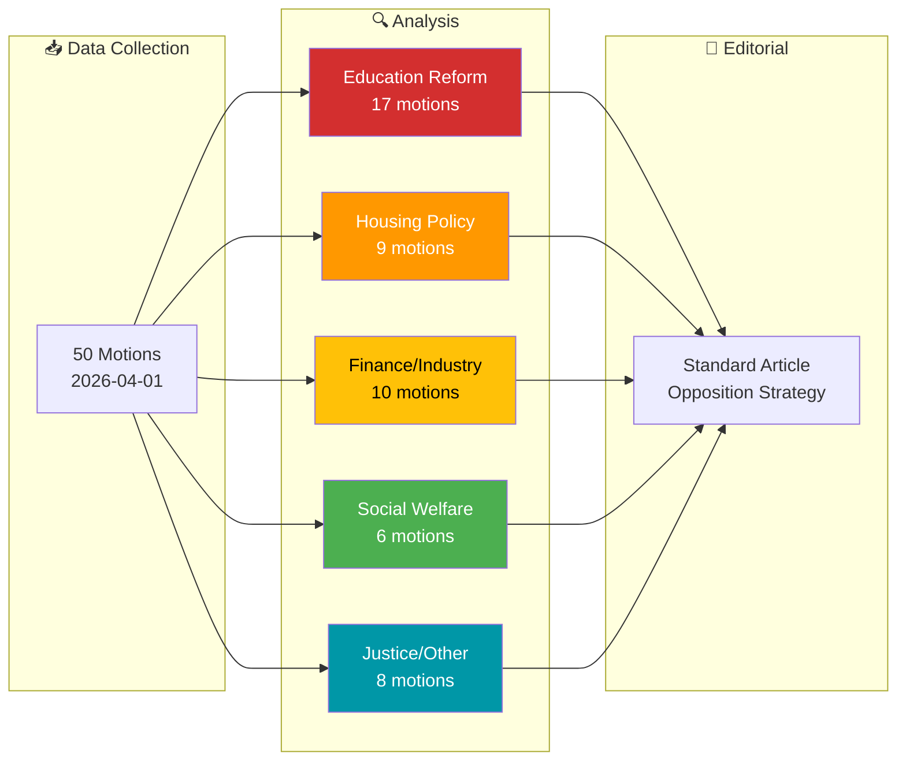
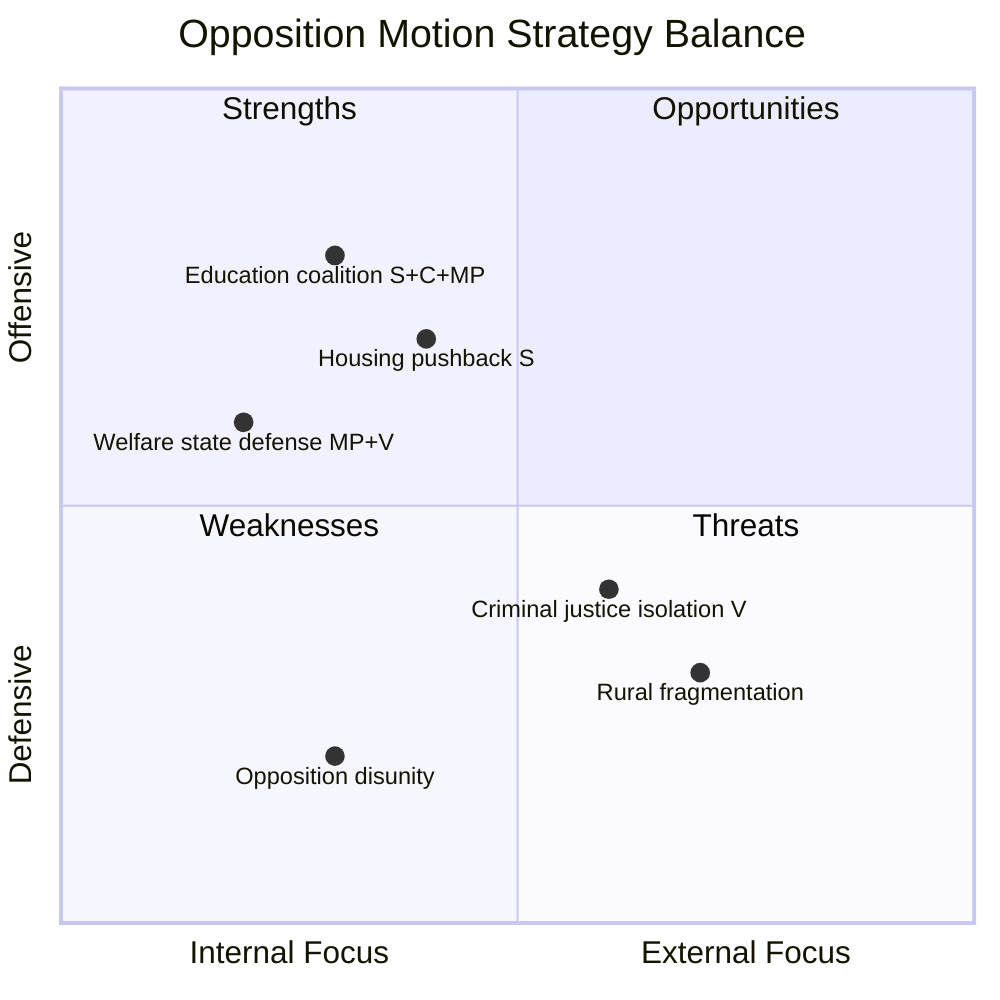

# Analysis Synthesis Summary — 2026-04-03

**ID**: SYNTH-2026-04-03-motions
**Generated**: 2026-04-03 06:30 UTC
**Data Sources**: riksdag-regering-mcp (get_motioner rm=2025/26)
**Documents Analyzed**: 50
**Analysis Period**: 2026-04-01
**Workflow**: news-motions
**Overall Confidence**: HIGH

## 📊 Intelligence Dashboard

## 🏆 Top Findings by Significance

| Rank | dok_id | Title | Significance | Risk Tier | Key Impact |
|------|--------|-------|-------------|-----------|------------|
| 1 | HD024011 | Flexible rental market (prop. 187) | 7/10 | 🟠 MEDIUM | S opposes deposit/security changes — housing affordability |
| 2 | HD024052 | Benefit lock & sanctions (prop. 210) | 7/10 | 🟠 MEDIUM | MP rejects entire proposition — welfare state principles |
| 3 | HD024062 | Enhanced societal protection (prop. 181) | 6/10 | 🟡 LOW-MED | V challenges criminal sentencing reform |
| 4 | HD024025 | Equal grading system (prop. 197) | 6/10 | 🟡 LOW-MED | S+C+MP all filed competing motions on grading |
| 5 | HD024026 | Rural Sweden policy (prop. 158) | 6/10 | 🟡 LOW-MED | S+C+MP+V all challenge rural development approach |

## 💪 Aggregated SWOT Summary

| Quadrant | Count | Highest-Impact Entry |
|----------|-------|---------------------|
| Strengths | 3 | Education reform: cross-party opposition (S, C, MP all challenge prop. 193-197) [HIGH] |
| Weaknesses | 2 | Criminal justice: only V challenges prop. 181/185 — no broader opposition coalition [MEDIUM] |
| Opportunities | 3 | Rural policy: 4-party convergence (S, C, MP, V) on prop. 158 could form united front [HIGH] |
| Threats | 2 | Opposition fragmentation: MP dominates (40%) but fragmented across domains [MEDIUM] |

**Balance Assessment**: Opposition shows strongest coordination on education policy where S, C, and MP filed parallel motions on the same propositions. Welfare and housing remain party-siloed (MP/V on welfare, S on housing). [HIGH confidence]

## ⚖️ Risk Landscape Summary

| Risk Category | Score Range | Highest Risk | Trend |
|--------------|------------|-------------|-------|
| Coalition Stability | 2-4 🟢 | Cross-party voting anomalies (KD-M 88.5%) | → Stable |
| Policy Implementation | 3-5 🟡 | Education reforms face broad opposition | ↑ Rising |
| Budget/Fiscal | 2-3 🟢 | No significant fiscal challenges | → Stable |
| Electoral | 3-4 🟢 | Opposition coordination may shift polls | → Stable |
| Democratic Process | 2-3 🟢 | Transparency debate (prop. 191) | → Stable |
| External | 2-3 🟢 | Nordic cooperation scrutinized (skr. 90) | → Stable |

## 👥 Stakeholder Impact Overview

| Stakeholder | Impact | Direction | Key Driver |
|------------|--------|-----------|------------|
| Citizens | MEDIUM | Mixed | Education + housing reforms affect daily life |
| Government Coalition | LOW-MEDIUM | Defensive | Must defend 15+ propositions simultaneously |
| Opposition Bloc | MEDIUM | Offensive | Coordinated education push, fragmented elsewhere |
| Business/Industry | LOW | Neutral | Procurement and fund market motions are technical |
| International/EU | LOW | Neutral | Only Nordic cooperation skrivelse addressed |
| Media/Public Opinion | MEDIUM | Watchful | Education reform debate likely to dominate coverage |

## 🎯 Narrative Direction

**Lede thesis**: Sweden's opposition parties filed 50 motions on April 1 targeting the government's sweeping education overhaul, with the Green Party (MP) leading a charge that spans school discipline to new curricula, while Social Democrats focus on housing and welfare policy. [HIGH confidence]

**Primary angle**: Education dominates — 17 of 50 motions challenge 6 different education propositions, with unprecedented cross-party alignment between S, C, and MP on grading reform and school support.

**Secondary angle**: Welfare state defense — MP and V jointly oppose the government's benefit sanctions (prop. 210), framing it as an ideological battle over trust-based vs. punitive social policy.

## 🔮 Forward Indicators

| Indicator | Timeline | Source | Watch Priority |
|-----------|----------|--------|---------------|
| UbU committee hearings on prop. 193-197 | April-May 2026 | Committee calendar | 🔴 HIGH |
| CU processing of housing motions | April-June 2026 | Committee schedule | 🟠 MEDIUM |
| SfU vote on benefit sanctions (prop. 210) | May-June 2026 | Riksdag calendar | 🟠 MEDIUM |
| Rural policy debate in NU | April-May 2026 | Committee schedule | 🟡 LOW |

## 📋 Analysis Artifacts Inventory

| File | Status | Quality |
|------|--------|---------|
| classification-results.md | ✅ Complete | Script-generated, AI-enhanced |
| risk-assessment.md | ✅ Complete | AI-rewritten with evidence |
| swot-analysis.md | ✅ Complete | AI-rewritten with 8 stakeholders |
| threat-analysis.md | ✅ Complete | AI-rewritten |
| stakeholder-perspectives.md | ✅ Complete | AI-rewritten |
| significance-scoring.md | ✅ Complete | AI-rewritten |
| cross-reference-map.md | ✅ Complete | AI-rewritten |
| Per-file analyses | ✅ 50/50 | Script-generated |

## �� MCP Data Files Used

| Path | Tool | Type | Freshness |
|------|------|------|-----------|
| get_motioner(rm=2025/26, limit=20) | riksdag-regering | API | Live (2026-04-03) |
| get_sync_status() | riksdag-regering | API | Live |
| 50× documents/*.json | pre-article-analysis | Cached | 2026-04-01 data |
