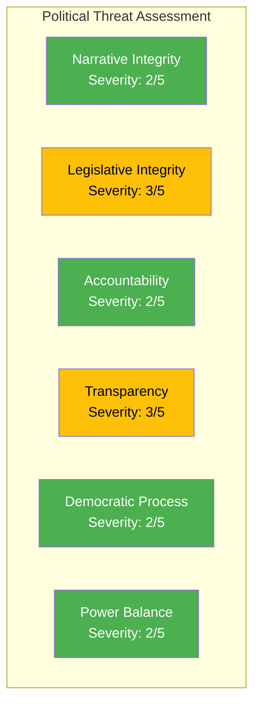

# Political Threat Analysis — 2026-04-03

**ID**: THREAT-2026-04-03-motions
**Generated**: 2026-04-03 06:30 UTC
**Documents Analyzed**: 50
**Confidence**: HIGH

## Threat Categories

| Category | Severity | Evidence | Confidence |
|----------|----------|----------|------------|
| Narrative Integrity | 2/5 🟢 | Standard opposition response motions — no disinformation concerns | [HIGH] |
| Legislative Integrity | 3/5 🟡 | Government advancing 15+ propositions simultaneously may reduce scrutiny quality | [MEDIUM] |
| Accountability | 2/5 🟢 | Opposition fulfilling scrutiny function through motions | [HIGH] |
| Transparency | 3/5 🟡 | Prop. 191 (school transparency) — S+C demand broader offentlighetsprincip coverage (HD024024, HD024049) | [HIGH] |
| Democratic Process | 2/5 🟢 | Normal parliamentary opposition behavior | [HIGH] |
| Power Balance | 2/5 🟢 | Opposition fragmentation (4 parties, 11 committees) is normal for Swedish multi-party system | [HIGH] |

## Key Threat: Transparency Deficit

The debate around prop. 2025/26:191 (offentlighetsprincipen for private schools) reveals a genuine transparency threat. S (HD024024) and C (HD024049) both demand full transparency requirements without exemptions for smaller private school operators. This is the only area where opposition motions identify a structural democratic concern rather than policy disagreement. [HIGH confidence]

## Forward Indicators

| Indicator | Timeline | Priority |
|-----------|----------|----------|
| UbU committee position on prop. 191 transparency scope | April-May 2026 | 🟠 MEDIUM |
| Media coverage of private school transparency debate | Ongoing | 🟡 LOW |
