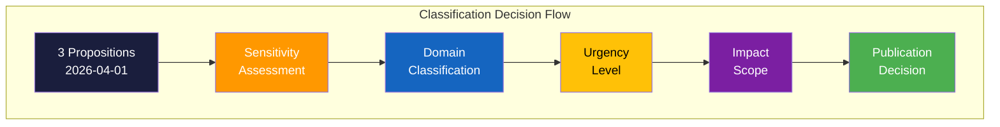

# 🏷️ Classification Results — Propositions

## 📋 Classification Context

| Field | Value |
|-------|-------|
| **Classification ID** | CLASS-2026-04-03-PROP |
| **Date** | 2026-04-03 |
| **Riksmöte** | 2025/26 |
| **Documents Classified** | 3 |
| **Confidence** | HIGH |
| **Classification** | Public |

## 📊 Classification Decision Tree

## 📊 Batch Classification Table

| dok_id | Title | Sensitivity | Domain | Urgency | Scope | Significance | Decision | Confidence |
|--------|-------|:-----------:|:------:|:-------:|:-----:|:------------:|:--------:|:----------:|
| HD03214 | Lagändringar för ett stärkt nationellt cybersäkerhetscenter | SENSITIVE | DEF | ELEVATED | NATIONAL | 7/10 | 📰 Publish | HIGH |
| HD03228 | Ett modernt och anpassat regelverk för krigsmateriel | SENSITIVE | DEF/FOR | ELEVATED | INTERNATIONAL | 7/10 | 📰 Publish | HIGH |
| HD03235 | Skärpta regler om utvisning på grund av brott | SENSITIVE | JUS/MIG | ELEVATED | NATIONAL | 7/10 | 📰 Publish | HIGH |

## 📝 Per-Document Classification Rationale

### HD03214 — Cybersecurity Center

| Dimension | Classification | Rationale |
|-----------|:-----------:|----------|
| **Sensitivity** | SENSITIVE | National security infrastructure legislation; involves FRA, MSB, SÄPO coordination |
| **Domain** | DEF (Defense) | Primary: defense/cybersecurity. Secondary: infrastructure (INF) |
| **Urgency** | ELEVATED | NATO integration timeline creates time pressure; not immediate crisis |
| **Scope** | NATIONAL | Primarily affects Swedish agency ecosystem; NATO dimension adds international layer |
| **Significance** | 7/10 | Major defense legislation with institutional restructuring implications |

**Recommended Action**: 📰 Publish — Standard priority article with defense/cyber angle. [HIGH confidence]

### HD03228 — War Materials Regulation

| Dimension | Classification | Rationale |
|-----------|:-----------:|----------|
| **Sensitivity** | SENSITIVE | Defense trade legislation with geopolitical implications |
| **Domain** | DEF/FOR (Defense/Foreign) | Dual domain: defense industry regulation + foreign policy tool |
| **Urgency** | ELEVATED | Regulatory modernization needed for NATO-era defense cooperation |
| **Scope** | INTERNATIONAL | Export rules affect bilateral relationships and alliance positioning |
| **Significance** | 7/10 | Reshapes Swedish defense export framework; geopolitical signaling |

**Recommended Action**: 📰 Publish — Prioritize geopolitical and trade dimensions. [HIGH confidence]

### HD03235 — Deportation Rules

| Dimension | Classification | Rationale |
|-----------|:-----------:|----------|
| **Sensitivity** | SENSITIVE | Criminal justice/migration intersection; human rights implications |
| **Domain** | JUS/MIG (Justice/Migration) | Dual domain: criminal law enforcement + migration policy |
| **Urgency** | ELEVATED | High public salience; implementation timeline has capacity constraints |
| **Scope** | NATIONAL | Primarily domestic; EU/ECHR dimension adds international scrutiny layer |
| **Significance** | 7/10 | Major criminal justice reform; electorally salient; civil liberties tension |

**Recommended Action**: 📰 Publish — Lead with public impact and civil liberties analysis. [HIGH confidence]

## 📊 Impact Analysis Matrix

| dok_id | Likelihood (1-5) | Impact (1-5) | Combined Score | Action |
|--------|:-:|:-:|:-:|--------|
| HD03214 | 4 (likely to pass) | 4 (institutional restructuring) | 16 | Monitor implementation closely |
| HD03228 | 4 (likely to pass) | 3 (regulatory modernization) | 12 | Monitor export decisions |
| HD03235 | 3 (may face amendments) | 4 (significant rights impact) | 12 | Monitor EU/ECHR response |

## 🔖 Cross-Reference Tags

| Tag Type | Values |
|----------|--------|
| **Actors** | Carl-Oskar Bohlin (M), Benjamin Dousa (M), Johan Forssell (M) |
| **Parties** | M (lead), KD, L, SD (support) |
| **Committees** | FöU, UU, JuU |
| **Riksmöte** | 2025/26 |
| **Related IDs** | HD03214, HD03228, HD03235 |
| **Themes** | Defense modernization, NATO integration, criminal justice, migration |

---

**Document Control:**
- **Template Path:** `/analysis/templates/political-classification.md`
- **Version:** 2.1
- **Classification:** Public
- **Next Review:** 2026-06-30
