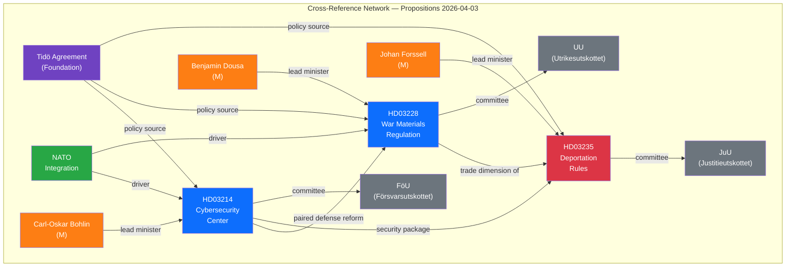

# 🔗 Cross-Reference Map — Propositions

## 📋 Map Context

| Field | Value |
|-------|-------|
| **Map ID** | XREF-2026-04-03-PROP |
| **Date** | 2026-04-03 |
| **Riksmöte** | 2025/26 |
| **Documents Mapped** | 3 |
| **Confidence** | HIGH |
| **Classification** | Public |

## 📊 Document Relationship Network

## 📋 Cross-Reference Register

| Source | Target | Relationship Type | Strength | Evidence |
|--------|--------|------------------|:--------:|----------|
| HD03214 | HD03228 | Paired defense reform — both modernize Sweden's security apparatus for NATO era | HIGH | Shared defense modernization agenda |
| HD03214 | HD03235 | Security package — comprehensive security (cyber + enforcement) | MEDIUM | Tidö Agreement delivery cluster |
| HD03228 | HD03235 | Trade dimension — defense exports fund enforcement capacity | LOW | Indirect budget linkage |
| HD03214 | Tidö Agreement | Policy origin — cybersecurity commitment in coalition agreement | HIGH | Tidö text reference |
| HD03228 | Tidö Agreement | Policy origin — defense export modernization commitment | HIGH | Tidö text reference |
| HD03235 | Tidö Agreement | Policy origin — migration enforcement commitment | HIGH | Tidö text reference |
| HD03214 | NATO membership | External driver — interoperability requirements | HIGH | NATO standards |
| HD03228 | NATO membership | External driver — alliance defense trade cooperation | HIGH | NATO defense planning |

## 👤 Actor Cross-Reference

| Actor | Role | Documents | Party | Department |
|-------|------|-----------|:-----:|------------|
| Carl-Oskar Bohlin | Defense Minister, proposition sponsor | HD03214 | M | Försvarsdepartementet |
| Benjamin Dousa | Minister for Trade/Defense Trade | HD03228 | M | Utrikesdepartementet |
| Johan Forssell | Migration Minister | HD03235 | M | Justitiedepartementet |
| Ulf Kristersson | PM — overall policy direction | HD03214, HD03228, HD03235 | M | Statsrådsberedningen |
| Jimmie Åkesson | SD leader — tacit support provider | HD03235 (primary) | SD | — |

## 🏛️ Committee Cross-Reference

| Committee | Documents | Expected Action | Timeline |
|-----------|-----------|----------------|----------|
| FöU (Försvarsutskottet) | HD03214 | Committee hearing + report | Q2 2026 |
| UU (Utrikesutskottet) | HD03228 | Committee hearing + report | Q2 2026 |
| JuU (Justitieutskottet) | HD03235 | Committee hearing + report | Q2 2026 |
| KU (Konstitutionsutskottet) | HD03214 (oversight dimension) | Potential constitutional review | Q2-Q3 2026 |

## 📊 Thematic Clusters

| Cluster | Documents | Theme | Coherence |
|---------|-----------|-------|:---------:|
| Defense Modernization | HD03214, HD03228 | NATO-era military/cyber capability | HIGH |
| Internal Security | HD03235 | Criminal justice enforcement | HIGH |
| Tidö Delivery | HD03214, HD03228, HD03235 | Coalition agreement implementation | HIGH |
| Sovereignty & Alliance | HD03214, HD03228 | Balancing national sovereignty with NATO integration | MEDIUM |

## 🔄 Temporal Cross-Reference

| Period | Related Events | Connection |
|--------|---------------|------------|
| 2022 | NATO application | Strategic foundation for HD03214, HD03228 |
| 2022-10 | Tidö Agreement signed | Policy mandate for all three propositions |
| 2024 | NATO membership ratified | Accelerated timeline for HD03214, HD03228 |
| 2026-04-01 | Three propositions published | Coordinated delivery window |
| Q2 2026 (forecast) | Committee hearings | Next decision points for all three |

---

**Document Control:**
- **Template Path:** `/analysis/templates/synthesis-summary.md` (cross-reference section)
- **Version:** 2.1
- **Classification:** Public
- **Next Review:** 2026-06-30
