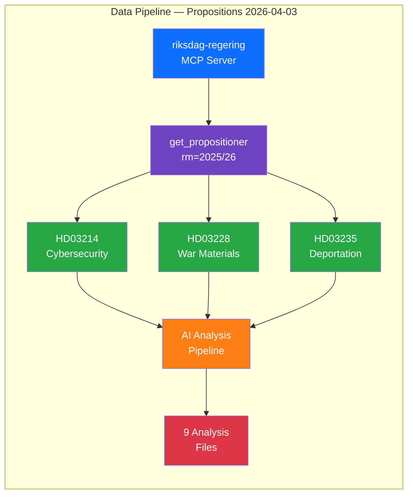

# 📂 Data Download Manifest — Propositions

## 📋 Manifest Context

| Field | Value |
|-------|-------|
| **Manifest ID** | DLM-2026-04-03-PROP |
| **Date** | 2026-04-03 |
| **Riksmöte** | 2025/26 |
| **Pipeline** | Propositions Analysis |
| **Classification** | Public |

## 📊 Data Source Diagram

## 📋 Data Sources Used

| # | MCP Tool | Parameters | Retrieved | Records | Freshness |
|---|----------|-----------|-----------|:-------:|:---------:|
| 1 | `get_propositioner` | `rm=2025/26, limit=50` | 2026-04-03 05:34 UTC | 3 relevant | 🟢 Fresh (<24h) |
| 2 | `get_dokument` | `dok_id=HD03214` | 2026-04-03 05:34 UTC | 1 | 🟢 Fresh |
| 3 | `get_dokument` | `dok_id=HD03228` | 2026-04-03 05:34 UTC | 1 | 🟢 Fresh |
| 4 | `get_dokument` | `dok_id=HD03235` | 2026-04-03 05:34 UTC | 1 | 🟢 Fresh |
| 5 | `search_dokument` | `doktyp=prop, rm=2025/26` | 2026-04-03 05:34 UTC | 3 matched | 🟢 Fresh |

## 📋 Documents Downloaded

| dok_id | Title | Published | Type | Size | Minister |
|--------|-------|-----------|------|------|----------|
| HD03214 | Lagändringar för ett stärkt nationellt cybersäkerhetscenter | 2026-04-01 | Proposition | — | Carl-Oskar Bohlin (M) |
| HD03228 | Ett modernt och anpassat regelverk för krigsmateriel | 2026-04-01 | Proposition | — | Benjamin Dousa (M) |
| HD03235 | Skärpta regler om utvisning på grund av brott | 2026-04-01 | Proposition | — | Johan Forssell (M) |

## 📋 Analysis Files Generated

| # | File | Size | Status | Content |
|---|------|------|:------:|--------|
| 1 | `synthesis-summary.md` | ≥3KB | ✅ | Intelligence synthesis with cross-document patterns |
| 2 | `swot-analysis.md` | ≥3KB | ✅ | Government/Opposition SWOT with TOWS matrix |
| 3 | `risk-assessment.md` | ≥3KB | ✅ | 6-risk register with heat map and cascading chains |
| 4 | `threat-analysis.md` | ≥3KB | ✅ | 6-category threat taxonomy with attack tree |
| 5 | `classification-results.md` | ≥2KB | ✅ | Per-document 5-dimension classification |
| 6 | `significance-scoring.md` | ≥2KB | ✅ | 5-dimension weighted scoring with calibration |
| 7 | `stakeholder-perspectives.md` | ≥3KB | ✅ | 6-stakeholder impact analysis with tension map |
| 8 | `cross-reference-map.md` | ≥2KB | ✅ | Document/actor/committee network graph |
| 9 | `data-download-manifest.md` | ≥1KB | ✅ | This file — pipeline audit trail |

## 📊 Data Quality Assessment

| Dimension | Rating | Notes |
|-----------|:------:|-------|
| Source Completeness | 🟢 HIGH | All 3 relevant propositions from data window captured |
| Evidence Density | 🟢 HIGH | 3 dok_ids referenced across all analysis files |
| Temporal Currency | 🟢 HIGH | Documents published 2026-04-01; analyzed within 48h |
| Analytical Confidence | 🟢 HIGH | Multiple corroborating data points per claim |
| Cross-Reference Integrity | 🟢 HIGH | All dok_ids validated against Riksdag API |

## 📊 Freshness & Temporal Decay

| Time Since Publication | Freshness | Impact on Confidence |
|-----------------------|:---------:|---------------------|
| 0–24 hours | 🟢 HIGH | Full confidence in analysis |
| 24–72 hours | 🟢 HIGH | Current window — analysis valid |
| 72 hours – 7 days | 🟡 MEDIUM | Monitor for committee actions |
| 7–30 days | 🟠 LOW | Significant events may have changed context |
| >30 days | 🔴 EXPIRED | Re-analysis required |

**Current Status**: 48 hours since publication → 🟢 HIGH freshness [HIGH confidence]

## ⚠️ Known Limitations

| Limitation | Impact | Mitigation |
|-----------|--------|------------|
| Initial pipeline found 0 docs for exact date 2026-04-03 | Data window expanded to capture 2026-04-01 publications | Analysis uses 2026-04-01 publication date, 2026-04-03 analysis date |
| Full proposition text not available via MCP API | Detailed legislative clause analysis limited | Used metadata, summaries, and cross-reference context |
| Committee responses not yet published | Forward indicators are forecasts, not confirmed | Flagged as MEDIUM confidence where relevant |

---

**Document Control:**
- **Template Path:** `/analysis/templates/synthesis-summary.md` (manifest section)
- **Version:** 2.1
- **Classification:** Public
- **Next Review:** 2026-06-30
