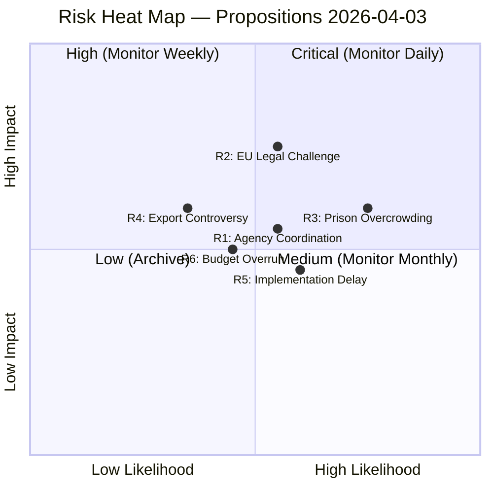
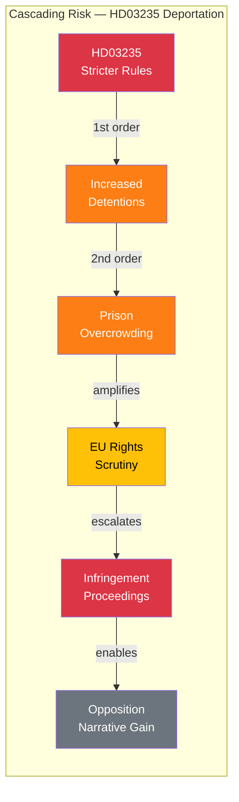

# ⚠️ Risk Assessment — Propositions

## 📋 Risk Context

| Field | Value |
|-------|-------|
| **Assessment ID** | RISK-2026-04-03-PROP |
| **Date** | 2026-04-03 |
| **Riksmöte** | 2025/26 |
| **Documents** | HD03214, HD03228, HD03235 |
| **Overall Risk Level** | MEDIUM-HIGH |
| **Confidence** | HIGH |
| **Classification** | Public |

## 🗂️ Risk Heat Map

## 📊 Risk Register

| Risk ID | Description | Likelihood (1-5) | Impact (1-5) | Score | Tier | Trend | Source | Owner |
|---------|-------------|:-:|:-:|:-:|------|:---:|--------|-------|
| R1 | Inter-agency coordination failure — FRA, MSB, SÄPO jurisdictional conflicts delay cybersecurity center | 3 | 3 | 9 | 🟡 Medium | → | HD03214 | Försvarsdepartementet |
| R2 | EU Commission infringement proceedings on deportation rule compatibility with ECHR | 3 | 4 | 12 | 🟠 High | ↑ | HD03235 | Justitiedepartementet |
| R3 | Prison system overcrowding from expanded deportation detention requirements | 4 | 3 | 12 | 🟠 High | ↑ | HD03235 | Kriminalvården |
| R4 | Defense export reputational damage if weapons reach active conflict zones | 2 | 3 | 6 | 🟡 Medium | → | HD03228 | Utrikesdepartementet |
| R5 | Implementation delay — three simultaneous reforms compete for legislative drafting capacity | 3 | 2 | 6 | 🟡 Medium | → | HD03214, HD03228, HD03235 | Regeringskansliet |
| R6 | Budget overrun on cybersecurity center establishment costs | 2 | 3 | 6 | 🟡 Medium | → | HD03214 | Finansdepartementet |

### Risk Tier Legend

| Score Range | Tier | Re-evaluation |
|-------------|------|---------------|
| 1–4 | 🟢 Low | Monthly |
| 5–9 | 🟡 Medium | Weekly |
| 10–14 | 🟠 High | Daily |
| 15–25 | 🔴 Critical | Immediate |

## 🤝 Coalition Stability Risk

| Factor | Assessment | Evidence | Confidence |
|--------|-----------|----------|------------|
| Coalition cohesion | STABLE — all three propositions have SD tacit support | HD03214, HD03228, HD03235 | HIGH |
| SD alignment | ALIGNED — security/migration agenda matches SD priorities | HD03235 | HIGH |
| Liberal (L) tension | LOW — defense bills align with L position, HD03235 borderline | HD03235 | MEDIUM |
| Collapse probability | <5% from these propositions specifically | All | HIGH |

## 📋 Policy Implementation Risk

| Policy | Ministry | Stage | Risk | Mitigation |
|--------|----------|-------|------|------------|
| Cybersecurity center (HD03214) | Försvarsdepartementet | Committee review | Agency turf wars (R1) | PM-level coordination directive |
| War materials rules (HD03228) | Utrikesdepartementet | Committee review | Export controversy (R4) | Strengthened end-user certificates |
| Deportation rules (HD03235) | Justitiedepartementet | Committee review | Prison capacity (R3), EU challenge (R2) | Phased implementation, EU dialogue |

## 🔗 Cascading Risk Chain

## 🔮 Forward Indicators & Scenario Outlook

| Scenario | Probability | Trigger | Impact | Timeline |
|----------|:-----------:|---------|--------|----------|
| **Baseline**: All three pass committee with amendments | 60% | FöU/JuU/UU hearings complete | Moderate reform pace | Q2-Q3 2026 |
| **Optimistic**: Rapid passage with cross-party support | 20% | S joins defense consensus | Accelerated NATO integration | Q2 2026 |
| **Adverse**: EU challenge delays HD03235, cascading to HD03228 | 15% | EU Commission inquiry | Major legislative slowdown | Q3-Q4 2026 |
| **Severe**: Prison crisis forces HD03235 amendment or withdrawal | 5% | Kriminalvård capacity breach | Coalition credibility damage | Q4 2026 |

## 🛡️ Risk Mitigation Recommendations

| Priority | Action | Risk Addressed | Owner |
|----------|--------|----------------|-------|
| 🔴 HIGH | Proactive EU Commission dialogue on HD03235 ECHR compatibility | R2 | Justitiedepartementet |
| 🟠 MEDIUM | Establish PM-level agency coordination committee for HD03214 | R1 | Statsrådsberedningen |
| 🟠 MEDIUM | Commission Kriminalvård capacity assessment before HD03235 enactment | R3 | Justitiedepartementet |
| 🟡 LOW | Strengthen ISP end-user certificate regime under HD03228 | R4 | Utrikesdepartementet |

---

**Document Control:**
- **Template Path:** `/analysis/templates/risk-assessment.md`
- **Version:** 2.1
- **Classification:** Public
- **Next Review:** 2026-06-30
