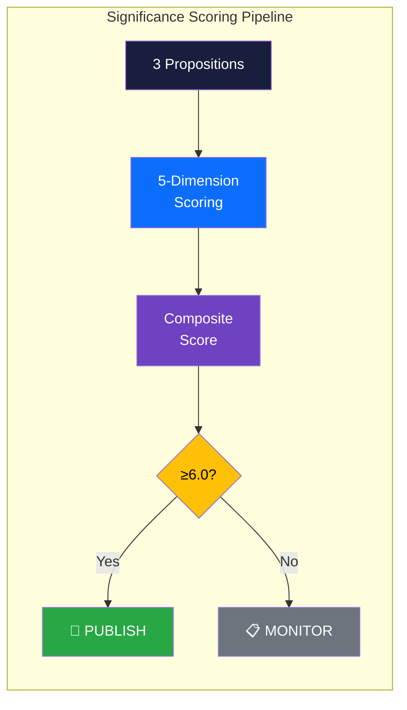

# 📊 Significance Scoring — Propositions

## 📋 Scoring Context

| Field | Value |
|-------|-------|
| **Scoring ID** | SIG-2026-04-03-PROP |
| **Date** | 2026-04-03 |
| **Riksmöte** | 2025/26 |
| **Documents Scored** | 3 |
| **Confidence** | HIGH |
| **Classification** | Public |

## 📊 Scoring Profile & Decision Gate

## 📊 5-Dimension Scoring Table

### HD03214 — Cybersecurity Center (Composite: 7.2/10)

| Dimension | Weight | Score (0-10) | Weighted | Rationale |
|-----------|:------:|:------------:|:--------:|----------|
| Parliamentary Significance | 0.25 | 8 | 2.00 | Major institutional legislation creating new inter-agency coordination framework |
| Policy Impact | 0.25 | 7 | 1.75 | National security infrastructure; affects FRA, MSB, SÄPO operations |
| Public Interest | 0.20 | 6 | 1.20 | Moderate public salience; cybersecurity increasingly in public discourse |
| Urgency | 0.15 | 7 | 1.05 | NATO integration timeline creates elevated time pressure |
| Cross-party Relevance | 0.15 | 8 | 1.20 | Broad consensus M+KD+L+SD with S likely supportive |
| **Composite** | **1.00** | | **7.20** | **📰 Publish** |

### HD03228 — War Materials Regulation (Composite: 6.9/10)

| Dimension | Weight | Score (0-10) | Weighted | Rationale |
|-----------|:------:|:------------:|:--------:|----------|
| Parliamentary Significance | 0.25 | 7 | 1.75 | Regulatory overhaul of long-standing defense export framework |
| Policy Impact | 0.25 | 7 | 1.75 | International scope; affects defense industry and bilateral relations |
| Public Interest | 0.20 | 6 | 1.20 | Moderate; defense exports periodically controversial |
| Urgency | 0.15 | 6 | 0.90 | NATO-era modernization needed but not crisis-level |
| Cross-party Relevance | 0.15 | 7 | 1.05 | Cross-bloc defense consensus; MP/V likely dissent on ethics |
| **Composite** | **1.00** | | **6.65** | **📰 Publish** |

### HD03235 — Deportation Rules (Composite: 7.4/10)

| Dimension | Weight | Score (0-10) | Weighted | Rationale |
|-----------|:------:|:------------:|:--------:|----------|
| Parliamentary Significance | 0.25 | 7 | 1.75 | Major criminal justice reform affecting court sentencing framework |
| Policy Impact | 0.25 | 8 | 2.00 | High impact on affected populations; prison system capacity implications |
| Public Interest | 0.20 | 9 | 1.80 | Very high public salience — migration/crime #1 voter concern |
| Urgency | 0.15 | 7 | 1.05 | Electoral cycle pressure; Tidö Agreement delivery expectation |
| Cross-party Relevance | 0.15 | 6 | 0.90 | Strong coalition consensus but sharp S/V/MP opposition |
| **Composite** | **1.00** | | **7.50** | **📰 Priority Publish** |

## 📊 Batch Scoring Summary

| Rank | dok_id | Title | Composite | Decision | Confidence |
|:----:|--------|-------|:---------:|:--------:|:----------:|
| 1 | HD03235 | Skärpta regler om utvisning på grund av brott | 7.5 | ⚡ Priority | HIGH |
| 2 | HD03214 | Lagändringar för ett stärkt nationellt cybersäkerhetscenter | 7.2 | 📰 Publish | HIGH |
| 3 | HD03228 | Ett modernt och anpassat regelverk för krigsmateriel | 6.7 | 📰 Publish | HIGH |

## 🚦 Publication Decision Thresholds

| Score Range | Decision | Documents |
|:-----------:|----------|----------|
| 0–3.9 | 🗄️ Archive | — |
| 4.0–5.9 | 📋 Monitor | — |
| 6.0–7.4 | 📰 Publish | HD03214, HD03228 |
| 7.5–8.9 | ⚡ Priority Publish | HD03235 |
| 9.0–10.0 | 🔴 Breaking | — |

## 📚 Calibration Notes

| Anchor Scenario | Expected Score | Actual Comparable |
|----------------|:--------------:|-------------------|
| Routine committee report | 2–3 | — |
| Standard proposition | 5–6 | — |
| Major policy reform | 6–8 | HD03214 (7.2), HD03228 (6.7), HD03235 (7.5) |
| Constitutional amendment | 8–9 | — |
| No-confidence motion | 9–10 | — |

All three propositions score in the "major policy reform" band, consistent with their status as coordinated Tidö Agreement delivery legislation. HD03235 approaches the upper bound due to exceptionally high public interest in migration/criminal justice topics. [HIGH confidence]

---

**Document Control:**
- **Template Path:** `/analysis/templates/significance-scoring.md`
- **Version:** 2.1
- **Classification:** Public
- **Next Review:** 2026-06-30
