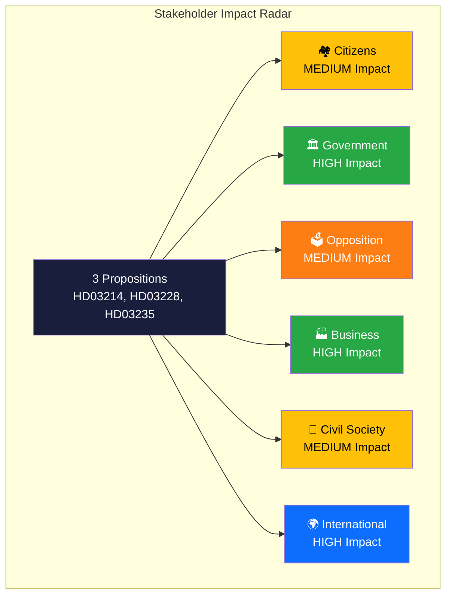

# 👥 Stakeholder Perspectives — Propositions

## 📋 Assessment Context

| Field | Value |
|-------|-------|
| **Assessment ID** | STAK-2026-04-03-PROP |
| **Date** | 2026-04-03 |
| **Riksmöte** | 2025/26 |
| **Documents** | HD03214, HD03228, HD03235 |
| **Confidence** | HIGH |
| **Classification** | Public |

## 📊 Stakeholder Impact Overview

## 🏘️ Citizens

| Dimension | Assessment | Evidence | Confidence |
|-----------|-----------|----------|:----------:|
| **Impact Level** | MEDIUM | Cybersecurity protection benefits all; deportation rules affect specific communities | HIGH |
| **Timeline** | Medium-term (6–18 months) | Implementation phased across 2026–2027 | MEDIUM |
| **Affected Population** | Broad (cybersecurity), Targeted (deportation, defense exports) | HD03214 (all), HD03235 (immigrant communities) | HIGH |
| **Impact Type** | Security enhancement + rights trade-off | Improved cyber protection offset by deportation concerns | HIGH |
| **Net Effect** | Mixed positive | Security gains for majority; rights concerns for minorities | MEDIUM |

**Key Citizen Impact by Proposition:**

| dok_id | Citizen Benefit | Citizen Risk | Net |
|--------|----------------|-------------|:---:|
| HD03214 | Improved national cyber defense | Surveillance scope creep concern | ➕ |
| HD03228 | Economic benefit from defense industry jobs | Ethical exposure to arms trade | ⚖️ |
| HD03235 | Perceived safety improvement | Civil liberties constraints for affected communities | ⚖️ |

## 🏛️ Government Coalition

| Dimension | Assessment | Evidence | Confidence |
|-----------|-----------|----------|:----------:|
| **Cohesion Effect** | STRENGTHENS | Three coordinated deliveries demonstrate legislative capacity | HIGH |
| **SD Alignment** | POSITIVE | All three align with SD priorities (defense, migration enforcement) | HIGH |
| **L Tension Risk** | LOW-MEDIUM | Defense bills fully aligned; HD03235 borderline for L's rights profile | MEDIUM |
| **Electoral Positioning** | POSITIVE | "Action government" narrative on security and migration | HIGH |
| **Net Effect** | Strongly positive for coalition cohesion | HD03214, HD03228, HD03235 | HIGH |

**Per-Party Assessment:**

| Party | Position | Rationale | Risk |
|-------|----------|-----------|------|
| M (Moderaterna) | Lead sponsor — all three ministers are M | Core governing party priority delivery | LOW |
| KD | Supportive | Aligns with law-and-order, defense values | LOW |
| L (Liberalerna) | Supportive with reservations | Defense yes; deportation rules may strain liberal identity | MEDIUM |
| SD | Tacit support | Migration enforcement (HD03235) is SD signature issue | LOW |

## 🗳️ Opposition Parties

| Dimension | Assessment | Evidence | Confidence |
|-----------|-----------|----------|:----------:|
| **Electoral Positioning** | NEGATIVE — forced onto government terrain | Security/defense framing advantages coalition | HIGH |
| **S (Socialdemokraterna)** | Partially supportive on defense (HD03214, HD03228); critical on HD03235 | Split positioning | HIGH |
| **V (Vänsterpartiet)** | Strongly opposed to HD03235, critical of HD03228 | Civil liberties and arms ethics | HIGH |
| **MP (Miljöpartiet)** | Opposed to HD03235, skeptical of HD03228 | Human rights and environmental ethics | HIGH |
| **C (Centerpartiet)** | Nuanced — supportive on cyber, cautious on deportation | Rural defense support vs. liberal values | MEDIUM |
| **Net Effect** | Moderately negative — limited opposition space on security terrain | All | HIGH |

## 🏭 Business Sector

| Dimension | Assessment | Evidence | Confidence |
|-----------|-----------|----------|:----------:|
| **Impact Level** | HIGH | Defense industry (HD03228), cybersecurity sector (HD03214) directly affected | HIGH |
| **Economic Impact** | OPPORTUNITY | Modernized export rules enable expanded market access | HIGH |
| **Compliance Burden** | MODERATE | New cybersecurity reporting requirements for critical infrastructure | MEDIUM |
| **Sector Winners** | Saab, Ericsson (defense/cyber), cybersecurity startups | HD03214, HD03228 | HIGH |
| **Net Effect** | Strongly positive for defense/tech sectors | HD03214, HD03228 | HIGH |

## 🤝 Civil Society

| Dimension | Assessment | Evidence | Confidence |
|-----------|-----------|----------|:----------:|
| **Response** | DIVIDED | Security community supportive; human rights organizations critical | HIGH |
| **HD03214 Response** | Generally supportive — cybersecurity broadly seen as positive | HD03214 | HIGH |
| **HD03228 Response** | Split — Swedish Peace & Arbitration Society likely critical | HD03228 | MEDIUM |
| **HD03235 Response** | Strongly opposed — FARR, Civil Rights Defenders, Amnesty Sweden | HD03235 | HIGH |
| **Net Effect** | Mixed — security vs. rights tension divides civil society | All | HIGH |

## 🌍 International / EU

| Dimension | Assessment | Evidence | Confidence |
|-----------|-----------|----------|:----------:|
| **NATO Impact** | POSITIVE — enhanced interoperability and alliance commitment | HD03214, HD03228 | HIGH |
| **EU Compliance** | AT RISK — HD03235 deportation rules may face ECHR scrutiny | HD03235 | MEDIUM |
| **Nordic Cooperation** | POSITIVE — cybersecurity center enables Nordic intel sharing | HD03214 | HIGH |
| **Arms Trade Treaty** | COMPLIANT — modernized rules maintain ATT alignment | HD03228 | MEDIUM |
| **Net Effect** | Mixed — NATO positive offset by EU human rights scrutiny risk | All | HIGH |

## 📊 Impact Summary Matrix

| Stakeholder | Impact Level | Timeline | Confidence | Net Effect | Primary Risk |
|-------------|:-----------:|----------|:----------:|:----------:|--------------|
| 🏘️ Citizens | MEDIUM | 6–18 months | HIGH | Mixed ➕/⚖️ | Civil liberties |
| 🏛️ Government | HIGH | Immediate | HIGH | Strongly ➕ | L party tension |
| 🗳️ Opposition | MEDIUM | 3–6 months | HIGH | Negative ➖ | Terrain disadvantage |
| 🏭 Business | HIGH | 6–12 months | HIGH | Strongly ➕ | Compliance costs |
| 🤝 Civil Society | MEDIUM | Ongoing | HIGH | Divided ⚖️ | Rights backlash |
| 🌍 International | HIGH | 6–24 months | HIGH | Mixed ➕/⚖️ | EU scrutiny |

## 🔑 Inter-Stakeholder Tension Map

| Tension Pair | Mechanism | Severity | Evidence |
|-------------|-----------|:--------:|----------|
| Business ↔ Civil Society | Defense export profits vs. ethical concerns | MEDIUM | HD03228 |
| Government ↔ EU/ECHR | Deportation enforcement vs. rights obligations | HIGH | HD03235 |
| Citizens (majority) ↔ Citizens (affected) | Perceived safety vs. deportation rights impact | MEDIUM | HD03235 |
| Opposition ↔ Government | Forced to oppose on security terrain they traditionally support | MEDIUM | HD03214, HD03228 |

## 📰 Publication Recommendation

| Dimension | Recommendation |
|-----------|---------------|
| **Publish?** | YES — all three propositions |
| **Article Type** | Analysis + stakeholder impact feature |
| **Lead Angle** | "Tidö government delivers coordinated security package — winners and losers" |
| **Priority** | HD03235 (highest public interest) → HD03214 (defense angle) → HD03228 (geopolitics) |

---

**Document Control:**
- **Template Path:** `/analysis/templates/stakeholder-impact.md`
- **Version:** 2.1
- **Classification:** Public
- **Next Review:** 2026-06-30
