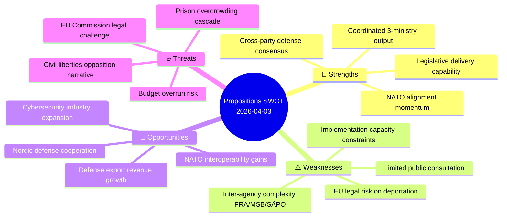

# 💪 SWOT Analysis — Propositions

## 📋 SWOT Context

| Field | Value |
|-------|-------|
| **Analysis ID** | SWOT-2026-04-03-PROP |
| **Date** | 2026-04-03 |
| **Riksmöte** | 2025/26 |
| **Documents** | HD03214, HD03228, HD03235 |
| **Confidence** | HIGH |
| **Classification** | Public |

## 📊 SWOT Quadrant Mapping

## 🏛️ Government Coalition SWOT

### 💪 Strengths

| # | Statement | Evidence | Confidence | Impact |
|---|-----------|----------|------------|--------|
| S1 | Broad cross-party support for defense modernization — M, KD, L, SD and partial S backing | HD03214, HD03228 | HIGH | HIGH |
| S2 | Demonstrates Tidö Agreement legislative delivery with three coordinated propositions in one week | HD03214, HD03228, HD03235 | HIGH | HIGH |
| S3 | NATO integration accelerated through cybersecurity and war materials alignment | HD03214, HD03228 | HIGH | HIGH |
| S4 | Strong ministerial ownership — Bohlin, Dousa, Forssell each lead clearly defined reforms | HD03214, HD03228, HD03235 | HIGH | MEDIUM |

### ⚠️ Weaknesses

| # | Statement | Evidence | Confidence | Impact |
|---|-----------|----------|------------|--------|
| W1 | Inter-agency coordination complexity: FRA, MSB, SÄPO jurisdictional overlaps unresolved | HD03214 | MEDIUM | HIGH |
| W2 | Deportation rules face EU Convention on Human Rights tension — legal challenge probable | HD03235 | MEDIUM | HIGH |
| W3 | Limited public consultation period on war materials regulatory overhaul | HD03228 | MEDIUM | MEDIUM |
| W4 | Implementation capacity — three major reforms competing for government attention | HD03214, HD03228, HD03235 | MEDIUM | MEDIUM |

### 🌱 Opportunities

| # | Statement | Evidence | Confidence | Impact |
|---|-----------|----------|------------|--------|
| O1 | Defense export revenue growth — modernized rules open new markets | HD03228 | MEDIUM | HIGH |
| O2 | Cybersecurity center positions Sweden as Nordic hub — potential for EU funding | HD03214 | MEDIUM | MEDIUM |
| O3 | NATO interoperability score improvement strengthens alliance standing | HD03214, HD03228 | HIGH | HIGH |
| O4 | Stricter deportation rules may reduce recidivism — measurable outcome for electoral positioning | HD03235 | LOW | MEDIUM |

### 🔥 Threats

| # | Statement | Evidence | Confidence | Impact |
|---|-----------|----------|------------|--------|
| T1 | Prison system overcrowding from increased deportation detention — cascading resource crisis | HD03235 | MEDIUM | HIGH |
| T2 | Civil liberties organizations mount sustained opposition campaign against HD03235 | HD03235 | HIGH | MEDIUM |
| T3 | EU Commission opens infringement proceedings on deportation rules | HD03235 | MEDIUM | HIGH |
| T4 | Defense export controversy if weapons reach conflict zones — reputational risk | HD03228 | LOW | HIGH |

## 🏛️ Opposition SWOT (Brief)

| Quadrant | Key Finding | Evidence | Confidence |
|----------|------------|----------|------------|
| 💪 S | S/V can critique civil liberties impact of HD03235 | HD03235 | HIGH |
| 💪 S | MP can raise environmental/ethical objections to defense exports | HD03228 | MEDIUM |
| ⚠️ W | Opposition forced onto government's security-first terrain | HD03214, HD03228 | HIGH |
| ⚠️ W | S partially supportive of defense bills — limits opposition space | HD03214 | HIGH |
| 🌱 O | EU legal challenge on deportation creates sustained criticism vector | HD03235 | MEDIUM |
| 🔥 T | Opposing defense modernization risks appearing soft on security | HD03214, HD03228 | HIGH |

## 🔄 Cross-SWOT Interference Analysis

| Government Element | Interfering Element | Effect | Net Impact |
|-------------------|---------------------|--------|------------|
| S1: Cross-party defense consensus | T2: Civil liberties opposition | Defense consensus holds but deportation splits | Moderate dampening |
| W2: EU legal risk (HD03235) | O3: NATO alignment gains | International credibility pull in opposite directions | Tension |
| S3: NATO integration | T4: Export controversy | Reputational offset if export rules misapplied | Conditional risk |
| W1: Agency coordination | O2: Nordic hub opportunity | Coordination failure would undermine hub ambition | High dependency |

## 📊 TOWS Strategic Options

| | **Opportunities (O)** | **Threats (T)** |
|---|---|---|
| **Strengths (S)** | **SO**: Leverage cross-party defense consensus (S1) to secure NATO interoperability gains (O3) and Nordic hub funding (O2) | **ST**: Use legislative delivery track record (S2) to counter civil liberties narrative (T2) with implementation evidence |
| **Weaknesses (W)** | **WO**: Address agency coordination (W1) through Nordic cooperation frameworks (O2) | **WT**: Proactively engage EU Commission (W2) before infringement risk (T3) materializes |

## 🔮 Forward Indicators

| Indicator | Timeline | Source | Watch Priority |
|-----------|----------|--------|----------------|
| FöU committee vote on HD03214 | Q2 2026 | Riksdag | 🔴 HIGH |
| EU Commission response to HD03235 | Q3 2026 | EU monitoring | 🟠 MEDIUM |
| Defense export license applications under HD03228 | H2 2026 | ISP reporting | 🟡 MEDIUM |

---

**Document Control:**
- **Template Path:** `/analysis/templates/swot-analysis.md`
- **Version:** 2.1
- **Classification:** Public
- **Next Review:** 2026-06-30
