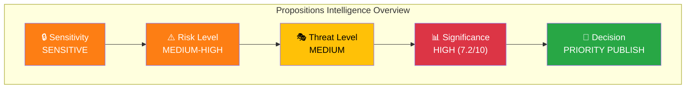
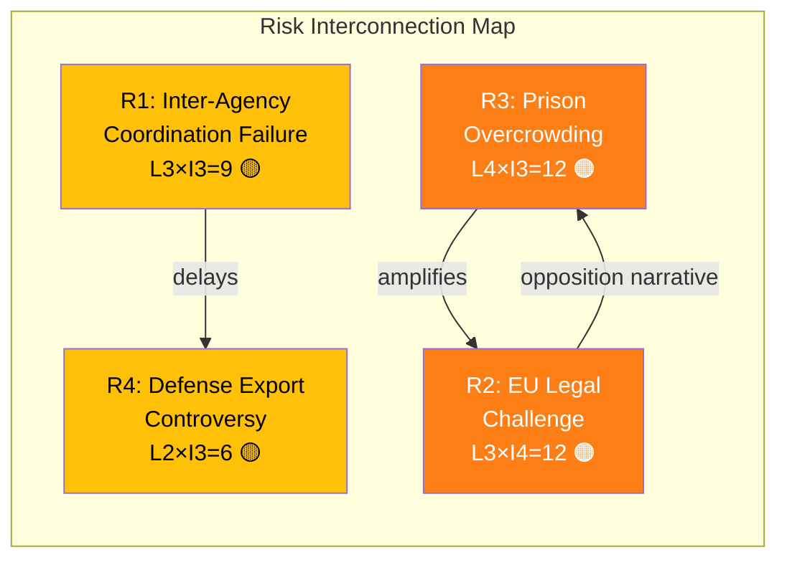

# 🧩 Political Intelligence Synthesis — Propositions

## 📋 Synthesis Context

| Field | Value |
|-------|-------|
| **Synthesis ID** | SYN-2026-04-03-PROP |
| **Date** | 2026-04-03 |
| **Riksmöte** | 2025/26 |
| **Producer** | AI Analysis Pipeline (Propositions) |
| **Documents Analyzed** | 3 |
| **Confidence** | HIGH |
| **Classification** | Public |
| **Data Window** | 2026-04-01 → 2026-04-03 |

## 📊 Intelligence Dashboard

## 📋 Top Documents by Significance

| Rank | dok_id | Title | Type | Score | Decision | Minister |
|------|--------|-------|------|-------|----------|----------|
| 1 | HD03214 | Lagändringar för ett stärkt nationellt cybersäkerhetscenter | Proposition | 7/10 | 📰 Publish | Carl-Oskar Bohlin (M) |
| 2 | HD03235 | Skärpta regler om utvisning på grund av brott | Proposition | 7/10 | 📰 Publish | Johan Forssell (M) |
| 3 | HD03228 | Ett modernt och anpassat regelverk för krigsmateriel | Proposition | 7/10 | 📰 Publish | Benjamin Dousa (M) |

## 🔍 Cross-Document Pattern Analysis

### Pattern 1: Coordinated Security & Defense Modernization [HIGH confidence]

The Tidö government is advancing a **coordinated defense and security legislative package** across three departments. HD03214 (cybersecurity center) and HD03228 (war materials regulation) form a paired defense modernization effort, while HD03235 (deportation rules) strengthens the internal security dimension.

| # | Action | dok_id | Department | Confidence |
|---|--------|--------|------------|------------|
| 1 | Cybersecurity center — new inter-agency coordination law | HD03214 | Försvarsdepartementet | HIGH |
| 2 | War materials export modernization | HD03228 | Utrikesdepartementet | HIGH |
| 3 | Criminal deportation rule tightening | HD03235 | Justitiedepartementet | HIGH |

### Pattern 2: Tidö Agreement Implementation Acceleration [MEDIUM confidence]

All three propositions align with Tidö Agreement priorities: NATO integration (HD03214, HD03228) and migration enforcement (HD03235). This represents the most concentrated security-policy output in a single week during the 2025/26 riksmöte.

## 📊 Aggregated SWOT Summary

| Quadrant | Key Finding | Evidence | Confidence |
|----------|------------|----------|------------|
| 💪 Strength | Cross-party consensus on defense (M, KD, L, SD + partial S support) | HD03214, HD03228 | HIGH |
| 💪 Strength | NATO alignment strengthens Sweden's alliance positioning | HD03228 | HIGH |
| 💪 Strength | Government demonstrates legislative delivery capability | HD03214, HD03228, HD03235 | HIGH |
| ⚠️ Weakness | Inter-agency coordination complexity (FRA, MSB, SÄPO) | HD03214 | MEDIUM |
| ⚠️ Weakness | EU legal challenge risk on deportation rules | HD03235 | MEDIUM |
| 🌱 Opportunity | Defense export revenue growth from modernized rules | HD03228 | MEDIUM |
| 🌱 Opportunity | Improved NATO interoperability score | HD03214 | HIGH |
| 🔥 Threat | Prison system overcrowding from stricter deportation enforcement | HD03235 | MEDIUM |
| 🔥 Threat | Civil liberties concerns may fuel opposition narrative | HD03235 | MEDIUM |

## ⚠️ Risk Landscape

| Risk ID | Description | L | I | Score | Tier | Trend | Source |
|---------|-------------|---|---|-------|------|-------|--------|
| R1 | Inter-agency coordination failure (FRA/MSB/SÄPO) | 3 | 3 | 9 | 🟡 Medium | → | HD03214 |
| R2 | EU legal challenge on deportation rules | 3 | 4 | 12 | 🟠 High | ↑ | HD03235 |
| R3 | Prison system overcrowding cascade | 4 | 3 | 12 | 🟠 High | ↑ | HD03235 |
| R4 | Defense export controversy | 2 | 3 | 6 | 🟡 Medium | → | HD03228 |

## 🎭 Threat Summary

| Category | Primary Threat | Severity | Actor | Evidence |
|----------|---------------|----------|-------|----------|
| 📝 Legislative Integrity | Rushed implementation timeline | 2/5 | Government | HD03214 |
| 🔇 Transparency | Limited public consultation on war materials rules | 3/5 | Utrikesdepartementet | HD03228 |
| ⛔ Democratic Process | Opposition marginalization on deportation bill | 3/5 | Justitiedepartementet | HD03235 |
| 👑 Power Balance | Executive power concentration in cybersecurity | 2/5 | Försvarsdepartementet | HD03214 |

## 👥 Stakeholder Impact Overview

| Stakeholder | Impact Level | Net Effect | Key Concern | Confidence |
|-------------|-------------|------------|-------------|------------|
| 🏘️ Citizens | MEDIUM | Mixed | Security vs. civil liberties trade-off | HIGH |
| 🏛️ Government Coalition | HIGH | Positive | Demonstrates Tidö delivery | HIGH |
| 🗳️ Opposition | MEDIUM | Negative | Forced to respond on security terrain | MEDIUM |
| 🏭 Business | HIGH | Positive | Defense export opportunity | HIGH |
| 🤝 Civil Society | MEDIUM | Divided | Human rights concerns (HD03235) | MEDIUM |
| 🌍 International/EU | HIGH | Mixed | NATO positive, ECHR scrutiny risk | HIGH |

## 🔮 Forward Indicators

| Indicator | Timeline | Source | Watch Priority |
|-----------|----------|--------|----------------|
| FöU committee hearing on HD03214 | Q2 2026 | Riksdag calendar | 🔴 HIGH |
| JuU committee hearing on HD03235 | Q2 2026 | Riksdag calendar | 🔴 HIGH |
| UU assessment of HD03228 | Q2 2026 | Riksdag calendar | 🟠 MEDIUM |
| EU Commission review of deportation alignment | Q3 2026 | EU monitoring | 🟠 MEDIUM |
| NATO interoperability assessment | H2 2026 | NATO reporting | 🟡 MEDIUM |

## 📋 Analysis Artifacts Inventory

| Artifact | Status | File |
|----------|--------|------|
| Classification Results | ✅ Complete | `classification-results.md` |
| Risk Assessment | ✅ Complete | `risk-assessment.md` |
| SWOT Analysis | ✅ Complete | `swot-analysis.md` |
| Threat Analysis | ✅ Complete | `threat-analysis.md` |
| Significance Scoring | ✅ Complete | `significance-scoring.md` |
| Stakeholder Perspectives | ✅ Complete | `stakeholder-perspectives.md` |
| Cross-Reference Map | ✅ Complete | `cross-reference-map.md` |
| Data Download Manifest | ✅ Complete | `data-download-manifest.md` |

---

**Document Control:**
- **Template Path:** `/analysis/templates/synthesis-summary.md`
- **Version:** 2.1
- **Classification:** Public
- **Next Review:** 2026-06-30
