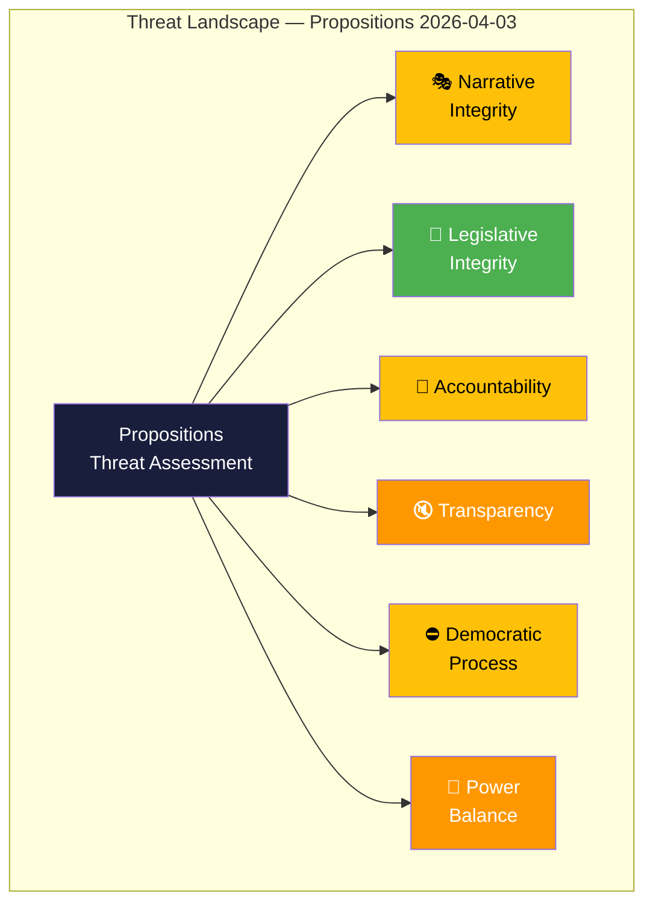
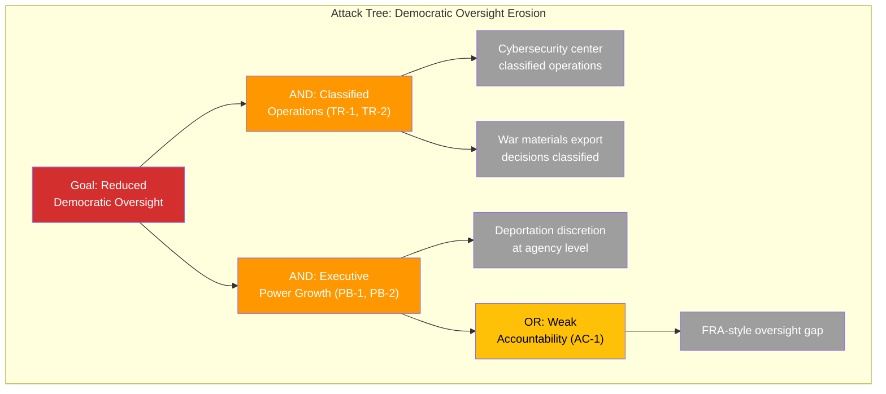

# 🎭 Threat Analysis — Propositions

## 📋 Threat Analysis Context

| Field | Value |
|-------|-------|
| **Analysis ID** | THREAT-2026-04-03-PROP |
| **Date** | 2026-04-03 |
| **Riksmöte** | 2025/26 |
| **Documents** | HD03214, HD03228, HD03235 |
| **Threat Level** | MEDIUM |
| **Confidence** | HIGH |
| **Classification** | Public |

## 🏷️ Political Threat Taxonomy

## 🎭 Narrative Integrity (Disinformation & False Framing)

| Threat ID | Description | Actor | Evidence | Severity | Confidence |
|-----------|-------------|-------|----------|:--------:|------------|
| NI-1 | Government framing of HD03235 as "public safety" obscures civil liberties trade-offs | Justitiedepartementet | HD03235 | 3/5 | MEDIUM |
| NI-2 | "Cybersecurity center" branding may overstate operational readiness vs. legal framework reality | Försvarsdepartementet | HD03214 | 2/5 | MEDIUM |
| NI-3 | Defense export "modernization" framing sidesteps ethical scrutiny of weapons transfers | Utrikesdepartementet | HD03228 | 3/5 | MEDIUM |

## 📝 Legislative Integrity (Policy Corruption & Manipulation)

| Threat ID | Description | Actor | Evidence | Severity | Confidence |
|-----------|-------------|-------|----------|:--------:|------------|
| LI-1 | Compressed timeline — three major propositions simultaneous may reduce scrutiny depth | Government | HD03214, HD03228, HD03235 | 2/5 | MEDIUM |
| LI-2 | Remiss consultation period on HD03228 shorter than standard for defense trade legislation | Utrikesdepartementet | HD03228 | 2/5 | LOW |

## 🚫 Accountability (Oversight Evasion & Obstruction)

| Threat ID | Description | Actor | Evidence | Severity | Confidence |
|-----------|-------------|-------|----------|:--------:|------------|
| AC-1 | Cybersecurity center oversight mechanism unclear — risk of FRA-style accountability gap | Försvarsdepartementet | HD03214 | 3/5 | MEDIUM |
| AC-2 | Deportation enforcement accountability — who monitors proportionality in practice? | Polismyndigheten/Migrationsverket | HD03235 | 3/5 | MEDIUM |

## 🔇 Transparency (Information Suppression)

| Threat ID | Description | Actor | Evidence | Severity | Confidence |
|-----------|-------------|-------|----------|:--------:|------------|
| TR-1 | War materials export decisions may be classified, reducing public transparency | ISP/Utrikesdepartementet | HD03228 | 3/5 | HIGH |
| TR-2 | Cybersecurity operations inherently classified — limited parliamentary visibility | FRA/MSB/SÄPO | HD03214 | 3/5 | HIGH |

## ⛔ Democratic Process (Procedural Obstruction)

| Threat ID | Description | Actor | Evidence | Severity | Confidence |
|-----------|-------------|-------|----------|:--------:|------------|
| DP-1 | Opposition parties forced to respond on government-chosen security terrain | Government coalition | HD03214, HD03228, HD03235 | 2/5 | HIGH |
| DP-2 | SD tacit support structure sidesteps formal coalition accountability | SD | All propositions | 2/5 | MEDIUM |

## 👑 Power Balance (Concentration & Overreach)

| Threat ID | Description | Actor | Evidence | Severity | Confidence |
|-----------|-------------|-------|----------|:--------:|------------|
| PB-1 | Cybersecurity center concentrates executive authority over threat intelligence | Försvarsdepartementet | HD03214 | 3/5 | MEDIUM |
| PB-2 | Expanded deportation powers shift discretion from courts to enforcement agencies | Polismyndigheten | HD03235 | 3/5 | HIGH |
| PB-3 | War materials export authority consolidation at ISP level | ISP/Government | HD03228 | 2/5 | MEDIUM |

## 🌳 Attack Tree — Primary Threat (Executive Power Concentration)

## 💎 Diamond Model (Primary Threat Actor)

| Facet | Assessment |
|-------|----------|
| **Adversary** | Government coalition (M, KD, L with SD support) — not malicious but structurally incentivized toward executive efficiency over oversight |
| **Capability** | HIGH — parliamentary majority enables legislative passage without opposition support |
| **Infrastructure** | Three coordinating ministries (Försvar, Utrikes, Justitie) with institutional momentum |
| **Victim** | Parliamentary oversight mechanisms, judicial review, civil liberties organizations |

## 🛡️ Priority Mitigations

| Priority | Mitigation | Threat Addressed | Responsible |
|----------|-----------|------------------|-------------|
| 🔴 HIGH | Establish independent oversight board for cybersecurity center | AC-1, PB-1 | Riksdag (KU) |
| 🔴 HIGH | Mandate judicial proportionality review for deportation decisions | PB-2, AC-2 | JuU |
| 🟠 MEDIUM | Annual parliamentary transparency report on defense exports | TR-1, PB-3 | UU |
| 🟡 LOW | Extended public consultation on cybersecurity framework rules | TR-2, NI-2 | FöU |

## ⚡ Escalation Decision

| Condition | Action | Current Status |
|-----------|--------|----------------|
| Severity ≥4 on any single threat | Escalate to breaking analysis | ❌ Not triggered |
| ≥3 threats at severity 3+ in same category | Flag for immediate review | ❌ Not triggered |
| Novel attack vector identified | Immediate analyst review | ❌ Not triggered |

**Assessment**: Overall threat level MEDIUM. No single threat warrants escalation, but the *cumulative effect* of transparency and power-balance threats across three simultaneous propositions merits ongoing monitoring. [HIGH confidence]

---

**Document Control:**
- **Template Path:** `/analysis/templates/threat-analysis.md`
- **Version:** 2.1
- **Classification:** Public
- **Next Review:** 2026-06-30
