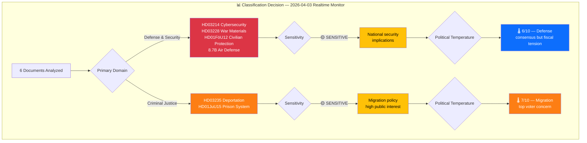

# 🏷️ Political Event Classification — Realtime Monitor 1018

## 📋 Document Metadata

| Field | Value |
|-------|-------|
| **Classification ID** | `CLS-2026-04-03-RT1018` |
| **Document Type** | Political Event Classification |
| **Event Date** | 2026-04-03 |
| **Classification Date** | 2026-04-03 10:18 UTC |
| **Primary Source dok_id** | HD03235, HD03214, HD03228, HD01FöU12, HD01JuU15 |
| **Classified By** | news-realtime-monitor |

---

## 🏷️ Classification Dimensions

### Classification Decision Tree

---

## 📊 Individual Document Classifications

| # | dok_id | Title | Domain | Sensitivity | Urgency | Temperature | Significance |
|:-:|--------|-------|--------|:-----------:|:-------:|:-----------:|:------------:|
| 1 | HD03235 | Skärpta regler om utvisning | CRI-MIG | 🟡 SENSITIVE | 🟠 URGENT | 7/10 | HIGH |
| 2 | HD03214 | Cybersäkerhetscenter | DEF-CYB | 🟡 SENSITIVE | 🔵 ELEVATED | 5/10 | HIGH |
| 3 | HD03228 | Krigsmateriel regelverk | DEF-TRD | 🟡 SENSITIVE | 🔵 ELEVATED | 6/10 | HIGH |
| 4 | HD01FöU12 | Civilbefolkningsskydd | DEF-CIV | 🟡 SENSITIVE | 🔵 ELEVATED | 4/10 | HIGH |
| 5 | HD01JuU15 | Kriminalvårdsfrågor | CRI | 🟢 PUBLIC | 🔵 ELEVATED | 5/10 | MEDIUM |
| 6 | govt-air-defense | 8.7B SEK luftvärnsavtal | DEF-BUD | 🔴 RESTRICTED | 🟠 URGENT | 6/10 | CRITICAL |

---

## 📈 Aggregate Classification

| Metric | Value |
|--------|-------|
| **Total Documents** | 6 |
| **Highest Sensitivity** | 🔴 RESTRICTED (air defense procurement) |
| **Dominant Domain** | Defense & Security (4 of 6 documents) |
| **Average Political Temperature** | 5.5/10 |
| **Maximum Strategic Significance** | CRITICAL |
| **Coalition Impact Vector** | +0.7 (defense consensus strengthens coalition) |

---

## 🔑 Classification Insights

The April 1-3 period shows an **unprecedented concentration of defense legislation**, with 4 of 6 significant events directly related to Sweden's defense modernization:

1. **Defense cluster** (HD03214, HD03228, HD01FöU12, air defense contract) — Represents a coordinated government push to modernize Sweden's defense posture post-NATO accession
2. **Criminal justice thread** (HD03235, HD01JuU15) — Continues the government's Tidö Agreement implementation on crime and migration
3. **Cross-cutting theme**: Both clusters strengthen the M-KD-L-SD governing arrangement by delivering on core priorities

**Document Control:** CLS-2026-04-03-RT1018 | news-realtime-monitor | 2026-04-03
