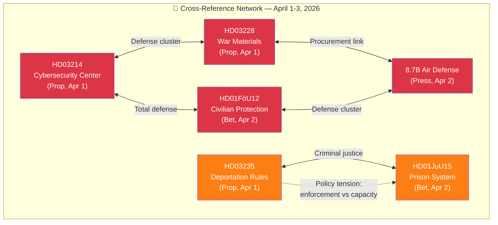

# 🔗 Cross-Reference Map — Realtime Monitor 1018

## 📋 Context

| Field | Value |
|-------|-------|
| **Map ID** | `XRF-2026-04-03-RT1018` |
| **Date** | 2026-04-03 10:18 UTC |
| **Documents Mapped** | 6 |
| **Produced By** | news-realtime-monitor |

---

## 🔗 Document Relationship Diagram

---

## 📊 Reference Matrix

| From → To | Relationship Type | Strength | Description |
|-----------|------------------|:--------:|-------------|
| HD03214 ↔ HD03228 | Thematic (Defense) | Strong | Both part of defense modernization package |
| HD03214 ↔ HD01FöU12 | Thematic (Total Defense) | Strong | Cybersecurity + civilian protection = totalförsvaret |
| HD03228 ↔ Air Defense | Operational | Strong | War materials regulation enables procurement like 8.7B deal |
| HD01FöU12 ↔ Air Defense | Strategic | Strong | Civilian + military protection aligned |
| HD03235 ↔ HD01JuU15 | Policy Tension | Strong | Stricter enforcement vs. insufficient capacity |
| HD03214 ↔ Air Defense | Budget Competition | Moderate | Both require defense budget allocation |

---

## 🏷️ Thematic Clusters

| Cluster | Documents | Coherence |
|---------|----------|:---------:|
| **Defense Modernization** | HD03214, HD03228, HD01FöU12, Air Defense | HIGH |
| **Criminal Justice** | HD03235, HD01JuU15 | HIGH |
| **Cross-Cluster** | HD03235 ↔ HD01JuU15 (tension) | MEDIUM |

**Document Control:** XRF-2026-04-03-RT1018 | news-realtime-monitor | 2026-04-03
