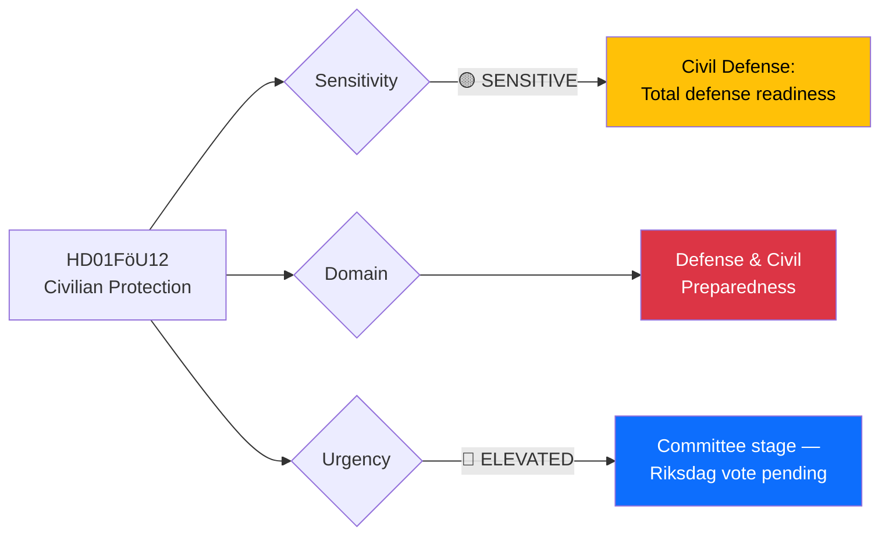

# 🔍 Per-File Political Intelligence Analysis: HD01FöU12

## 📋 Document Identity

| Field | Value |
|-------|-------|
| **Document ID** | `HD01FöU12` |
| **Document Type** | Committee Report (bet) |
| **Title** | Ett starkare skydd för civilbefolkningen vid höjd beredskap |
| **Date** | 2026-04-02 |
| **Riksmöte** | 2025/26 |
| **Source MCP Tool** | `get_betankanden`, `get_dokument` |
| **Analysis Timestamp** | 2026-04-03 10:24 UTC |
| **Analyst** | news-realtime-monitor |
| **Committee** | Försvarsutskottet (FöU) |

---

## 🎯 Executive Summary

The Defense Committee (FöU) report on strengthening civilian protection during heightened military readiness represents a significant totalförsvaret development. Betänkande 2025/26:FöU12 addresses civil defense preparedness — including shelter capacity, evacuation planning, and crisis communication — in the context of Sweden's post-NATO-accession security environment. This report arrives alongside three major defense propositions (HD03214 cybersecurity, HD03228 war materials, HD03235 deportation) and the 8.7B SEK air defense contract, forming the most concentrated defense legislative push in modern Swedish parliamentary history. **[MEDIUM confidence]**

---

## 📊 Political Classification

| Dimension | Classification | Rationale |
|-----------|---------------|-----------|
| **Sensitivity** | 🟡 SENSITIVE | Civil defense infrastructure; public anxiety management |
| **Policy Domain** | Defense & Civil Preparedness | Totalförsvaret civil defense pillar |
| **Urgency** | 🔵 ELEVATED | Committee report complete; Riksdag vote expected soon |
| **Political Temperature** | 4/10 | Broad consensus on civil defense; limited partisan controversy |
| **Strategic Significance** | HIGH | Foundational for total defense; affects every municipality |

---

## 💼 SWOT Analysis

### ✅ Strengths

| # | Statement | Evidence (dok_id) | Confidence | Impact |
|---|-----------|-------------------|:----------:|:------:|
| S1 | Strong cross-party consensus on civilian protection strengthening | HD01FöU12 | H | H |
| S2 | Builds on MSB (Civil Contingencies Agency) existing infrastructure and expertise | HD01FöU12 | M | M |
| S3 | NATO membership provides framework for allied civilian protection cooperation | HD01FöU12 | H | M |

### ⚠️ Weaknesses

| # | Statement | Evidence (dok_id) | Confidence | Impact |
|---|-----------|-------------------|:----------:|:------:|
| W1 | Shelter capacity severely degraded since Cold War era; massive investment needed | HD01FöU12 | H | H |
| W2 | Municipal implementation capacity varies widely; risk of uneven protection | HD01FöU12 | M | H |

### 🚀 Opportunities

| # | Statement | Evidence (dok_id) | Confidence | Impact |
|---|-----------|-------------------|:----------:|:------:|
| O1 | Public support for defense spending at historic highs post-Ukraine conflict | HD01FöU12 | H | H |
| O2 | EU Civil Protection Mechanism provides co-financing for infrastructure upgrades | HD01FöU12 | M | M |

### 🔴 Threats

| # | Statement | Evidence (dok_id) | Confidence | Impact |
|---|-----------|-------------------|:----------:|:------:|
| T1 | Implementation timeline too slow given current threat environment | HD01FöU12 | M | H |
| T2 | Cost overruns in shelter construction could divert funds from military defense | HD01FöU12 | M | M |

---

## ⚖️ Risk Assessment

| Risk | Likelihood (1-5) | Impact (1-5) | Score | Mitigation |
|------|:-----------------:|:------------:|:-----:|------------|
| Insufficient shelter capacity within 5 years | 4 | 4 | 16 | Prioritize population centers; accelerated procurement |
| Municipal implementation failure | 3 | 3 | 9 | Earmarked state transfers with compliance monitoring |
| Public anxiety from crisis communication testing | 2 | 2 | 4 | Graduated public education campaign |

---

## 👥 Stakeholder Impact

| Stakeholder | Impact | Mechanism |
|------------|:------:|-----------|
| **Citizens** | HIGH | Direct impact on personal safety; shelter access, evacuation planning |
| **Government Coalition** | HIGH | Demonstrates total defense commitment |
| **Municipalities** | HIGH | Major implementation burden and cost implications |
| **Opposition** | LOW | Broad support expected; limited political controversy |
| **Business/Industry** | MEDIUM | Construction industry benefits from shelter building program |
| **International** | MEDIUM | NATO credibility enhanced by civilian resilience |

---

## 🔮 Forward Indicators

1. **Riksdag vote date** — Watch for scheduling of FöU12 plenary vote
2. **Municipal budget allocations** — Local government preparedness spending signals
3. **MSB guidance updates** — Implementation directives from Civil Contingencies Agency
4. **Public shelter exercises** — Scheduled drills indicating readiness timeline

**Document Control:** Analysis of HD01FöU12 | Analyst: news-realtime-monitor | 2026-04-03
