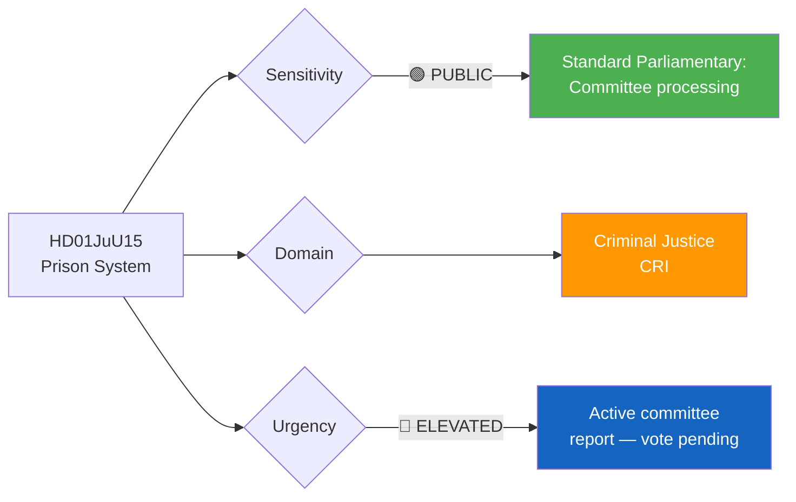

# 🔍 Per-File Political Intelligence Analysis: HD01JuU15

## 📋 Document Identity

| Field | Value |
|-------|-------|
| **Document ID** | `HD01JuU15` |
| **Document Type** | Committee Report (bet) |
| **Title** | Kriminalvårdsfrågor |
| **Date** | 2026-04-02 |
| **Riksmöte** | 2025/26 |
| **Source MCP Tool** | `get_betankanden`, `get_dokument` |
| **Analysis Timestamp** | 2026-04-03 10:26 UTC |
| **Analyst** | news-realtime-monitor |
| **Committee** | Justitieutskottet (JuU) |

---

## 🎯 Executive Summary

The Justice Committee report on prison system issues (Bet 2025/26:JuU15) addresses critical capacity and reform questions within Kriminalvården (Swedish Prison and Probation Service). This arrives alongside Prop 2025/26:235 on stricter deportation rules, forming a coherent criminal justice narrative. Sweden faces a prison capacity crisis with occupancy rates above 100% in several facilities, making this committee report politically significant for the government's "tough on crime" agenda. The report likely processes multiple opposition motions while potentially recommending government action on capacity expansion. **[MEDIUM confidence]**

---

## 📊 Political Classification

| Dimension | Classification | Rationale |
|-----------|---------------|-----------|
| **Sensitivity** | 🟢 PUBLIC | Standard criminal justice policy; public information |
| **Policy Domain** | Criminal Justice | Prison system capacity and reform |
| **Urgency** | 🔵 ELEVATED | Committee report ready; Riksdag vote expected |
| **Political Temperature** | 5/10 | Crime is top voter concern but prison policy less partisan than sentencing |
| **Strategic Significance** | MEDIUM | Implementation capacity for government's broader criminal justice agenda |

---

## 💼 SWOT Analysis

### ✅ Strengths

| # | Statement | Evidence (dok_id) | Confidence | Impact |
|---|-----------|-------------------|:----------:|:------:|
| S1 | Government has allocated record budget for Kriminalvården expansion in 2025/26 budget | HD01JuU15 | M | H |
| S2 | Cross-party agreement that prison capacity must increase; limited opposition to expansion | HD01JuU15 | H | M |

### ⚠️ Weaknesses

| # | Statement | Evidence (dok_id) | Confidence | Impact |
|---|-----------|-------------------|:----------:|:------:|
| W1 | Current overcrowding (>100% in multiple facilities) creates immediate safety risks | HD01JuU15 | H | H |
| W2 | Staff recruitment challenges slow capacity expansion | HD01JuU15 | M | H |

### 🚀 Opportunities

| # | Statement | Evidence (dok_id) | Confidence | Impact |
|---|-----------|-------------------|:----------:|:------:|
| O1 | New prison construction projects can incorporate modern rehabilitation design | HD01JuU15 | M | M |

### 🔴 Threats

| # | Statement | Evidence (dok_id) | Confidence | Impact |
|---|-----------|-------------------|:----------:|:------:|
| T1 | Stricter sentencing from other propositions (HD03235) will further increase demand | HD01JuU15 + HD03235 | H | H |
| T2 | Budget constraints may force choice between prison expansion and other criminal justice spending | HD01JuU15 | M | M |

---

## ⚖️ Risk Assessment

| Risk | Likelihood (1-5) | Impact (1-5) | Score | Mitigation |
|------|:-----------------:|:------------:|:-----:|------------|
| Prison overcrowding reaches critical safety threshold | 4 | 4 | 16 | Accelerated modular facility construction |
| Staff shortage limits new facility operation | 3 | 3 | 9 | Enhanced recruitment incentives and training programs |
| Cascade effect from stricter sentencing laws | 4 | 3 | 12 | Capacity planning integrated with sentencing reform timeline |

---

## 👥 Stakeholder Impact

| Stakeholder | Impact | Mechanism |
|------------|:------:|-----------|
| **Citizens** | MEDIUM | Public safety; prison system effectiveness affects recidivism |
| **Government Coalition** | HIGH | Criminal justice credibility depends on implementation capacity |
| **SD** | HIGH | Demand for tough sentencing requires corresponding prison capacity |
| **Opposition (S)** | MEDIUM | Can critique government on implementation gaps |
| **Kriminalvården staff** | HIGH | Working conditions, safety, staffing levels directly affected |
| **Judiciary** | MEDIUM | Sentencing capacity depends on available prison places |

---

## 🔮 Forward Indicators

1. **Kriminalvården capacity reports** — Monthly occupancy statistics
2. **Budget supplementary requests** — Additional funding for prison construction
3. **Staff recruitment numbers** — Quarterly hiring data from Kriminalvården
4. **New facility commissioning** — Timeline for planned prison openings

**Document Control:** Analysis of HD01JuU15 | Analyst: news-realtime-monitor | 2026-04-03
