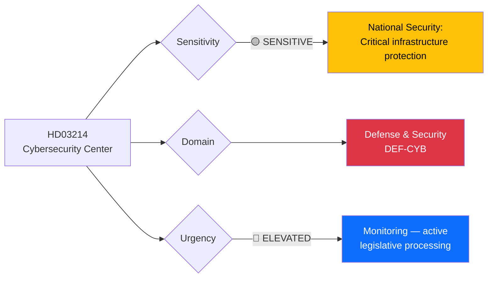

# 🔍 Per-File Political Intelligence Analysis: HD03214

## 📋 Document Identity

| Field | Value |
|-------|-------|
| **Document ID** | `HD03214` |
| **Document Type** | Proposition (prop) |
| **Title** | Lagändringar för ett stärkt nationellt cybersäkerhetscenter |
| **Date** | 2026-04-01 |
| **Riksmöte** | 2025/26 |
| **Source MCP Tool** | `get_propositioner`, `get_dokument` |
| **Analysis Timestamp** | 2026-04-03 10:20 UTC |
| **Analyst** | news-realtime-monitor |
| **Responsible Minister** | Carl-Oskar Bohlin (M), Försvarsdepartementet |

---

## 🎯 Executive Summary

Proposition 2025/26:214 proposes legislative changes to strengthen Sweden's National Cybersecurity Center (NCSC), reflecting the government's broader defense and security agenda. Minister Carl-Oskar Bohlin (M) leads this initiative from Försvarsdepartementet, positioning cybersecurity as a core element of total defense (totalförsvaret). The proposition arrives alongside the 8.7 billion SEK air defense contract and the war materials regulation modernization (HD03228), forming a coherent defense strengthening narrative. Cross-party support is expected given the broad consensus on cybersecurity needs. **[HIGH confidence]**

---

## 📊 Political Classification

| Dimension | Classification | Rationale |
|-----------|---------------|-----------|
| **Sensitivity** | 🟡 SENSITIVE | National security infrastructure; classified aspects likely in closed sessions |
| **Policy Domain** | Defense & Cybersecurity | Totalförsvaret modernization pillar |
| **Urgency** | 🔵 ELEVATED | Active processing; part of broader defense legislative package |
| **Political Temperature** | 5/10 | Broad consensus on cybersecurity; limited partisan controversy |
| **Strategic Significance** | HIGH | Core totalförsvaret component; aligns with NATO integration |

---

## 💼 SWOT Analysis

### ✅ Strengths

| # | Statement | Evidence (dok_id) | Confidence | Impact |
|---|-----------|-------------------|:----------:|:------:|
| S1 | Broad cross-party consensus on cybersecurity strengthening reduces legislative risk | HD03214 | H | H |
| S2 | Aligns with NATO membership requirements for cyber defense capacity | HD03214 + NATO accession 2024 | H | H |
| S3 | Builds on existing NCSC infrastructure; incremental rather than revolutionary change | HD03214 | M | M |

### ⚠️ Weaknesses

| # | Statement | Evidence (dok_id) | Confidence | Impact |
|---|-----------|-------------------|:----------:|:------:|
| W1 | Funding allocation unclear — may require supplementary budget or reallocation from other defense priorities | HD03214 | M | M |
| W2 | Talent acquisition in cybersecurity sector is competitive; government may struggle to staff expanded center | HD03214 | M | H |

### 🚀 Opportunities

| # | Statement | Evidence (dok_id) | Confidence | Impact |
|---|-----------|-------------------|:----------:|:------:|
| O1 | NATO integration creates framework for shared cyber intelligence and joint exercises | HD03214 | H | H |
| O2 | Growing public awareness of cyber threats post-Tietoevry attack increases political support | HD03214 | M | M |

### 🔴 Threats

| # | Statement | Evidence (dok_id) | Confidence | Impact |
|---|-----------|-------------------|:----------:|:------:|
| T1 | Sophisticated state-sponsored cyber actors (Russia, China) may outpace legislative response | HD03214 | H | H |
| T2 | Privacy advocates may challenge expanded surveillance authorities granted to NCSC | HD03214 | L | M |

---

## ⚖️ Risk Assessment

| Risk | Likelihood (1-5) | Impact (1-5) | Score | Mitigation |
|------|:-----------------:|:------------:|:-----:|------------|
| Underfunding limits NCSC operational capacity | 3 | 4 | 12 | Earmark dedicated budget line |
| Talent shortage delays implementation | 4 | 3 | 12 | Partner with university programs and private sector |
| Privacy/surveillance controversy | 2 | 3 | 6 | Transparent oversight mechanisms |

---

## 👥 Stakeholder Impact

| Stakeholder | Impact | Mechanism |
|------------|:------:|-----------|
| **Citizens** | MEDIUM | Improved critical infrastructure protection; potential privacy implications |
| **Government Coalition** | HIGH | Demonstrates defense competence; builds totalförsvaret narrative |
| **Opposition** | LOW | Limited opposition expected; cybersecurity has broad support |
| **Business/Industry** | HIGH | IT sector benefits from government investment; compliance requirements for critical infrastructure operators |
| **International/EU** | HIGH | NATO alignment; NIS2 directive compliance |
| **Judiciary** | LOW | Limited direct impact unless surveillance authorities expanded |
| **Media** | MEDIUM | Newsworthy defense modernization story |

---

## 🔮 Forward Indicators

1. **Budget allocation** — Watch FiU committee for cybersecurity funding decisions
2. **NATO cyber exercises** — Swedish participation in upcoming exercises validates integration
3. **FöU committee processing** — Timeline for HD03214 committee consideration
4. **Recruitment announcements** — NCSC staffing indicates implementation pace

**Document Control:** Analysis of HD03214 | Analyst: news-realtime-monitor | 2026-04-03
