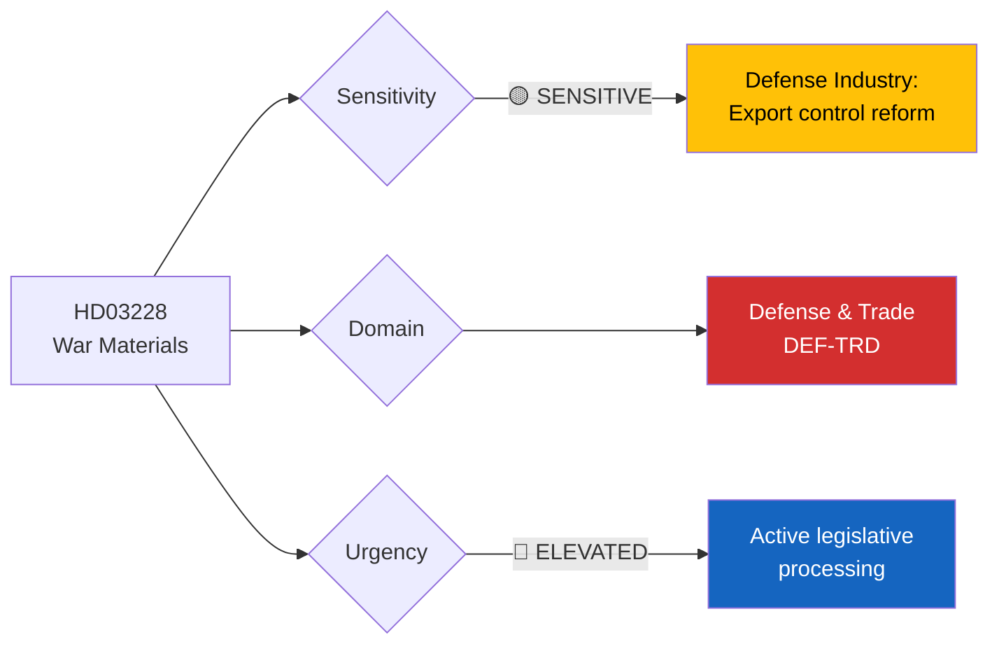

# 🔍 Per-File Political Intelligence Analysis: HD03228

## 📋 Document Identity

| Field | Value |
|-------|-------|
| **Document ID** | `HD03228` |
| **Document Type** | Proposition (prop) |
| **Title** | Ett modernt och anpassat regelverk för krigsmateriel |
| **Date** | 2026-04-01 |
| **Riksmöte** | 2025/26 |
| **Source MCP Tool** | `get_propositioner`, `get_dokument` |
| **Analysis Timestamp** | 2026-04-03 10:22 UTC |
| **Analyst** | news-realtime-monitor |
| **Responsible Minister** | Benjamin Dousa (M), Utrikesdepartementet |

---

## 🎯 Executive Summary

Proposition 2025/26:228 modernizes Sweden's war materials regulatory framework, adapting export controls and production rules to post-NATO-accession realities. Minister Benjamin Dousa (M) leads this from Utrikesdepartementet, reflecting the shifting defense industrial landscape since Sweden joined NATO in 2024. The proposition enables closer defense industrial cooperation with NATO allies, streamlines export licensing, and updates the Krigsmateriellagen. Combined with the 8.7B SEK air defense contract (April 2) and the cybersecurity center legislation (HD03214), this forms part of a comprehensive defense modernization push. **[HIGH confidence]**

---

## 📊 Political Classification

| Dimension | Classification | Rationale |
|-----------|---------------|-----------|
| **Sensitivity** | 🟡 SENSITIVE | Defense exports politically charged; human rights scrutiny of arms sales |
| **Policy Domain** | Defense & Trade | Cross-domain: defense industry + foreign trade policy |
| **Urgency** | 🔵 ELEVATED | NATO integration demands rapid regulatory alignment |
| **Political Temperature** | 6/10 | Arms export policy historically divisive; V and MP oppose liberal export rules |
| **Strategic Significance** | HIGH | Enables NATO defense industrial cooperation; major geopolitical shift |

---

## 💼 SWOT Analysis

### ✅ Strengths

| # | Statement | Evidence (dok_id) | Confidence | Impact |
|---|-----------|-------------------|:----------:|:------:|
| S1 | Enables defense industrial cooperation within NATO framework; strengthens alliance interoperability | HD03228 | H | H |
| S2 | Supports Swedish defense industry competitiveness (Saab, BAE Systems Bofors) in growing European market | HD03228 | H | H |
| S3 | Modernizes outdated regulatory framework that predates NATO membership | HD03228 | H | M |

### ⚠️ Weaknesses

| # | Statement | Evidence (dok_id) | Confidence | Impact |
|---|-----------|-------------------|:----------:|:------:|
| W1 | Liberalized export rules may face criticism over sales to authoritarian regimes | HD03228 | M | H |
| W2 | V and MP likely to oppose; creates legislative vulnerability if SD defects on specific provisions | HD03228 | M | M |

### 🚀 Opportunities

| # | Statement | Evidence (dok_id) | Confidence | Impact |
|---|-----------|-------------------|:----------:|:------:|
| O1 | European defense spending surge (post-Ukraine war) creates export opportunities for Swedish industry | HD03228 | H | H |
| O2 | NATO membership legitimizes expanded defense cooperation previously constrained by neutrality doctrine | HD03228 | H | H |

### 🔴 Threats

| # | Statement | Evidence (dok_id) | Confidence | Impact |
|---|-----------|-------------------|:----------:|:------:|
| T1 | NGO/media scrutiny of arms exports to Saudi Arabia, UAE could create political embarrassment | HD03228 | M | M |
| T2 | Geopolitical shifts could make current export partners problematic (e.g., Turkey human rights record) | HD03228 | L | M |

---

## ⚖️ Risk Assessment

| Risk | Likelihood (1-5) | Impact (1-5) | Score | Mitigation |
|------|:-----------------:|:------------:|:-----:|------------|
| Arms export controversy to specific countries | 3 | 3 | 9 | Maintain human rights criteria in export decisions |
| V+MP opposition blocks specific provisions | 2 | 2 | 4 | Seek S support for defense-related measures |
| International reputational risk from liberalized exports | 2 | 3 | 6 | Transparent annual export reporting |

---

## 👥 Stakeholder Impact

| Stakeholder | Impact | Mechanism |
|------------|:------:|-----------|
| **Citizens** | LOW | Indirect impact through defense industry employment and security |
| **Government Coalition** | HIGH | Demonstrates NATO integration commitment; defense industry support |
| **SD** | MEDIUM | Generally supports defense strengthening; specific provisions may require negotiation |
| **Opposition (V, MP)** | HIGH | Likely oppose liberal export rules; potential for parliamentary debate |
| **Business/Industry** | HIGH | Saab, BAE Bofors, defense SMEs benefit from streamlined regulation |
| **International/EU** | HIGH | NATO allies welcome regulatory alignment; EU defense cooperation |
| **Media** | MEDIUM | Arms export stories attract significant public attention |

---

## 🔮 Forward Indicators

1. **UU committee referral** — Watch for Utrikesutskottet scheduling of HD03228
2. **Defense industry reaction** — Saab and industry associations' public statements
3. **NGO response** — Swedish Peace and Arbitration Society (SPAS) position
4. **NATO partner engagement** — Bilateral defense cooperation announcements

**Document Control:** Analysis of HD03228 | Analyst: news-realtime-monitor | 2026-04-03
