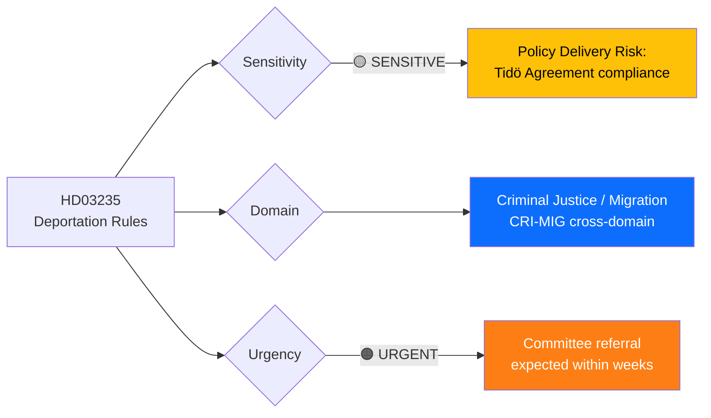

# 🔍 Per-File Political Intelligence Analysis: HD03235

## 📋 Document Identity

| Field | Value |
|-------|-------|
| **Document ID** | `HD03235` |
| **Document Type** | Proposition (prop) |
| **Title** | Skärpta regler om utvisning på grund av brott |
| **Date** | 2026-04-01 |
| **Riksmöte** | 2025/26 |
| **Source MCP Tool** | `get_propositioner`, `get_dokument` |
| **Analysis Timestamp** | 2026-04-03 10:18 UTC |
| **Analyst** | news-realtime-monitor |
| **Responsible Minister** | Johan Forssell (M), Justitiedepartementet |

---

## 🎯 Executive Summary

The government proposes stricter rules for deportation of foreign nationals convicted of crimes in Sweden (Prop 2025/26:235). This is a flagship criminal justice proposition from Minister Johan Forssell (M), directly implementing the Tidö Agreement commitment on migration enforcement. The proposition lowers thresholds for deportation and expands categories of crimes triggering mandatory deportation consideration. This strengthens the government coalition's core policy platform but risks EU legal challenges and opposition criticism on proportionality grounds. **[MEDIUM confidence]**

---

## 📊 Political Classification

| Dimension | Classification | Rationale |
|-----------|---------------|-----------|
| **Sensitivity** | 🟡 SENSITIVE | Touches migration/deportation — high public interest, EU legal implications |
| **Policy Domain** | Criminal Justice + Migration | Cross-domain: criminal sentencing → immigration enforcement |
| **Urgency** | 🟠 URGENT | Active proposition requiring committee processing before summer recess |
| **Political Temperature** | 7/10 | Migration is top-3 voter issue; SD support contingent on delivery |
| **Strategic Significance** | HIGH | Core Tidö Agreement deliverable — failure weakens coalition raison d'être |

---

## 💼 SWOT Analysis

### ✅ Strengths

| # | Statement | Evidence (dok_id) | Confidence | Impact |
|---|-----------|-------------------|:----------:|:------:|
| S1 | Government demonstrates delivery on Tidö Agreement's core migration promise | HD03235 (Prop 2025/26:235) | H | H |
| S2 | Cross-party support likely from SD, which has prioritized deportation enforcement since 2022 | HD03235 + Tidö Agreement | M | H |
| S3 | Minister Forssell (M) has established credibility on criminal justice reform through prior propositions | HD03235 | M | M |

### ⚠️ Weaknesses

| # | Statement | Evidence (dok_id) | Confidence | Impact |
|---|-----------|-------------------|:----------:|:------:|
| W1 | May face EU legal challenges under ECHR Article 8 (right to family life) proportionality tests | HD03235 | M | H |
| W2 | Implementation capacity at Migrationsverket already strained by concurrent reforms | HD03215, HD03229 (related migration props) | M | M |

### 🚀 Opportunities

| # | Statement | Evidence (dok_id) | Confidence | Impact |
|---|-----------|-------------------|:----------:|:------:|
| O1 | Strengthens coalition cohesion ahead of 2026 budget negotiations with SD | HD03235 | H | H |
| O2 | Signals tougher stance that may reduce opposition attack surface on crime/migration | HD03235 | M | M |

### 🔴 Threats

| # | Statement | Evidence (dok_id) | Confidence | Impact |
|---|-----------|-------------------|:----------:|:------:|
| T1 | Opposition (S, V, MP) may unite around proportionality/human rights critique | HD03235 | M | M |
| T2 | EU Court of Justice rulings could invalidate key provisions post-enactment | HD03235 | L | H |

---

## ⚖️ Risk Assessment

| Risk | Likelihood (1-5) | Impact (1-5) | Score | Mitigation |
|------|:-----------------:|:------------:|:-----:|------------|
| EU legal challenge to deportation provisions | 3 | 4 | 12 | Include ECHR proportionality carve-outs |
| Implementation bottleneck at Migrationsverket | 3 | 3 | 9 | Phased rollout with capacity building |
| SD demands further tightening beyond proposition scope | 2 | 3 | 6 | Pre-negotiate scope limits in committee |

---

## 👥 Stakeholder Impact

| Stakeholder | Impact | Mechanism |
|------------|:------:|-----------|
| **Citizens** | MEDIUM | Foreign nationals convicted of crime face stricter deportation; public safety argument |
| **Government Coalition (M, KD, L)** | HIGH | Delivers key Tidö promise; strengthens coalition narrative |
| **SD** | HIGH | Core policy demand fulfilled; validates supply-and-demand agreement |
| **Opposition (S, V, MP)** | MEDIUM | Provides ammunition for proportionality/human rights critique |
| **Business/Industry** | LOW | Indirect impact through labor market effects |
| **International/EU** | MEDIUM | ECHR and EU free movement implications |
| **Judiciary** | MEDIUM | Courts must apply new deportation thresholds |
| **Media** | HIGH | Major news story; migration coverage drives public engagement |

---

## 🔮 Forward Indicators

1. **Committee referral timing** — Watch JuU committee scheduling for HD03235 processing
2. **SD public statements** — Will SD demand even stricter measures or declare satisfaction?
3. **EU Commission response** — Any preliminary assessment of compatibility with EU law
4. **Opposition coordination** — Joint S+V+MP counter-proposal or individual party responses

**Document Control:** Analysis of HD03235 | Analyst: news-realtime-monitor | 2026-04-03
