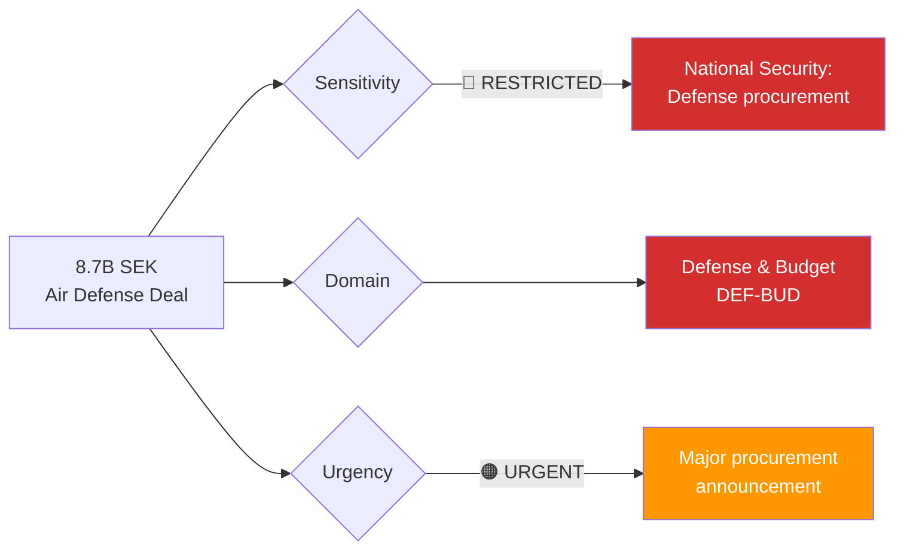

# 🔍 Per-File Political Intelligence Analysis: Air Defense Contract

## 📋 Document Identity

| Field | Value |
|-------|-------|
| **Document ID** | `govt-air-defense-2026-04-02` |
| **Document Type** | Government Press Release |
| **Title** | Luftvärnsavtal på 8,7 miljarder stärker Sveriges anti-drönarförmåga |
| **Date** | 2026-04-02 |
| **Riksmöte** | 2025/26 |
| **Source MCP Tool** | `search_regering` |
| **Analysis Timestamp** | 2026-04-03 10:28 UTC |
| **Analyst** | news-realtime-monitor |
| **Key Actor** | Defense Minister Pål Jonson (M) |

---

## 🎯 Executive Summary

Sweden has signed an 8.7 billion SEK air defense contract specifically targeting anti-drone capability, representing the largest single defense procurement in the current budget cycle. Defense Minister Pål Jonson (M) announced this alongside his visit to the United States, underscoring Sweden's deepening transatlantic defense ties post-NATO accession. The anti-drone focus reflects lessons learned from the Ukraine conflict, where drone warfare has fundamentally changed battlefield dynamics. This contract, combined with the cybersecurity center legislation (HD03214) and war materials regulation reform (HD03228), signals the most comprehensive defense modernization effort since Sweden abandoned neutrality. **[HIGH confidence]**

---

## 📊 Political Classification

| Dimension | Classification | Rationale |
|-----------|---------------|-----------|
| **Sensitivity** | 🔴 RESTRICTED | Major defense procurement; national security implications |
| **Policy Domain** | Defense & Budget | 8.7B SEK has significant fiscal and defense dimensions |
| **Urgency** | 🟠 URGENT | Contract signed; immediate geopolitical signal |
| **Political Temperature** | 6/10 | Large defense spend in economic squeeze; potential political friction |
| **Strategic Significance** | CRITICAL | Largest single defense deal; signals Sweden's NATO role |

---

## 💼 SWOT Analysis

### ✅ Strengths

| # | Statement | Evidence (dok_id) | Confidence | Impact |
|---|-----------|-------------------|:----------:|:------:|
| S1 | 8.7B SEK contract addresses critical capability gap identified in lessons from Ukraine conflict | govt-air-defense press release | H | H |
| S2 | Demonstrates Sweden as serious NATO contributor with advanced military capabilities | govt-air-defense + HD03228 | H | H |
| S3 | Anti-drone technology is cutting-edge; positions Sweden as technology leader in NATO | govt-air-defense | M | H |

### ⚠️ Weaknesses

| # | Statement | Evidence (dok_id) | Confidence | Impact |
|---|-----------|-------------------|:----------:|:------:|
| W1 | 8.7B SEK represents significant fiscal commitment; pressure on other defense budget lines | govt-air-defense | H | H |
| W2 | Technology delivery timeline uncertain; may face supply chain challenges | govt-air-defense | M | M |

### 🚀 Opportunities

| # | Statement | Evidence (dok_id) | Confidence | Impact |
|---|-----------|-------------------|:----------:|:------:|
| O1 | Contract strengthens defense industrial base; potential for export versions to NATO allies | govt-air-defense + HD03228 | H | H |
| O2 | Pål Jonson's USA visit creates opportunities for bilateral defense cooperation expansion | govt-air-defense | M | H |

### 🔴 Threats

| # | Statement | Evidence (dok_id) | Confidence | Impact |
|---|-----------|-------------------|:----------:|:------:|
| T1 | Opposition may challenge fiscal priorities: 8.7B for defense vs. healthcare/education needs | govt-air-defense | M | M |
| T2 | Rapid technology evolution could make anti-drone systems obsolete before full deployment | govt-air-defense | L | H |

---

## ⚖️ Risk Assessment

| Risk | Likelihood (1-5) | Impact (1-5) | Score | Mitigation |
|------|:-----------------:|:------------:|:-----:|------------|
| Budget overrun on procurement | 3 | 4 | 12 | Fixed-price contract with milestones |
| Delivery delays | 3 | 3 | 9 | Parallel procurement tracks |
| Technology obsolescence | 2 | 4 | 8 | Modular upgrade architecture |
| Political backlash on spending priorities | 2 | 3 | 6 | Communicate threat environment clearly |

---

## 👥 Stakeholder Impact

| Stakeholder | Impact | Mechanism |
|------------|:------:|-----------|
| **Citizens** | MEDIUM | Enhanced national security; fiscal cost implications |
| **Government Coalition** | HIGH | Major defense delivery; demonstrates leadership capability |
| **SD** | HIGH | Supports defense spending; validates coalition agenda |
| **Opposition (S)** | MEDIUM | Historically supports defense; may critique fiscal priorities |
| **Defense Industry** | HIGH | Major contract for Swedish/allied defense companies |
| **NATO Allies** | HIGH | Demonstrates Swedish commitment to collective defense |
| **Media** | HIGH | Flagship defense story; public interest in defense spending |

---

## 🔮 Forward Indicators

1. **Procurement authority reports** — FMV delivery timeline and contractor selection
2. **NATO integration exercises** — Swedish anti-drone systems in allied exercises
3. **Parliamentary budget debate** — Opposition response to defense spending levels
4. **Pål Jonson USA visit outcomes** — Bilateral agreements and cooperation announcements

**Document Control:** Analysis of govt-air-defense | Analyst: news-realtime-monitor | 2026-04-03
