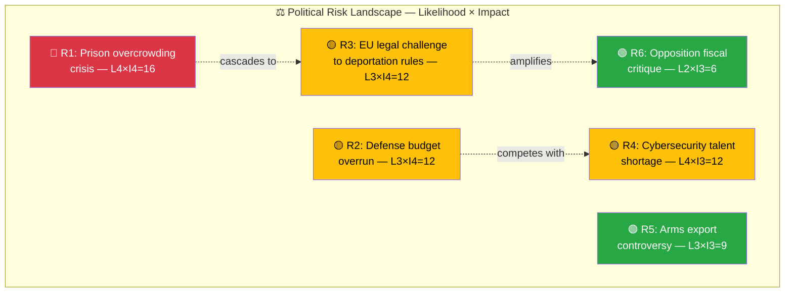

# ⚠️ Political Risk Assessment — Realtime Monitor 1018

## 📋 Risk Context

| Field | Value |
|-------|-------|
| **Risk Assessment ID** | `RSK-2026-04-03-RT1018` |
| **Assessment Date** | 2026-04-03 10:18 UTC |
| **Assessment Period** | 2026-04-01 to 2026-04-03 |
| **Produced By** | news-realtime-monitor |
| **Political Context** | Kristersson government (M+KD+L with SD supply) enters final 18 months of mandate. Defense modernization accelerating post-NATO accession. Criminal justice reform package ongoing. |
| **Riksmöte** | 2025/26 |
| **Overall Risk Level** | MEDIUM |

---

## 🗂️ Risk Inventory

### Risk Heat Map

### 5-Dimension Risk Scoring

| Dimension | Score (1-5) | Key Driver | Evidence |
|-----------|:-----------:|------------|----------|
| **Coalition Risk** | 2 | SD satisfied with defense/crime agenda delivery | HD03235, HD03228 |
| **Policy Delivery Risk** | 3 | Implementation capacity strained across defense + justice reforms | HD01JuU15, HD03214 |
| **Budget Risk** | 3 | 8.7B air defense + prison expansion + cybersecurity center | govt-air-defense |
| **Electoral Risk** | 2 | Government delivering on core promises pre-2026 budget | All documents |
| **External Risk** | 3 | EU legal challenges to deportation; geopolitical uncertainty | HD03235 |

**Composite Risk Score: 2.6/5.0 — MEDIUM**

---

## 📊 Risk Register

| ID | Risk Description | Category | Likelihood (1-5) | Impact (1-5) | Score | Trend | Evidence |
|:--:|-----------------|----------|:-----------------:|:------------:|:-----:|:-----:|----------|
| R1 | Prison overcrowding exceeds safe capacity before new facilities ready | Policy | 4 | 4 | 16 | ↑ | HD01JuU15 |
| R2 | 8.7B defense procurement faces cost overrun | Budget | 3 | 4 | 12 | → | govt-air-defense |
| R3 | EU/ECHR legal challenge invalidates deportation provisions | External | 3 | 4 | 12 | → | HD03235 |
| R4 | Cybersecurity center understaffed due to talent shortage | Policy | 4 | 3 | 12 | ↑ | HD03214 |
| R5 | Arms export to controversial regime creates diplomatic incident | External | 3 | 3 | 9 | → | HD03228 |
| R6 | Opposition unites around fiscal irresponsibility narrative | Electoral | 2 | 3 | 6 | → | All |

---

## 🔗 Cascading Risk Chain — Prison Capacity Crisis

```mermaid
graph LR
    A["Stricter deportation<br/>rules (HD03235)"] --> B["Increased detentions<br/>awaiting deportation"]
    B --> C["Prison overcrowding<br/>worsens (HD01JuU15)"]
    C --> D["Safety incidents<br/>in prisons"]
    D --> E["Media coverage<br/>government failure"]
    E --> F["Opposition attack:<br/>'tough talk, no capacity'"]
    F --> G["Electoral damage<br/>to coalition"]

    style A fill:#ffc107,color:#000
    style B fill:#fd7e14,color:#fff
    style C fill:#dc3545,color:#fff
    style D fill:#dc3545,color:#fff
    style E fill:#fd7e14,color:#fff
    style F fill:#ffc107,color:#000
    style G fill:#dc3545,color:#fff
```

---

## 🔮 Forward Risk Indicators

| Indicator | Current Value | Trigger Level | Monitoring Frequency |
|-----------|:------------:|:------------:|:--------------------:|
| Prison occupancy rate | >100% (estimated) | >110% | Monthly (Kriminalvården) |
| Defense procurement milestone | Contract signed | Cost overrun >10% | Quarterly (FMV) |
| EU legal proceedings | None initiated | ECJ preliminary ruling | Ongoing |
| NCSC staffing level | Unknown | <70% target | Quarterly |
| SD satisfaction with coalition | Stable | Public criticism | Weekly |

---

## 🔑 Strategic Risk Assessment

The primary risk cluster is **implementation capacity**: the government is simultaneously pursuing defense modernization (8.7B air defense, cybersecurity, war materials), criminal justice reform (stricter deportation, prison system), and healthcare improvements (HD03216, SoU16/17). While politically coherent, this risks overwhelming administrative capacity and creating visible delivery gaps that opposition can exploit. The cascading risk from stricter sentencing → prison overcrowding is the most immediate concern.

**Risk Mitigation Priority:**
1. **Immediate**: Prison capacity expansion (R1 — score 16)
2. **Short-term**: Defense procurement cost control (R2 — score 12)
3. **Medium-term**: EU legal defense preparation for deportation rules (R3 — score 12)

**Document Control:** RSK-2026-04-03-RT1018 | news-realtime-monitor | 2026-04-03
