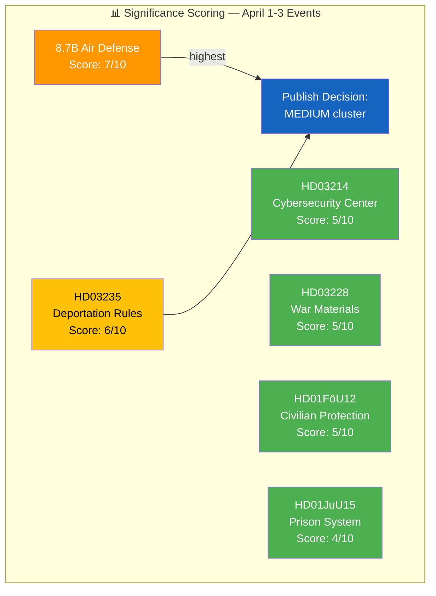

# 📈 Political Significance Scoring — Realtime Monitor 1018

## 📋 Event Context

| Field | Value |
|-------|-------|
| **Score ID** | `SIG-2026-04-03-RT1018` |
| **Event / Document** | Defense & Criminal Justice Legislative Package (April 1-3, 2026) |
| **Primary dok_id** | HD03235, HD03214, HD03228, HD01FöU12, HD01JuU15, govt-air-defense |
| **Scoring Date** | 2026-04-03 10:18 UTC |
| **Scored By** | news-realtime-monitor |
| **Classification ID** | CLS-2026-04-03-RT1018 |

---

## 📊 Section 1: Individual Event Scoring

### Scoring Profile Visualization

### Detailed Scoring Matrix

| dok_id | Parliamentary (0.25) | Policy Impact (0.20) | Public Interest (0.15) | Urgency (0.20) | Cross-Party (0.10) | International (0.10) | **Weighted Score** |
|--------|:-------------------:|:-------------------:|:---------------------:|:--------------:|:------------------:|:-------------------:|:-----------------:|
| HD03235 | 7 | 7 | 8 | 6 | 3 | 5 | **6.4** |
| HD03214 | 6 | 6 | 4 | 5 | 7 | 7 | **5.7** |
| HD03228 | 6 | 6 | 3 | 5 | 5 | 8 | **5.5** |
| HD01FöU12 | 6 | 6 | 5 | 5 | 8 | 5 | **5.8** |
| HD01JuU15 | 5 | 5 | 5 | 5 | 5 | 2 | **4.7** |
| Air defense | 3 | 8 | 7 | 8 | 6 | 8 | **6.5** |

**Scoring Rationale:**
- **Air defense deal (6.5):** Highest combined score due to massive fiscal commitment (8.7B SEK), immediate defense impact, and international significance. Not parliamentary (press release, score 3) but highest policy/urgency.
- **Deportation rules (6.4):** High public interest (migration is top voter issue), significant policy impact, but limited cross-party support (S may oppose, V/MP will oppose).
- **Civilian protection (5.8):** Strong cross-party score (defense consensus) elevates an otherwise moderate-impact committee report.
- **Cybersecurity center (5.7):** Elevated by international dimension (NATO alignment) and cross-party support.

---

## 📊 Section 2: Aggregate Cluster Scoring

| Cluster | Documents | Max Score | Avg Score | Cluster Significance |
|---------|----------|:---------:|:---------:|:-------------------:|
| **Defense Modernization** | HD03214, HD03228, HD01FöU12, air defense | 6.5 | 5.9 | **HIGH** |
| **Criminal Justice Reform** | HD03235, HD01JuU15 | 6.4 | 5.6 | **MEDIUM** |
| **Combined Package** | All 6 documents | 6.5 | 5.8 | **HIGH** |

**Cluster Effect:** The combined defense + criminal justice package is more significant than individual documents suggest. Six significant government actions in 48 hours indicates a coordinated legislative push.

---

## 📊 Section 3: Publication Decision

| Decision Criteria | Assessment |
|------------------|-----------|
| **Highest Individual Score** | 6.5 (air defense) → MEDIUM threshold |
| **Cluster Significance** | HIGH (6 coordinated actions) |
| **News Hook** | 8.7B SEK contract + defense minister USA visit |
| **Differentiation from Last Coverage** | New propositions and procurement not previously covered |
| **Recommended Action** | **GENERATE ARTICLE** — combined defense/criminal justice update |
| **Article Type** | Breaking news — defense modernization package |
| **Priority Languages** | EN, SV (core) |

---

## 🔑 Significance Summary

The April 1-3 period represents the **most concentrated defense legislative activity** in the 2025/26 riksmöte. While no single event crosses the HIGH threshold (≥7), the cluster effect of 6 coordinated government actions — spanning defense procurement (8.7B SEK), cybersecurity legislation, war materials regulation, civilian protection, stricter deportation rules, and prison system review — creates a compelling composite narrative. The 8.7B air defense contract is the strongest individual news hook.

**Document Control:** SIG-2026-04-03-RT1018 | news-realtime-monitor | 2026-04-03
