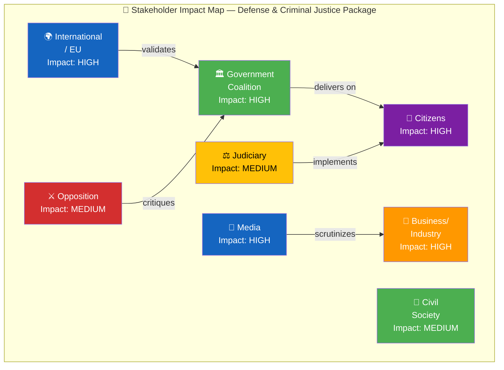

# 👥 Stakeholder Impact Assessment — Realtime Monitor 1018

## 📋 Assessment Context

| Field | Value |
|-------|-------|
| **Assessment ID** | `STA-2026-04-03-RT1018` |
| **Assessment Date** | 2026-04-03 10:18 UTC |
| **Policy/Event Subject** | Sweden's defense modernization package and criminal justice reform (April 1-3, 2026) |
| **Primary dok_id** | HD03235, HD03214, HD03228, HD01FöU12, HD01JuU15, govt-air-defense |
| **Stage of Process** | Propositions submitted; committee reports published; procurement contract signed |
| **Produced By** | news-realtime-monitor |
| **Overall Impact Level** | HIGH |

---

## 👥 Stakeholder Group Assessments

### Stakeholder Impact Overview

---

### 1. 👤 Citizens — Impact: **HIGH**

| Dimension | Assessment | Evidence |
|-----------|-----------|----------|
| **Security** | Enhanced national defense through 8.7B air defense contract and cybersecurity center | govt-air-defense, HD03214 |
| **Civil Protection** | Improved shelter capacity and evacuation planning under FöU12 | HD01FöU12 |
| **Criminal Justice** | Stricter deportation of convicted foreign nationals; public safety argument | HD03235 |
| **Fiscal** | Significant government spending commitments may affect future tax/service decisions | All documents |
| **Rights** | Deportation rule changes raise proportionality concerns for affected individuals | HD03235 |

**Net Citizen Impact:** Citizens gain enhanced national security and criminal justice enforcement but face potential fiscal trade-offs and rights balance questions.

---

### 2. 🏛️ Government Coalition (M, KD, L + SD supply) — Impact: **HIGH**

| Dimension | Assessment | Evidence |
|-----------|-----------|----------|
| **Policy Delivery** | 6 significant legislative/procurement actions in 48 hours — strongest week of mandate | All documents |
| **Coalition Cohesion** | SD priorities (deportation) + M priorities (defense) both advanced | HD03235, govt-air-defense |
| **Electoral Position** | Demonstrates competence on top voter concerns (crime, security) | HD03235, HD01JuU15 |
| **Implementation Risk** | Simultaneous reforms strain administrative capacity | HD01JuU15 (prison), HD03214 (staffing) |

**Net Coalition Impact:** Highly positive for political positioning; risk in delivery execution.

---

### 3. ⚔️ Opposition (S, V, MP, C) — Impact: **MEDIUM**

| Dimension | Assessment | Evidence |
|-----------|-----------|----------|
| **S (Social Democrats)** | Limited attack surface on defense; can target implementation gaps in criminal justice | HD01JuU15 |
| **V (Left Party)** | Likely opposes war materials export liberalization; strongest opposition voice | HD03228 |
| **MP (Green Party)** | Opposes both arms exports and aggressive deportation policy | HD03228, HD03235 |
| **C (Centre Party)** | Mixed position; supports defense but may critique fiscal management | govt-air-defense |

**Net Opposition Impact:** Defense consensus limits opposition leverage; criminal justice implementation gaps provide best attack vector.

---

### 4. 💼 Business/Industry — Impact: **HIGH**

| Dimension | Assessment | Evidence |
|-----------|-----------|----------|
| **Defense Industry** | 8.7B procurement benefits Saab, BAE Bofors, defense SMEs; war materials reform opens export markets | govt-air-defense, HD03228 |
| **IT/Cybersecurity** | NCSC expansion creates government contracting opportunities | HD03214 |
| **Construction** | Prison expansion and shelter rebuilding create public construction contracts | HD01JuU15, HD01FöU12 |

---

### 5. 🤝 Civil Society — Impact: **MEDIUM**

| Dimension | Assessment | Evidence |
|-----------|-----------|----------|
| **Human Rights Orgs** | Will scrutinize deportation rule proportionality and arms export criteria | HD03235, HD03228 |
| **Peace Organizations** | SPAS and similar groups will oppose liberal war materials export rules | HD03228 |
| **Migration Advocacy** | Concerned about stricter deportation thresholds and family separation risks | HD03235 |

---

### 6. 🌍 International/EU — Impact: **HIGH**

| Dimension | Assessment | Evidence |
|-----------|-----------|----------|
| **NATO Allies** | Welcome Sweden's defense modernization and spending commitment | govt-air-defense, HD03214 |
| **EU Commission** | Will assess deportation rule compatibility with EU law and ECHR | HD03235 |
| **USA** | Defense minister visit signals deepening transatlantic cooperation | govt-air-defense |
| **Nordic Partners** | Shared defense cooperation benefits from Swedish capability upgrade | HD03214 |

---

### 7. ⚖️ Judiciary — Impact: **MEDIUM**

| Dimension | Assessment | Evidence |
|-----------|-----------|----------|
| **Courts** | Must apply new deportation thresholds; potential caseload increase | HD03235 |
| **Migrationsdomstolarna** | Migration courts will process deportation appeals under stricter rules | HD03235 |
| **EU Courts** | Potential ECHR challenges on proportionality | HD03235 |

---

### 8. 📰 Media/Public Opinion — Impact: **HIGH**

| Dimension | Assessment | Evidence |
|-----------|-----------|----------|
| **Defense Reporting** | 8.7B contract is major headline; defense minister USA visit provides compelling narrative | govt-air-defense |
| **Crime Reporting** | Deportation rules + prison system generate significant public interest coverage | HD03235, HD01JuU15 |
| **Investigative Potential** | Defense procurement transparency; prison conditions scrutiny | govt-air-defense, HD01JuU15 |

---

## 🔑 Cross-Stakeholder Dynamics

The defense modernization package creates **positive-sum dynamics** among most stakeholders: government, citizens, business, and international partners all benefit. The criminal justice package creates **zero-sum dynamics**: government and SD benefit at the expense of affected individuals and opposition positioning. The most contentious interaction is between **civil society** (human rights concerns) and **government** (delivery credibility) on the deportation rules.

**Document Control:** STA-2026-04-03-RT1018 | news-realtime-monitor | 2026-04-03
