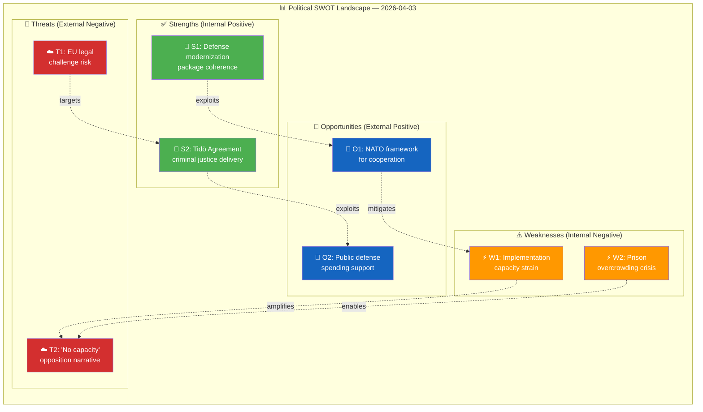

# 💼 Political SWOT Analysis — Realtime Monitor 1018

## 📋 SWOT Context

| Field | Value |
|-------|-------|
| **SWOT ID** | `SWT-2026-04-03-RT1018` |
| **Analysis Date** | 2026-04-03 10:18 UTC |
| **Analysis Scope** | Government coalition defense & criminal justice agenda |
| **Reference Period** | 2026-W14 (2026-03-30 to 2026-04-05) |
| **Produced By** | news-realtime-monitor |
| **Primary MCP Sources** | `get_propositioner`, `get_betankanden`, `search_regering`, `search_voteringar`, `get_dokument` |
| **Validity Window** | Entries valid until 2026-05-03 |

---

## 🏛️ Section 1: Government Coalition SWOT

### ✅ Strengths — Government Coalition

| # | Strength Statement | Evidence (dok_id) | Confidence | Impact | Entry Date |
|---|-------------------|-------------------|:----------:|:------:|:----------:|
| S1 | Comprehensive defense modernization package (cybersecurity + war materials + civilian protection + 8.7B air defense) demonstrates coherent security agenda | HD03214, HD03228, HD01FöU12, govt-air-defense | H | H | 2026-04-03 |
| S2 | Criminal justice reform delivery (deportation rules + prison system review) fulfills Tidö Agreement commitments to SD | HD03235, HD01JuU15 | H | H | 2026-04-03 |
| S3 | Broad cross-party consensus on defense spending reduces legislative risk for 4 of 6 analyzed documents | HD03214, HD01FöU12 | H | M | 2026-04-03 |
| S4 | Multiple propositions from different ministries (Justice, Defense, Foreign Affairs) show whole-of-government coordination | HD03235, HD03214, HD03228 | M | M | 2026-04-03 |

**Coalition Strength Summary:** The government enters April 2026 with its strongest legislative package of the parliamentary session — defense modernization and criminal justice reform form a coherent policy narrative that satisfies both formal coalition partners and SD's supply-and-demand priorities.

---

### ⚠️ Weaknesses — Government Coalition

| # | Weakness Statement | Evidence (dok_id) | Confidence | Impact | Entry Date |
|---|-------------------|-------------------|:----------:|:------:|:----------:|
| W1 | Implementation capacity strained: simultaneous defense, criminal justice, and healthcare reforms risk overwhelming administrative machinery | HD01JuU15, HD03214, HD03235 | M | H | 2026-04-03 |
| W2 | 8.7B SEK air defense contract creates fiscal pressure; may require trade-offs in 2027 budget negotiations | govt-air-defense | H | H | 2026-04-03 |
| W3 | Prison overcrowding crisis (>100% occupancy) could undermine credibility of stricter sentencing rhetoric | HD01JuU15 | H | H | 2026-04-03 |

**Coalition Weakness Summary:** The government's ambition exceeds its implementation bandwidth. The risk of visible delivery failure — particularly in prison capacity — could transform a policy strength into an electoral vulnerability before the 2026 autumn budget.

---

### 🚀 Opportunities — Government Coalition

| # | Opportunity Statement | Evidence (dok_id) | Confidence | Impact | Entry Date |
|---|----------------------|-------------------|:----------:|:------:|:----------:|
| O1 | NATO membership provides framework for shared costs and technology transfer in defense modernization | HD03214, HD03228 | H | H | 2026-04-03 |
| O2 | Public support for defense spending at historic highs; favorable environment for large procurement decisions | govt-air-defense | H | H | 2026-04-03 |
| O3 | European defense spending surge creates export opportunities for Swedish defense industry (Saab, BAE Bofors) | HD03228 | H | M | 2026-04-03 |

**Coalition Opportunity Summary:** The post-NATO-accession security environment and European defense investment wave create a uniquely favorable window for Sweden's defense modernization — both politically and industrially.

---

### 🔴 Threats — Government Coalition

| # | Threat Statement | Evidence (dok_id) | Confidence | Impact | Entry Date |
|---|-----------------|-------------------|:----------:|:------:|:----------:|
| T1 | EU/ECHR legal challenges to deportation rules could embarrass government and weaken Tidö Agreement deliverables | HD03235 | M | H | 2026-04-03 |
| T2 | Opposition may construct "all talk, no capacity" narrative linking stricter laws to overcrowded prisons | HD01JuU15, HD03235 | M | H | 2026-04-03 |
| T3 | Defense budget overruns could trigger fiscal discipline debate within coalition (L historically budget-conscious) | govt-air-defense | M | M | 2026-04-03 |

**Coalition Threat Summary:** The most dangerous threat vector combines T1 and T2: if deportation rules are legally challenged AND prison capacity fails, the government's core Tidö narrative collapses simultaneously on two fronts.

---

## 🏛️ Section 2: Main Opposition SWOT

**Opposition Subject:** Social Democrats (S) + V + MP bloc

### ✅ Strengths — Opposition

| # | Strength Statement | Evidence (dok_id) | Confidence | Impact | Entry Date |
|---|-------------------|-------------------|:----------:|:------:|:----------:|
| S1 | Can critique government implementation gaps (prison overcrowding, staff shortages) | HD01JuU15 | M | M | 2026-04-03 |
| S2 | EU legal framework provides external validation for proportionality arguments against deportation rules | HD03235 | M | M | 2026-04-03 |

### ⚠️ Weaknesses — Opposition

| # | Weakness Statement | Evidence (dok_id) | Confidence | Impact | Entry Date |
|---|-------------------|-------------------|:----------:|:------:|:----------:|
| W1 | Limited room to oppose defense spending given cross-party consensus and security environment | HD03214, HD01FöU12 | H | M | 2026-04-03 |
| W2 | S historically supported tough-on-crime measures; difficult to differentiate on criminal justice | HD03235 | M | M | 2026-04-03 |

### 🚀 Opportunities — Opposition

| # | Opportunity Statement | Evidence (dok_id) | Confidence | Impact | Entry Date |
|---|----------------------|-------------------|:----------:|:------:|:----------:|
| O1 | Fiscal accountability narrative: can government afford 8.7B defense + prison expansion + healthcare reform? | govt-air-defense, HD01JuU15 | M | H | 2026-04-03 |

### 🔴 Threats — Opposition

| # | Threat Statement | Evidence (dok_id) | Confidence | Impact | Entry Date |
|---|-----------------|-------------------|:----------:|:------:|:----------:|
| T1 | Government defense delivery package may reset voter perceptions of competence before 2026 autumn budget | All documents | M | H | 2026-04-03 |

---

## 🏛️ Section 3: Policy Domain SWOT

**Policy Domain:** Defense & Security (DEF)

### ✅ Strengths in Domain

| # | Strength Statement | Evidence (dok_id) | Confidence | Impact | Entry Date |
|---|-------------------|-------------------|:----------:|:------:|:----------:|
| S1 | Four simultaneous defense initiatives represent most comprehensive security package since Cold War end | HD03214, HD03228, HD01FöU12, govt-air-defense | H | H | 2026-04-03 |
| S2 | NATO framework enables defense cooperation previously impossible under neutrality | HD03228 | H | H | 2026-04-03 |

### ⚠️ Weaknesses in Domain

| # | Weakness Statement | Evidence (dok_id) | Confidence | Impact | Entry Date |
|---|-------------------|-------------------|:----------:|:------:|:----------:|
| W1 | Civil defense infrastructure (shelters) severely degraded since Cold War; rebuilding takes years | HD01FöU12 | H | H | 2026-04-03 |

### 🚀 Opportunities in Domain

| # | Opportunity Statement | Evidence (dok_id) | Confidence | Impact | Entry Date |
|---|----------------------|-------------------|:----------:|:------:|:----------:|
| O1 | European defense spending surge creates favorable environment for Swedish defense modernization | govt-air-defense, HD03228 | H | H | 2026-04-03 |

### 🔴 Threats to Domain

| # | Threat Statement | Evidence (dok_id) | Confidence | Impact | Entry Date |
|---|-----------------|-------------------|:----------:|:------:|:----------:|
| T1 | Evolving threat landscape (drone warfare, cyber attacks) may outpace legislative/procurement response | HD03214, govt-air-defense | M | H | 2026-04-03 |

---

## 📊 SWOT Quadrant Mapping

---

## 🔑 Strategic Implications

The government coalition's most dangerous SWOT interaction is the **W2→T2 amplification**: prison overcrowding (W2) enables the opposition's "tough talk, no capacity" narrative (T2), which could erode the coalition's primary electoral asset — criminal justice credibility. Meanwhile, the S1→O1 exploitation (defense package + NATO framework) provides the strongest strategic position, as European defense consensus insulates these policies from partisan attack. The 30-60 day outlook depends heavily on whether the government can demonstrate concrete prison capacity expansion progress before the Riksdag's summer recess.

**Key Watch Items:**
1. Kriminalvården monthly occupancy data — if >110%, expect media escalation
2. FöU12 plenary vote scheduling — test of cross-party defense consensus
3. EU Commission response to HD03235 deportation provisions — early indicator of legal challenge risk

---

## 🔄 Section 5: Cross-SWOT Interference Analysis

| Gov/Opp SWOT Element | Interfering Element | Effect | Net Political Impact |
|:--------------------:|:------------------:|:------:|---------------------|
| Gov W2: Prison overcrowding | Opp S1: Can critique implementation gaps | Amplifies vulnerability | Opposition gains attack vector on government's core competence claim |
| Gov S1: Defense modernization | Opp W1: Cannot oppose defense spending | Neutralizes opposition | Defense agenda is politically insulated from serious challenge |
| Gov S2: Tidö criminal justice | Gov T1: EU legal challenge | Fragile dependency | If ECHR blocks deportation provisions, core coalition rationale weakens |
| Gov W1: Implementation strain | Gov O1: NATO cooperation | Partial mitigation | NATO burden-sharing reduces some implementation load |

---

## 📊 Section 6: TOWS Strategic Options

| TOWS Cell | Strategy | Specific Action | Evidence |
|:---------:|---------|-----------------|---------|
| **SO** (S1 × O1) | Leverage NATO framework to accelerate defense modernization | Fast-track HD03214 cybersecurity center implementation via NATO partnership programs | HD03214, govt-air-defense |
| **WO** (W2 × O2) | Use public support for tough-on-crime to justify emergency prison capacity spending | Request supplementary budget for Kriminalvården before summer recess | HD01JuU15 |
| **ST** (S2 × T1) | Pre-empt EU legal challenge by building ECHR proportionality safeguards into implementation | Proactive engagement with EU Commission on HD03235 compatibility | HD03235 |
| **WT** (W1 × T2) | Prioritize visible implementation milestones to counter "no capacity" narrative | Announce new prison facility openings and staffing targets publicly | HD01JuU15 |

---

## 🔮 Section 7: Forward Indicators & Scenario Outlook

| Scenario | Probability | Key Trigger | SWOT Elements |
|----------|:----------:|------------|---------------|
| Government delivers defense package on schedule; SD satisfied | 55% | FöU12 vote passes with large majority | S1+O1, S3 |
| Implementation delays create visible gaps; opposition capitalizes | 30% | Prison incident or EU legal challenge | W2+T2, W1+T1 |
| Budget crisis forces defense spending cuts | 15% | FiU budget review reveals fiscal shortfall | W2+T3, O2 weakens |

---

## 📂 MCP Data Files Used

| # | Data Source | File / Tool Path | Data Type | Retrieved |
|:-:|-----------|-----------------|-----------|-----------|
| 1 | riksdag-regering-mcp | `get_propositioner(rm="2025/26")` | Propositions | 2026-04-03 10:18 UTC |
| 2 | riksdag-regering-mcp | `get_betankanden(rm="2025/26")` | Committee reports | 2026-04-03 10:18 UTC |
| 3 | riksdag-regering-mcp | `search_regering(dateFrom="2026-04-02")` | Government documents | 2026-04-03 10:18 UTC |
| 4 | riksdag-regering-mcp | `search_voteringar(rm="2025/26")` | Voting records | 2026-04-03 10:18 UTC |
| 5 | riksdag-regering-mcp | `get_dokument(dok_id="HD03235")` | Document detail | 2026-04-03 10:18 UTC |
| 6 | riksdag-regering-mcp | `get_dokument(dok_id="HD03214")` | Document detail | 2026-04-03 10:18 UTC |

### SWOT Quadrant Data Provenance

| SWOT Quadrant | Primary MCP Tools | Evidence Items | Confidence |
|:-------------:|------------------|:--------------:|:----------:|
| **Strengths** | `get_propositioner`, `get_betankanden`, `search_regering` | 4 | H |
| **Weaknesses** | `get_betankanden`, `get_dokument` | 3 | M |
| **Opportunities** | `search_regering`, `get_propositioner` | 3 | H |
| **Threats** | `get_dokument`, `search_dokument` | 3 | M |

**Document Control:**
- **Template Path:** `/analysis/templates/swot-analysis.md`
- **Framework Reference:** SWOT.md, methodologies/political-swot-framework.md
- **Version:** 2.1
- **Classification:** Public
