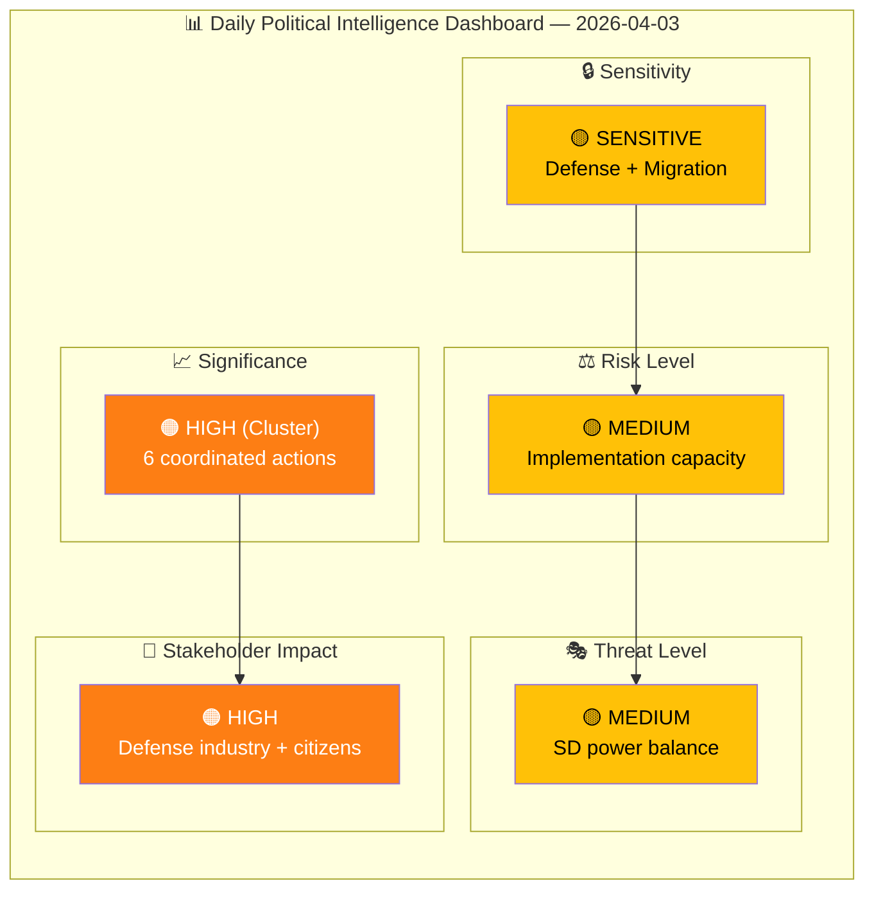
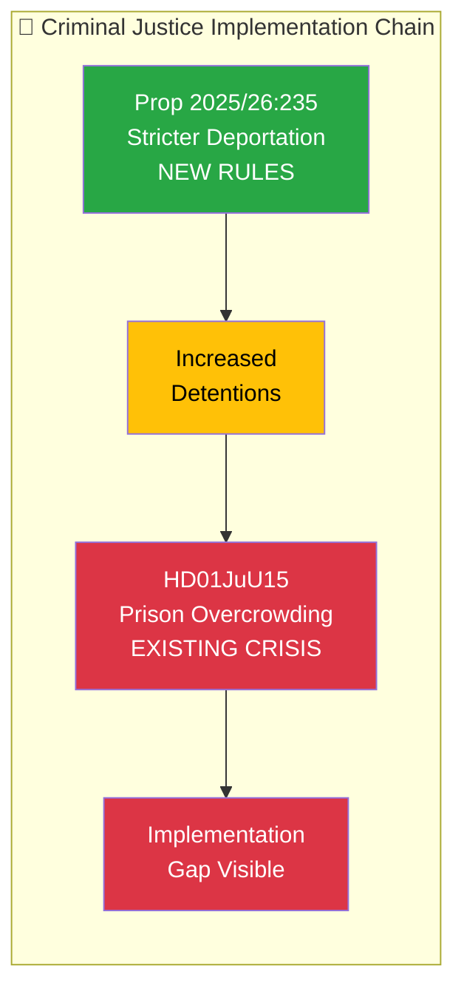
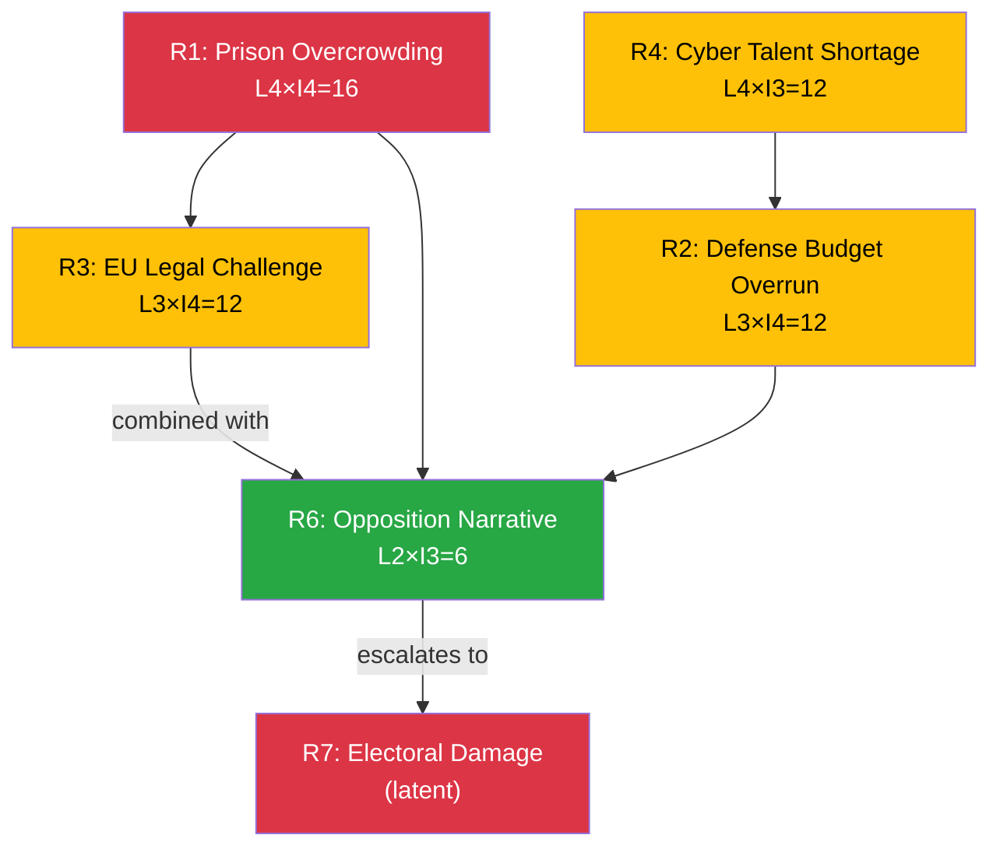

# 🧩 Political Intelligence Synthesis — Realtime Monitor 1018

## 📋 Synthesis Context

| Field | Value |
|-------|-------|
| **Synthesis ID** | `SYN-2026-04-03-RT1018` |
| **Analysis Date** | 2026-04-03 10:18 UTC |
| **Documents Analyzed** | 6 |
| **Analysis Period** | 2026-04-01 00:00 to 2026-04-03 10:18 UTC |
| **Produced By** | news-realtime-monitor |
| **Overall Confidence** | MEDIUM |

---

## 📊 Intelligence Dashboard

### Daily Political Landscape

---

## 🔍 Cross-Document Pattern Analysis

### Pattern 1: Defense Modernization Surge

The most striking pattern across April 1-3 documents is the **unprecedented concentration of defense-related actions**:

| Action | Date | Type | Value |
|--------|------|------|-------|
| Cybersecurity Center Law (HD03214) | Apr 1 | Proposition | Legislative |
| War Materials Regulation (HD03228) | Apr 1 | Proposition | Regulatory |
| Civilian Protection Report (HD01FöU12) | Apr 2 | Committee Report | Policy |
| 8.7B Air Defense Contract | Apr 2 | Procurement | 8.7B SEK |
| Defense Minister USA Visit | Apr 2 | Diplomatic | Bilateral |

**Pattern Assessment:** This is not coincidental. The government is executing a coordinated defense modernization push, likely timed to maximize media impact and demonstrate NATO-era defense commitment before the 2026 autumn budget debate. The Försvarsdepartementet, Utrikesdepartementet, and FöU are acting in concert.

### Pattern 2: Criminal Justice Implementation Gap

The juxtaposition of HD03235 (stricter deportation rules) and HD01JuU15 (prison system capacity crisis) reveals a **policy-implementation gap**: the government is legislating tougher enforcement while the system to enforce it is already at breaking point.

---

## 📊 Aggregate SWOT Summary

| Quadrant | Strongest Finding | Combined Confidence |
|----------|------------------|:-------------------:|
| **Strengths** | Coherent defense modernization package demonstrates government competence | HIGH |
| **Weaknesses** | Implementation capacity strained across defense + criminal justice + healthcare | MEDIUM |
| **Opportunities** | NATO framework + European defense spending surge create favorable environment | HIGH |
| **Threats** | EU legal challenge to deportation + prison overcrowding = dual vulnerability | MEDIUM |

---

## 📊 Risk Interconnection Map

---

## 📋 Document Significance Ranking

| Rank | dok_id | Title | Score | Rationale |
|:----:|--------|-------|:-----:|-----------|
| 1 | govt-air-defense | 8.7B SEK air defense contract | 6.5 | Largest single procurement; immediate capability impact |
| 2 | HD03235 | Stricter deportation rules | 6.4 | Core Tidö deliverable; high public interest |
| 3 | HD01FöU12 | Civilian protection report | 5.8 | Strong cross-party support; total defense pillar |
| 4 | HD03214 | Cybersecurity center law | 5.7 | NATO alignment; critical infrastructure protection |
| 5 | HD03228 | War materials regulation | 5.5 | Defense industry enabler; export market access |
| 6 | HD01JuU15 | Prison system questions | 4.7 | Implementation capacity indicator; lower standalone significance |

---

## 🔮 Forward Intelligence

### What to Watch Next

1. **FöU12 plenary vote** — When scheduled, indicates Riksdag's defense consensus strength
2. **JuU committee processing of HD03235** — Timeline reveals government's deportation reform priority level
3. **Kriminalvården occupancy data** — Monthly statistics signal prison crisis trajectory
4. **EU Commission deportation assessment** — Preliminary compatibility review could come within 30 days
5. **Defense Minister USA visit outcomes** — Bilateral agreements signal transatlantic defense direction

### Intelligence Collection Priority

| Priority | Target | MCP Tool | Frequency |
|:--------:|--------|----------|-----------|
| 1 | Riksdag plenary vote scheduling | `get_calendar_events` | Daily |
| 2 | JuU committee agenda for HD03235 | `search_dokument(organ="JuU")` | Twice weekly |
| 3 | Government press releases on defense | `search_regering(type="pressmeddelanden")` | Daily |
| 4 | Opposition speeches on criminal justice | `search_anforanden(parti="S")` | Weekly |

---

## 🔑 Synthesis Conclusion

**The April 1-3 period represents the Kristersson government's most concentrated legislative push of the 2025/26 riksmöte.** The defense modernization cluster (4 actions) and criminal justice reform thread (2 actions) together demonstrate a government racing to deliver on its core commitments before the mandate's final 18 months. The primary risk is not political opposition — defense has broad consensus and crime is a government strength — but rather **implementation capacity**: can the bureaucratic machinery deliver on 8.7B in defense procurement, a cybersecurity center, prison expansion, deportation enforcement, and civilian protection simultaneously? The answer to that question will determine whether this week's legislative ambition translates into electoral advantage or becomes the opposition's attack surface.

**Document Control:** SYN-2026-04-03-RT1018 | news-realtime-monitor | 2026-04-03
