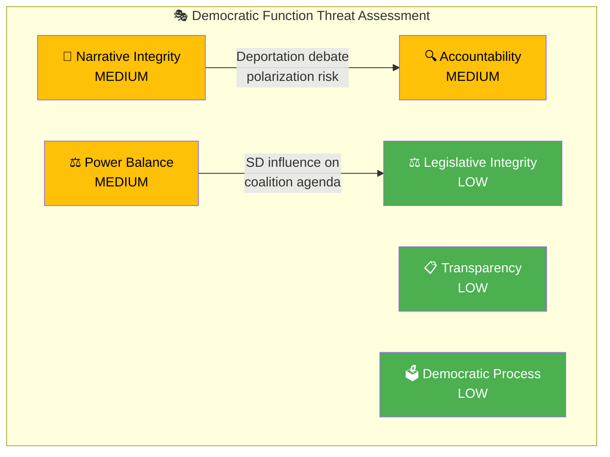
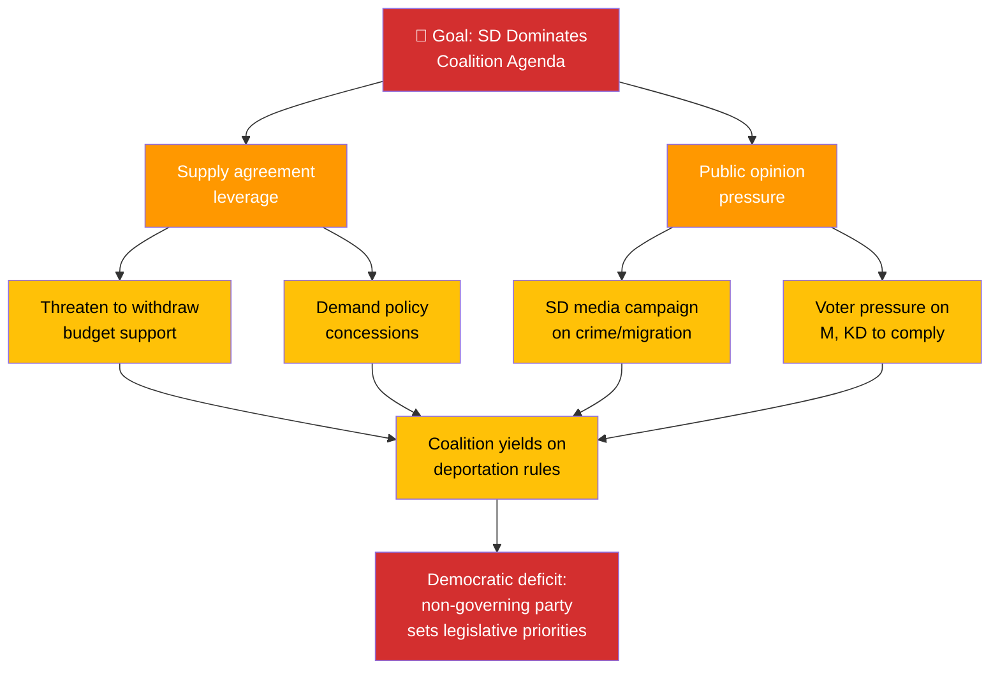

# 🎭 Political Threat Analysis — Realtime Monitor 1018

## 📋 Threat Analysis Context

| Field | Value |
|-------|-------|
| **Threat Analysis ID** | `THR-2026-04-03-RT1018` |
| **Analysis Date** | 2026-04-03 10:18 UTC |
| **Analysis Period** | 2026-W14 (2026-03-30 to 2026-04-05) |
| **Produced By** | news-realtime-monitor |
| **Political Context** | Kristersson government pursuing aggressive defense/criminal justice agenda. 6 significant documents in 48 hours. Coalition stable but implementation capacity under pressure. |
| **Overall Threat Level** | MEDIUM |

---

## 🏷️ Political Threat Taxonomy Assessment

| Category | Threat Level | Primary Driver | Evidence |
|----------|:----------:|----------------|----------|
| **Narrative Integrity** | MEDIUM | Deportation debate may produce polarized, fact-light public discourse | HD03235 |
| **Legislative Integrity** | LOW | Defense legislation has broad cross-party support; no procedural concerns | HD03214, HD03228, HD01FöU12 |
| **Accountability** | MEDIUM | 8.7B procurement transparency; prison capacity oversight gaps | govt-air-defense, HD01JuU15 |
| **Transparency** | LOW | Government propositions publicly available; standard legislative process | All documents |
| **Democratic Process** | LOW | No signs of process manipulation; standard committee procedures | All documents |
| **Power Balance** | MEDIUM | SD's informal veto power shapes agenda without formal government membership | HD03235 (Tidö priority) |

---

## 🌳 Attack Tree — Primary Threat: SD Informal Veto Power

---

## 💎 Diamond Model — SD as Informal Coalition Influence

| Diamond Facet | Assessment |
|:-------------:|-----------|
| **Adversary** | SD (Sverigedemokraterna) — not adversary in traditional sense, but exercises disproportionate influence relative to non-government status |
| **Capability** | 73 Riksdag seats; supply agreement leverage; strong media operation; polling at ~20% |
| **Infrastructure** | Tidö Agreement framework; budget negotiation veto; committee positions |
| **Victim** | Legislative agenda autonomy of M, KD, L governing parties |

---

## 🔫 Kill Chain Assessment

| Phase | Status | Evidence |
|-------|:------:|----------|
| 1. Reconnaissance | ✅ Complete | SD has detailed knowledge of coalition vulnerabilities |
| 2. Weaponization | ✅ Complete | Supply agreement structured as leverage tool |
| 3. Delivery | ✅ Ongoing | HD03235 deportation rules reflect SD priority demands |
| 4. Exploitation | ⚡ Active | Government propositions increasingly align with SD program |
| 5. Installation | ⚠️ Partial | Not all SD demands met; negotiation ongoing |
| 6. Command & Control | ❌ Not reached | SD does not directly control government policy execution |
| 7. Actions on Objectives | ⚠️ Partial | Some Tidö Agreement items delivered; others pending |

---

## 🔮 Forward Threat Indicators

| Indicator | Signal Level | Detection Method |
|-----------|:----------:|-----------------|
| SD public criticism of coalition speed | GREEN | `search_anforanden(parti="SD")` |
| Budget negotiation breakdown | GREEN | Media monitoring; `search_dokument` |
| EU legal proceedings on deportation | YELLOW | EU Commission communications |
| Prison safety incident | YELLOW | `search_dokument(organ="JuU")` |

---

## 🔑 Threat Assessment Summary

The primary democratic function threat in this period is **Power Balance distortion** — SD's informal veto power through the supply agreement shapes legislative priorities (particularly HD03235 deportation rules) without SD bearing direct governing responsibility. This structural democratic deficit is not new but becomes more visible when the government delivers SD-aligned policy at accelerated pace. The accountability risk (MEDIUM) stems from potential transparency gaps in the 8.7B defense procurement and prison capacity oversight. Overall threat level remains MEDIUM as democratic institutions function normally despite structural tensions.

**Document Control:** THR-2026-04-03-RT1018 | news-realtime-monitor | 2026-04-03
