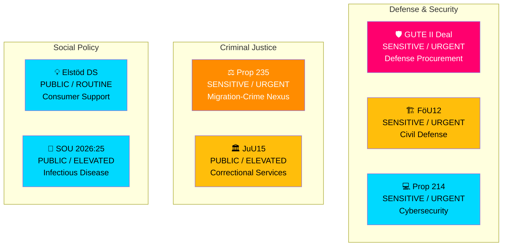

# 🏷️ Political Classification — Realtime Monitor 1416

**📋 Document Owner:** CEO | **📄 Version:** 2.1 | **📅 Analysis Date:** 2026-04-03 14:16 UTC
**🏢 Owner:** Hack23 AB (Org.nr 5595347807) | **🏷️ Classification:** Public

---

## 📊 Classification Matrix

---

## 📋 Document Classification Table

| Document | Sensitivity | Domain | Urgency | Severity Score | Tier |
|----------|:-----------:|--------|:-------:|:--------------:|:----:|
| GUTE II Defense Deal | 🟡 SENSITIVE | National Security / Defense | 🟠 URGENT | **7** | HIGH |
| FöU12 Civilian Protection | 🟡 SENSITIVE | Civil Defense | 🟠 URGENT | **6** | MEDIUM |
| Prop 214 Cybersecurity | 🟡 SENSITIVE | Cybersecurity | 🟠 URGENT | **6** | MEDIUM |
| Prop 235 Deportation | 🟡 SENSITIVE | Migration / Criminal Justice | 🟠 URGENT | **5** | MEDIUM |
| JuU15 Kriminalvård | 🟢 PUBLIC | Criminal Justice | 🔵 ELEVATED | **4** | MEDIUM |
| Elstöd DS | 🟢 PUBLIC | Consumer Protection | ⚪ ROUTINE | **3** | LOW |
| SOU 2026:25 Smittskydd | 🟢 PUBLIC | Public Health | 🔵 ELEVATED | **3** | LOW |

---

**Document Control:** Classification by news-realtime-monitor | 2026-04-03 14:16 UTC | Classification: Public
