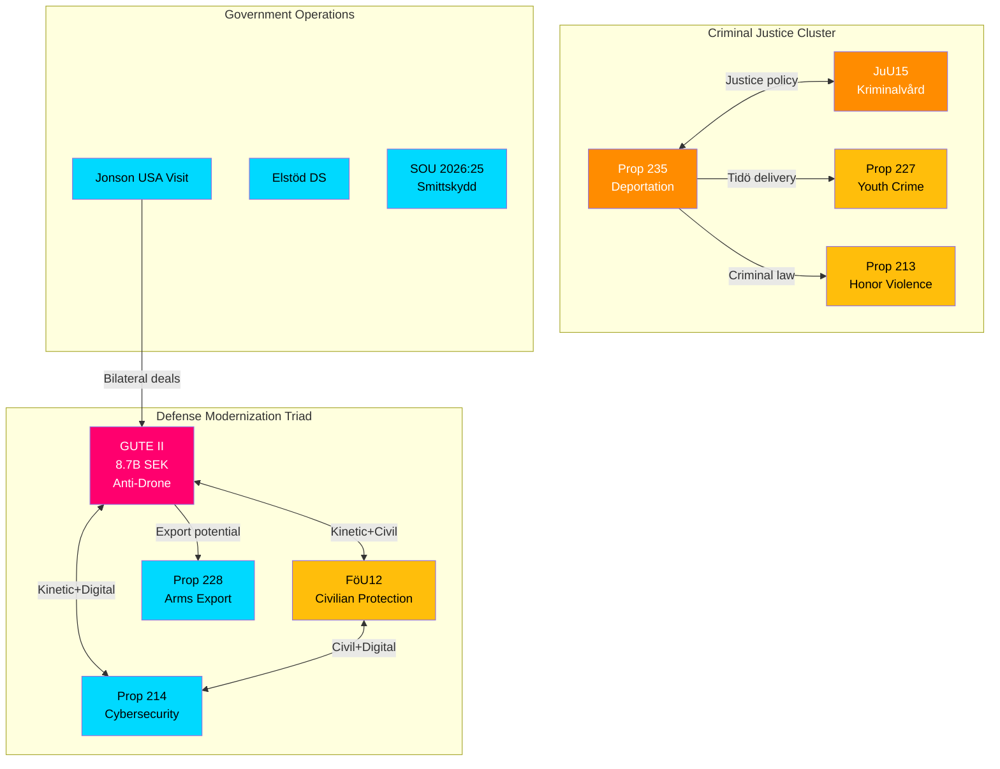

# 🔗 Cross-Reference Map — Realtime Monitor 1416

**📋 Document Owner:** CEO | **📄 Version:** 2.1 | **📅 Analysis Date:** 2026-04-03 14:16 UTC
**🏢 Owner:** Hack23 AB (Org.nr 5595347807) | **🏷️ Classification:** Public

---

## 📊 Cross-Reference Network

---

## 📋 Reference Matrix

| Source Document | References | Relationship Type |
|----------------|-----------|-------------------|
| GUTE II Deal | FöU12, Prop 214, Prop 228, USA visit | Policy cluster / complementary |
| FöU12 | GUTE II, Prop 214, FöU11 | Defense committee portfolio |
| Prop 214 | GUTE II, FöU12 | Digital defense complement |
| Prop 235 | JuU15, Prop 227, Prop 213, Prop 229 | Criminal justice / migration nexus |
| JuU15 | Prop 235, JuU16 | Justice committee portfolio |

---

**Document Control:** Cross-Reference Map by news-realtime-monitor | 2026-04-03 14:16 UTC | Classification: Public
