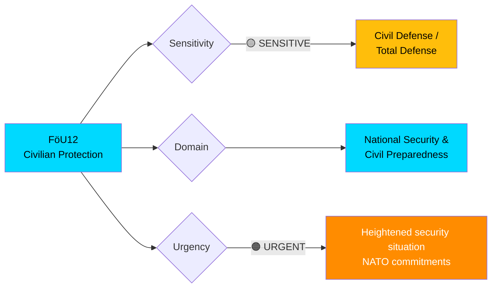
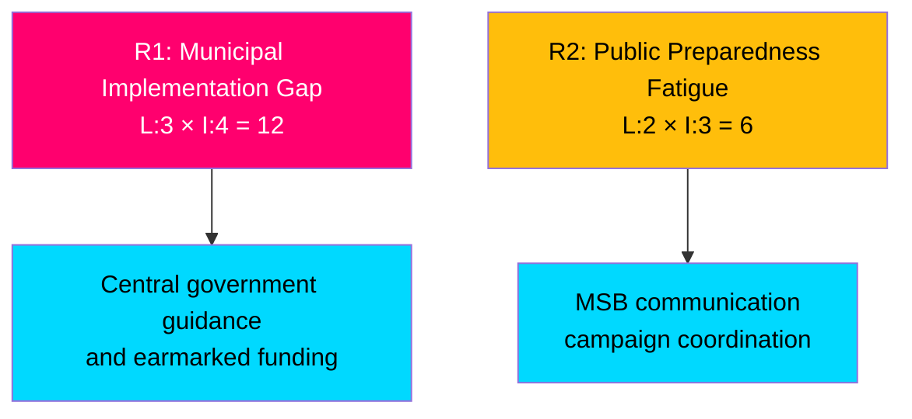

# 🔍 Per-File Political Intelligence Analysis: FöU12

**📋 Document Owner:** CEO | **📄 Version:** 2.1 | **📅 Last Updated:** 2026-04-03 14:16 UTC
**🏢 Owner:** Hack23 AB (Org.nr 5595347807) | **🏷️ Classification:** Public

---

## 📋 Document Identity

| Field | Value |
|-------|-------|
| **Document ID** | `HD01FöU12` |
| **Document Type** | `committeeReports / bet` |
| **Title** | Ett starkare skydd för civilbefolkningen vid höjd beredskap |
| **Date** | 2026-04-02 |
| **Riksmöte** | 2025/26 |
| **Committee** | FöU (Försvarsutskottet — Defense Committee) |
| **Source MCP Tool** | `get_betankanden`, `get_dokument` |
| **Analysis Timestamp** | 2026-04-03 14:16 UTC |
| **Analyst** | news-realtime-monitor |

---

## 🎯 Executive Summary

The Defense Committee (FöU) published betänkande 2025/26:FöU12 on strengthening civilian protection during heightened military preparedness. This committee report addresses critical civil defense gaps, proposing enhanced shelter capacity, evacuation procedures, and warning systems. Published on the same day as the SEK 8.7B GUTE II air defense deal, it forms part of a coordinated defense policy push by the Kristersson government. The report aligns with Sweden's total defense concept (totalförsvar) revitalization as a NATO member state. **[HIGH]**

---

## 📊 Political Classification

---

## 💼 SWOT Analysis

### ✅ Strengths

| # | Strength Statement | Evidence (dok_id) | Confidence | Impact | Entry Date |
|---|-------------------|-------------------|:----------:|:------:|:----------:|
| S1 | FöU committee demonstrates cross-party consensus on civil defense strengthening, signaling political unity on security | HD01FöU12 | H | H | 2026-04-02 |
| S2 | Report published alongside GUTE II deal shows coordinated "total defense" policy narrative | HD01FöU12, gute-ii-defense-deal | H | H | 2026-04-02 |
| S3 | Addresses long-neglected civilian shelter infrastructure — fills critical gap identified in 2017 total defense review | HD01FöU12 | M | H | 2026-04-02 |

### ⚠️ Weaknesses

| # | Weakness Statement | Evidence (dok_id) | Confidence | Impact | Entry Date |
|---|-------------------|-------------------|:----------:|:------:|:----------:|
| W1 | Committee report scope may not address funding mechanisms for municipal-level shelter construction | HD01FöU12 | M | M | 2026-04-02 |
| W2 | Implementation depends on municipal cooperation — Sweden has 290 municipalities with varying capacity | HD01FöU12 | M | H | 2026-04-02 |

### 🚀 Opportunities

| # | Opportunity Statement | Evidence (dok_id) | Confidence | Impact | Entry Date |
|---|----------------------|-------------------|:----------:|:------:|:----------:|
| O1 | NATO Article 3 compliance — member states must maintain civil resilience, FöU12 strengthens Sweden's position | HD01FöU12 | H | H | 2026-04-02 |
| O2 | Complements GUTE II military protection with civilian protection for dual-layered defense | HD01FöU12, gute-ii-defense-deal | H | H | 2026-04-02 |

### 🔴 Threats

| # | Threat Statement | Evidence (dok_id) | Confidence | Impact | Entry Date |
|---|-----------------|-------------------|:----------:|:------:|:----------:|
| T1 | Cost of civilian shelter modernization may compete with military procurement budgets | HD01FöU12, gute-ii-defense-deal | M | M | 2026-04-02 |
| T2 | Public awareness of heightened preparedness measures could increase anxiety without adequate communication | HD01FöU12 | L | M | 2026-04-02 |

---

## ⚡ Risk Assessment

| Risk ID | Risk | Likelihood (1-5) | Impact (1-5) | Score | Mitigation |
|---------|------|:-----------------:|:------------:|:-----:|------------|
| R1 | Uneven municipal implementation of civilian protection measures | 3 | 4 | **12** | Central guidance, earmarked funding, MSB oversight |
| R2 | Public preparedness fatigue undermines civil defense engagement | 2 | 3 | **6** | Coordinated MSB/municipality communication |

---

## 👥 Stakeholder Impact

| Stakeholder Group | Impact | Key Concern | Evidence |
|-------------------|:------:|-------------|----------|
| **Citizens** | 🟢 Positive | Enhanced shelter and evacuation capabilities | HD01FöU12 title |
| **Government Coalition** | 🟢 Positive | Demonstrates comprehensive total defense approach | Coordinated with GUTE II |
| **Opposition** | 🟡 Mixed | May support defense but question resource allocation | Historical positions |
| **Business/Industry** | 🟡 Mixed | Construction/infrastructure sector benefits; costs for businesses | Implementation needs |
| **International/NATO** | 🟢 Positive | Article 3 civil resilience compliance | NATO requirements |
| **Civil Society** | 🟢 Positive | MSB-led preparedness training opportunities | Civil defense tradition |
| **Media/Public Opinion** | 🟢 Positive | Public interest in personal preparedness high | Post-pandemic/Ukraine context |
| **Judiciary/Constitutional** | ⚪ Neutral | Standard legislative process | FöU committee procedure |

---

## 🔮 Forward Indicators

| # | Indicator | Trigger | Timeline | Confidence |
|---|-----------|---------|----------|:----------:|
| F1 | Riksdag plenary debate on FöU12 | Parliamentary calendar | April-May 2026 | H |
| F2 | Government appropriation for municipal civil defense | Budget bill 2027 | Autumn 2026 | M |
| F3 | MSB updated total defense guidelines referencing new legislation | MSB publication | 2026-2027 | H |

---

## 📎 Cross-References

- **gute-ii-defense-deal**: SEK 8.7B air defense contract — military complement to civilian protection
- **HD03214**: Cybersecurity center strengthening — digital dimension of total defense
- **HD01FöU11**: Riksrevisionen report on maritime emergency rescue — adjacent FöU topic
- FöU committee chair and members — monitoring positions on implementation timeline

---

**Document Control:** Analysis by news-realtime-monitor | 2026-04-03 14:16 UTC | Classification: Public
