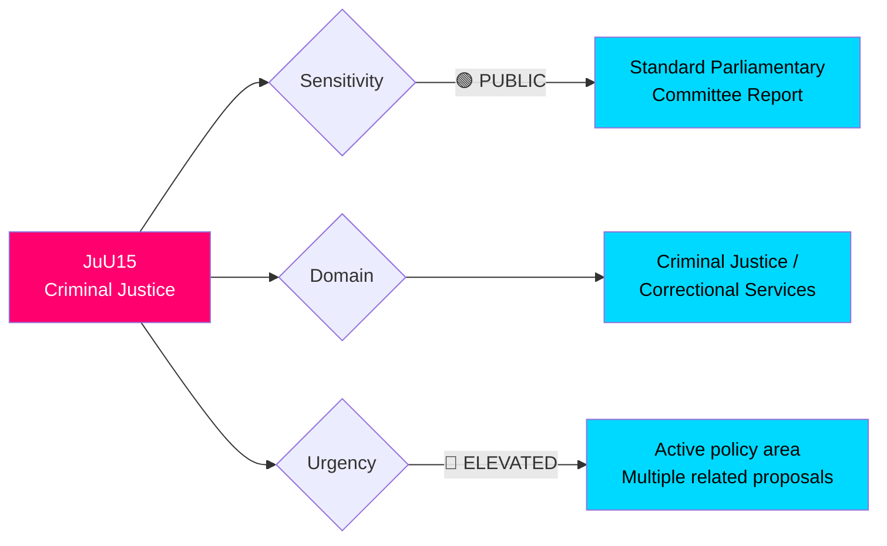
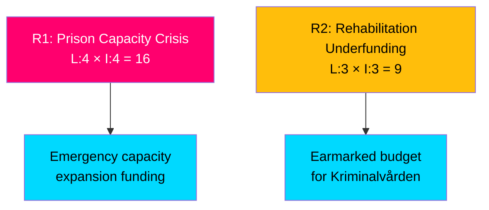

# 🔍 Per-File Political Intelligence Analysis: HD01JuU15

**📋 Document Owner:** CEO | **📄 Version:** 2.1 | **📅 Last Updated:** 2026-04-03 14:16 UTC
**🏢 Owner:** Hack23 AB (Org.nr 5595347807) | **🏷️ Classification:** Public

---

## 📋 Document Identity

| Field | Value |
|-------|-------|
| **Document ID** | `HD01JuU15` |
| **Document Type** | `committeeReports / bet` |
| **Title** | Kriminalvårdsfrågor |
| **Date** | 2026-04-02 |
| **Riksmöte** | 2025/26 |
| **Committee** | JuU (Justitieutskottet — Justice Committee) |
| **Source MCP Tool** | `get_betankanden`, `get_dokument` |
| **Analysis Timestamp** | 2026-04-03 14:16 UTC |
| **Analyst** | news-realtime-monitor |

---

## 🎯 Executive Summary

The Justice Committee published betänkande 2025/26:JuU15 on correctional services policy, addressing motion-period proposals on prison conditions, rehabilitation programs, and post-release support. Published alongside JuU16 (police matters) and concurrent criminal justice propositions (Prop 235 on deportation, Prop 227 on youth crime investigation), this report is part of the government's broad "law and order" legislative agenda. The JuU committee has been highly active in 2025/26, reflecting the coalition's emphasis on criminal justice reform with SD support. **[MEDIUM]**

---

## 📊 Political Classification

---

## 💼 SWOT Analysis

### ✅ Strengths

| # | Strength Statement | Evidence (dok_id) | Confidence | Impact | Entry Date |
|---|-------------------|-------------------|:----------:|:------:|:----------:|
| S1 | Government coalition maintains coherent criminal justice agenda across multiple parallel tracks | HD01JuU15, HD03235, HD03227 | H | M | 2026-04-02 |
| S2 | JuU committee efficiently processing high volume of criminal justice motions from 2025 allmänna motionstiden | HD01JuU15 | M | M | 2026-04-02 |

### ⚠️ Weaknesses

| # | Weakness Statement | Evidence (dok_id) | Confidence | Impact | Entry Date |
|---|-------------------|-------------------|:----------:|:------:|:----------:|
| W1 | Kriminalvården (prison service) capacity constraints may limit implementation of new policies | HD01JuU15 | M | H | 2026-04-02 |
| W2 | Committee reports on motions typically reject proposals, limiting substantive policy innovation from opposition | HD01JuU15 | H | L | 2026-04-02 |

### 🚀 Opportunities

| # | Opportunity Statement | Evidence (dok_id) | Confidence | Impact | Entry Date |
|---|----------------------|-------------------|:----------:|:------:|:----------:|
| O1 | Cross-party consensus on rehabilitation may emerge from committee deliberations | HD01JuU15 | L | M | 2026-04-02 |

### 🔴 Threats

| # | Threat Statement | Evidence (dok_id) | Confidence | Impact | Entry Date |
|---|-----------------|-------------------|:----------:|:------:|:----------:|
| T1 | Prison overcrowding may undermine new criminal justice policies before implementation | HD01JuU15, Kriminalvården reports | M | H | 2026-04-02 |

---

## ⚡ Risk Assessment

| Risk ID | Risk | Likelihood (1-5) | Impact (1-5) | Score | Mitigation |
|---------|------|:-----------------:|:------------:|:-----:|------------|
| R1 | Prison capacity insufficient for tougher sentencing policies | 4 | 4 | **16** | Emergency capacity expansion |
| R2 | Rehabilitation programs underfunded relative to incarceration growth | 3 | 3 | **9** | Earmarked Kriminalvården budget |

---

## 👥 Stakeholder Impact

| Stakeholder Group | Impact | Key Concern | Evidence |
|-------------------|:------:|-------------|----------|
| **Citizens** | 🟡 Mixed | Public safety vs. rehabilitation effectiveness | HD01JuU15 |
| **Government Coalition** | 🟢 Positive | Demonstrates tough-on-crime agenda delivery | Coalition agreement |
| **Opposition** | 🟡 Mixed | S may support parts; V opposes punitive approach | Historical positions |
| **Business/Industry** | ⚪ Neutral | Limited direct business impact | N/A |
| **International/EU** | 🟡 Mixed | ECHR standards on prison conditions | European standards |
| **Civil Society** | 🔴 Concerned | Human rights organizations may oppose direction | NGO positions |
| **Media/Public Opinion** | 🟢 Positive | Public demand for criminal justice action | Polling data |
| **Judiciary** | 🟡 Mixed | Courts must apply new sentencing frameworks | JuU15 scope |

---

## 🔮 Forward Indicators

| # | Indicator | Trigger | Timeline | Confidence |
|---|-----------|---------|----------|:----------:|
| F1 | Riksdag plenary vote on JuU15 | Parliamentary calendar | April-May 2026 | H |
| F2 | Kriminalvården capacity report | Annual agency report | 2026 Q3 | H |
| F3 | Integration with Prop 235 deportation rules in JuU pipeline | Committee scheduling | 2026 Q2 | M |

---

## 📎 Cross-References

- **HD03235**: Prop on stricter deportation rules — synergistic criminal justice policy
- **HD03227**: Prop on youth crime investigation — parallel JuU pipeline item
- **HD01JuU16**: Polisfrågor (police matters) — companion committee report from same week
- **HD03213**: Honor-based violence legislation — related criminal justice strengthening

---

**Document Control:** Analysis by news-realtime-monitor | 2026-04-03 14:16 UTC | Classification: Public
